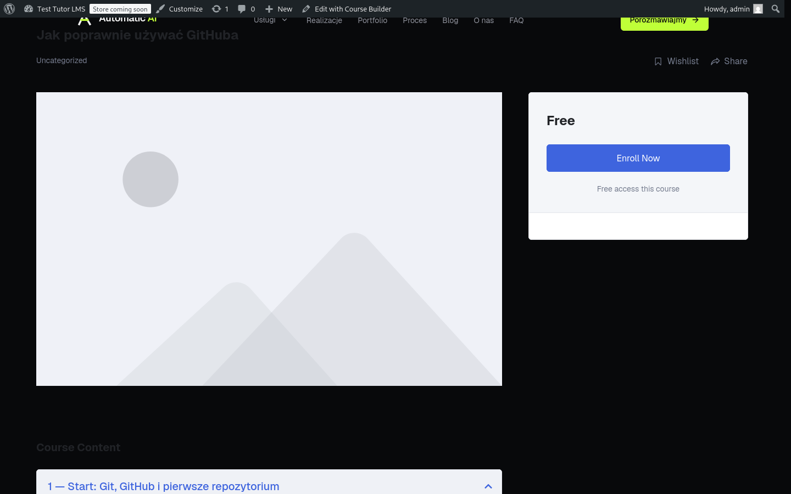
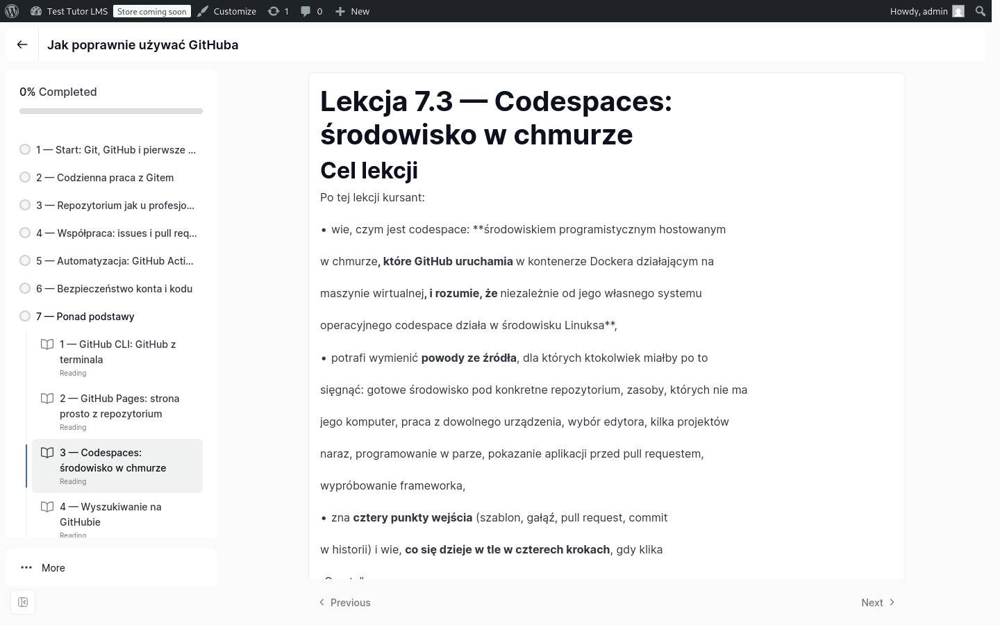

# Etap WordPress — ustalenia z rozmowy 2026-08-19

Dokument powstał, bo dwie nasze własne decyzje z 2026-08-18 stały ze sobą
w sprzeczności, a rozmowa nie jest nośnikiem trwałym:

- „sklep zostanie **przepisany 1:1 na wtyczkę WP**" (PLAN.md, decyzja zespołu),
- „materiał **nie będzie hostowany własnym kodem**, do rozważenia gotowy LMS"
  (CLAUDE.md, ten sam dzień, wieczorem).

Jeśli LMS bierze konta, sprzedaż i dostęp do materiału, to przepisywanie
CRUD-a na PHP dublowałoby funkcje, które LMS ma z pudełka — razem
z polskimi fakturami i płatnościami, których Plugin 2 nawet nie zaczął.
Rozmowa rozstrzygnęła to podziałem odpowiedzialności (niżej).

## Decyzje właściciela (2026-08-19)

1. **Wszystko na WordPressie.** Strona główna Automatic AI **jest już
   przekonwertowana na WP** i tam będzie docelowo hostowana (hosting
   + domena, nie VPS/Node). **Doprecyzowanie 2026-08-19:** konwersję
   zrobił kolega z zespołu i ma ją u siebie lokalnie — **my jej nie
   mamy** ani w repo, ani na dysku. To nie zmienia kierunku, zmienia
   kolejność pracy (patrz „Praca bez dostępu do motywu").
2. **Podstrona `/szkolenia` to WTYCZKA do tej strony.** Po wpięciu
   wtyczki w menu pojawia się pozycja „Szkolenia", a pod nią katalog,
   strony sprzedażowe i e-booki. Wtyczka ma się **dopasowywać** do
   strony — wchodzi w istniejący wygląd, nie stawia obok drugiego świata.
   Tą samą drogą dołączą pozostałe moduły (Plugin 2 — płatności,
   Plugin 3 — panel): **cała automatyzacja jako wtyczki jednej instalacji.**
3. **Podział odpowiedzialności (hybryda), a nie przepisywanie wszystkiego.**
   Nasz kod renderuje to, w co włożyliśmy 29 wydań pracy (katalog, strony
   sprzedażowe, kreator treści); gotowy LMS bierze to, czego nie mamy
   wcale (konta, koszyk, płatności, faktury, dostęp za logowaniem).
4. **LMS pierwszego wyboru: Tutor LMS (darmowy core) + WooCommerce.**
   Plan B: **Publigo BOX** — 1797 zł netto (PLUS) / 2997 zł (PRO)
   jednorazowo, polskie faktury (Fakturownia/wFirma/iFirma) i płatności
   (Tpay/PayU/P24/BLIK) w komplecie, 15 dni testów. Publigo **GO**
   (87–297 zł/mies.) odpada z góry: nie pozwala wgrywać własnych wtyczek,
   więc nasza wtyczka nie miałaby jak tam wejść.
5. **Kolejność: dokumentacja i research TERAZ, kod po kursach.**
   Etap WP nie czeka bezczynnie na krok 3, ale kodu wtyczki nie piszemy,
   zanim właściciel nie oceni gotowych kursów (bramka B7).

## Podział odpowiedzialności

| Obszar | Kto | Dlaczego tak |
|---|---|---|
| Katalog `/szkolenia`, strony sprzedażowe | **nasza wtyczka** | tu leży design premium i kontrakty sekcji z D5/D6 — to jest nasz wkład, nie CRUD |
| Kreator treści (kurs, program, sekcje) | **nasza wtyczka** | panel właściciela, strażnik rozjazdu kontrakt ↔ panel; w WP: ekran w kokpicie + REST/admin-ajax |
| Treść lekcji za logowaniem, postęp | **Tutor LMS** | konta, ograniczenie dostępu, postęp — gotowe i utrzymywane |
| Koszyk, płatności, faktury | **WooCommerce + wtyczka faktur** | polskie prawo podatkowe; tego nie piszemy sami |
| E-booki / PDF (dodatki) | **WooCommerce** (produkt do pobrania) | dostarczanie plików po zakupie ma z pudełka |
| Audyt zmian treści | **nasza wtyczka** | własne tabele + logika audytu, odpowiednik `course_changelog` z D2 |

## Co zostaje z prototypu Next.js

- **Specyfikacja wykonawcza**: design, kontrakty treści sekcji, przepływ
  BAZA → DZIAŁ → STRONA, jeden kanał zapisu, strażnicy, goldeny, testy.
  Wersja WP ma odtworzyć zachowanie, nie kod.
- **Treść to dane**: 2 kursy z bazy PostgreSQL → MySQL skryptem
  migracyjnym (jednorazowo, idempotentnie — wzorzec z `mp-test-env`).
- **Zabezpieczenia z kroku 2 mają odpowiedniki w WP**, nie znikają:
  CSP nagłówkiem, ograniczanie tempa (nośnik: baza albo obiekt cache WP),
  limity wejścia w sanitizacji, generyczne komunikaty błędów,
  nonce WP + `current_user_can()` zamiast tokenu z `.env`.

## Wzorce, które MAMY lokalnie (nie zaczynamy od zera)

| Ścieżka | Co daje |
|---|---|
| `/home/krzysiek/mp-test-env` | **najważniejszy wzorzec**: nasze własne środowisko WP z wtyczkami `mp-*` (`mp-sales-workflow` ma pełną strukturę: `blueprint/`, `docs/`, `includes/`, `uninstall.php`, `readme.txt`), zainstalowany WooCommerce, worktree `wt-p1`/`wt-p2`/`wt-audyt`, katalogi `narzedzia/` i `testy/` |
| `/home/krzysiek/zlecenia stron internetowych/czarodziejski-dworek/wordpress` | motyw WP + `PACZKA-DLA-KLIENTA` + `blueprint.json` — wzorzec oddania projektu klientowi |
| `/home/krzysiek/kredyt-kompas-wp` | `wp-content` + `blueprint.json` + `build-parts.py` |

> **Korekta zapisu:** CLAUDE.md do 2026-08-19 twierdził, że ściąga WP leży
> „w katalogu `wordpress/` w repo strony głównej". Tam **nie ma** takiego
> katalogu — sprawdzone. Ściągi są w projektach wymienionych wyżej.

## Pytania otwarte — do rozstrzygnięcia przed pisaniem kodu

1. ~~Jak zdobyć motyw strony głównej?~~ **MAMY GO 2026-08-20** — kolega
   z zespołu wypchnął całą konwersję do repo `MatthewPlugins/automatic-ai`,
   gałąź `main`, katalog `wordpress/`. Szczegóły i konsekwencje: sekcja
   „Motyw Automatic AI" niżej.
2. ~~Motyw blokowy (FSE) czy klasyczny?~~ **KLASYCZNY** — `header.php`,
   `footer.php`, `front-page.php`, `page.php`, zero `theme.json`
   i zero `templates/`. Wtyczka przechwytuje `template_include`.
3. ~~Co znaczy „dopasowuje się do strony"?~~ **Własny arkusz wtyczki
   z tymi samymi wartościami** — nie dziedziczenie, bo nie ma czego
   dziedziczyć: motyw nie ma `theme.json`, a jego CSS to skompilowany
   Tailwind (157 zmiennych, wszystkie `--tw-*`, czyli wewnętrzne
   Tailwinda, nie tokeny designu). Uzasadnienie niżej.
4. ~~Tutor LMS na realnej treści~~ **SPRAWDZONE 2026-08-19** — uniesie
   (59 kB lekcja renderuje się w 6,6 ms, cały Kurs 2 wszedł bez ubytku),
   da się ostylować (własne zmienne `--tutor-*` + szablony do nadpisania),
   dostęp za logowaniem działa z pudełka. Liczby: sekcja „Tutor LMS na
   realnej treści" niżej. Zostaje ścieżka zakupu przez WooCommerce.
5. Czy e-booki są osobnym produktem, czy dodatkiem do kursu (wpływa na
   układ katalogu i na to, co widzi WooCommerce). **Właściciel zapytał
   o to wprost 2026-08-20** („czy PDF idzie na maila kupującego") —
   pytanie zostaje otwarte do etapu WP.

### Jak wygląda dostarczenie kursu po zakupie (odpowiedź udzielona 2026-08-20)

Właściciel zapytał, czy po zakupie idzie PDF na maila plus link i hasło.
Odpowiedź z zapisanych decyzji, żeby nie wyprowadzać jej od nowa:

- **Hasła NIE wysyłamy mailem.** Kupujący zakłada konto przy kasie
  WooCommerce i sam ustawia hasło (albo dostaje link do jego ustawienia).
- Po zaksięgowaniu płatności WooCommerce zapisuje go na kurs w Tutorze,
  a mail po zakupie niesie potwierdzenie, fakturę i link „przejdź do
  kursu". Materiał czyta **za logowaniem**, nie z załącznika.
- **PDF to dodatek do pobrania** (link w koncie kupującego), nie rdzeń —
  powody odrzucenia PDF-a jako produktu: PRODUKCJA-MATERIALU-KROK-3.md.

**Czego jeszcze NIE sprawdziliśmy:** ścieżki „zapłata → automatyczny
zapis na kurs" na naszym środowisku. Pomiar z 2026-08-19 potwierdził
tylko, że Tutor unosi długie lekcje i że dostęp za logowaniem działa
z pudełka. Komenda generująca PDF też jeszcze nie istnieje.

## Praca bez dostępu do motywu (ustalenie 2026-08-19)

> **Nieaktualne od 2026-08-20 — motyw mamy** (sekcja „Motyw Automatic AI").
> Sekcja zostaje, bo jej rozstrzygnięcia dalej obowiązują: wtyczka ma być
> agnostyczna wobec motywu i testowana na dwóch rodzajach naraz. Jeden
> wiersz tabeli okazał się nieprawdziwy i jest poprawiony niżej.

Nie czekamy z założonymi rękami — projektujemy wtyczkę **agnostycznie
wobec motywu**, żeby wpięcie u kolegi było wpięciem, a nie przepisywaniem:

| Warstwa | Czy zależy od motywu | Co robimy teraz |
|---|---|---|
| Dokumentacja WP, `$wpdb`, własne tabele, audyt | **nie** | robimy od razu |
| Kontrakty treści, migracja Postgres → MySQL | **nie** | robimy od razu |
| Kreator w kokpicie WP (ekran + REST/nonce) | **nie** | kokpit ma własny wygląd, niezależny od motywu frontu |
| Szablony katalogu i stron sprzedażowych | **tak** | własne style z fallbackiem; jeśli motyw ma `theme.json`, dziedziczymy jego zmienne (kolory, typografia, odstępy) |
| Pozycja „Szkolenia" w menu | **TAK — i to bardziej, niż sądziliśmy** | ~~standardowe API WP~~ **nieprawda dla tego motywu**: nawigacja jest wpisana na sztywno w `header.php`, bez `wp_nav_menu()`. Pozycja wchodzi zmianą w źródle Next.js + regeneracją motywu — patrz „Motyw Automatic AI" |

**Warunek bezpieczeństwa: testujemy na DWÓCH rodzajach motywu naraz.**
W `mp-test-env` są już oba: `twentytwentyfive` (blokowy, FSE) oraz
`kredyt-kompas` (klasyczny). Wtyczka, która wygląda poprawnie na obu,
wejdzie w motyw Automatic AI bez niespodzianek — a jeśli nie wejdzie,
zobaczymy to na własnym środowisku, nie na produkcji kolegi.

## Motyw Automatic AI — mamy go (2026-08-20)

Kolega z zespołu wypchnął całą konwersję: **repo `MatthewPlugins/automatic-ai`,
gałąź `main`, katalog `wordpress/`** — motyw, treść i skrypty (216 plików,
6,1 MB). To **koryguje zapis z 2026-08-19**, że takiego katalogu tam nie ma:
wtedy faktycznie go nie było, teraz jest.

> Repo strony głównej pozostaje **tylko do odczytu** (WYTYCZNE, zakaz po
> BLAD-007 — także dla zmian niecommitowanych). Motyw bierzemy przez
> sparse checkout do katalogu roboczego; lokalnego klonu nie dotykamy.

### Co tam leży

| Ścieżka | Co to |
|---|---|
| `wp/theme/automatic-ai/` | motyw: `header.php`, `footer.php`, `front-page.php` (80 kB), `functions.php`, `index.php`, `page.php`, `style.css`, `static/` |
| `import/*.json` | treść strony wyeksportowana z builda (strony, wpisy, blog, menu) |
| `skrypty/` | `start.sh` (Docker: WP + MariaDB, `:8890`), importy PHP, eksport statyczny, **`generuj-motyw.mjs`** |
| `docker-compose.yml`, `README.md` | warsztat i instrukcja |

### Siedem faktów, które przesądzają o projekcie wtyczki

1. **Motyw jest KLASYCZNY.** `index.php` i `page.php` to dosłownie
   `get_header()` → `<main id="tresc">` → `get_footer()`. Nasza wtyczka
   wchodzi przez `template_include` i renderuje własny `<main>` — dokładnie
   tak, jak `/szkolenia` działa dziś w prototypie.
2. **Motyw jest GENEROWANY** przez `skrypty/generuj-motyw.mjs` z builda
   Next.js, a `style.css` mówi wprost: *„nie edytować ręcznie"*. Cokolwiek
   dopiszemy do motywu, zniknie przy następnej regeneracji — **wszystko musi
   siedzieć we wtyczce**.
3. **Nie ma `theme.json`.** Nie ma więc presetów `--wp--preset--*` do
   dziedziczenia, a `functions.php` dodatkowo robi
   `wp_dequeue_style('global-styles')`.
4. **CSS to skompilowany Tailwind** (jeden chunk, 87 kB): 157 zmiennych,
   wszystkie `--tw-*` — czyli wewnętrzne zmienne Tailwinda, nie tokeny
   designu. Tailwind emituje reguły **tylko dla klas użytych w źródle**,
   więc wtyczka nie może „użyć klas motywu": klasy, której nie ma na stronie
   głównej, po prostu nie ma w arkuszu. **Wniosek: wtyczka wnosi własny
   arkusz**, a „dopasowanie" znaczy te same wartości (kolory, typografia,
   promienie, cienie), nie wspólny mechanizm.
5. **Nawigacja jest wpisana na sztywno w `header.php`** — zero
   `wp_nav_menu()`, zero `register_nav_menu()`. To **obala wcześniejszy zapis
   z tabeli „Praca bez dostępu do motywu"**, że pozycję w menu doda
   standardowe API WP. Nie doda. Pozycja „Szkolenia" wymaga zmiany
   w **źródle Next.js** i regeneracji motywu — czyli prośby do kolegi albo
   PR-a do repo strony głównej, nie kodu w naszej wtyczce. Pięć możliwych
   dróg z oceną: sekcja „Pozycja »Szkolenia« w menu" na końcu rozdziału.
6. **Motyw przejmuje SEO i `<head>`**: usuwa `rel_canonical`, `wp_shortlink`,
   ustawia własny tytuł przez `pre_get_document_title`, a kanoniki i Open
   Graph wypycha z post meta `_aai_*`. Nasze strony kursów **nie dostaną
   kanonika od WordPressa** — wtyczka musi go dodać sama (mamy to gotowe
   z kroku 1: `lib/seo.ts`, kanoniki, OG, JSON-LD).
7. **Motyw usuwa `wpautop` i `wptexturize`** z `the_content`. Treść lekcji
   z naszego kreatora musi wejść jako **gotowy HTML** — puste linie nie zamienią
   się w akapity.

Dobra wiadomość: `wp_head()` jest na miejscu, a struktura
`get_header()` / `<main>` / `get_footer()` jest dokładnie tym, czego
potrzebuje wtyczka renderująca własne strony.

### Tutor LMS na PRAWDZIWYM motywie — sprawdzone

Motyw wgrany do naszego środowiska oceny (obok `twentytwentyfive`
i `twentytwentyone`) i włączony:

| Strona | Wynik |
|---|---|
| strona kursu (50 lekcji) | HTTP 200, 111 kB, **0,096 s** |
| lekcja 59 kB, zalogowany | HTTP 200, 192 kB, **0,136 s**, treść widoczna |
| nawigacja Automatic AI na stronie kursu | **jest** — Tutor renderuje się wewnątrz motywu |
| arkusze | motyw + trzy arkusze Tutora obok siebie |

**Ale zrzuty pokazują dwie różne sytuacje** — i to jest najważniejszy wniosek
tego dnia:

**Strona kursu** wchodzi w motyw i tam się z nim **gryzie**: Automatic AI jest
ciemny, a Tutor wstawia jasne karty („Free / Enroll Now", program, placeholder
okładki) i ciemny tekst nagłówków, który na ciemnym tle prawie znika. Interfejs
jest po angielsku. To jednak **teren naszej wtyczki** — katalog i strony
sprzedażowe robimy sami, więc tej strony Tutora po prostu nie użyjemy.

**Widok lekcji za logowaniem to osobny, pełnoekranowy ekran Tutora** — nie
wchodzi w motyw wcale (brak nagłówka Automatic AI) i dzięki temu jest spójny
sam w sobie: pasek z tytułem kursu, panel programu z 7 modułami, treść,
Previous/Next. **Nasza treść renderuje się w nim poprawnie.** To teren Tutora
i tam jego wygląd jest do zaakceptowania — do dociągnięcia zmiennymi
`--tutor-*` i tłumaczeniem interfejsu.

> **Uczciwie o zrzucie lekcji:** gołe gwiazdki i akapit-na-linię to usterka
> mojego prowizorycznego konwertera Markdown → HTML użytego do wrzucenia
> treści (wytłuszczenie przez wiele linii, `
` na każdą linię), **nie wina
> Tutora**. Docelowo treść przychodzi z naszego kreatora jako gotowy HTML.

Do wyłączenia przy wdrożeniu: onboardingowy modal Tutora („Take the Tour")
zasłaniający materiał przy pierwszym wejściu.

### Co z tego wynika dla podziału odpowiedzialności

Podział z tego dokumentu **broni się na dowodach**: strony sprzedażowe i katalog
zostają nasze (bo tam Tutor nie pasuje wizualnie i tak czy owak nie ma tam nic,
czego byśmy nie mieli lepiej), a materiał za logowaniem bierze Tutor (bo tam ma
własny, spójny ekran, konta i ograniczenie dostępu z pudełka).

### Pozycja „Szkolenia" w menu — pięć dróg (2026-08-21)

W tym motywie WordPress nie ma się gdzie wpiąć: jedyny hak w całym
`header.php` to `wp_head()` — zero `wp_nav_menu()`, zero `wp_body_open()`,
zero `do_action`/`apply_filters` w okolicy nawigacji. Filtr
`wp_nav_menu_items`, którym wtyczka normalnie dokłada pozycję, odpala się
tylko wtedy, gdy motyw woła `wp_nav_menu()` — a ten nie woła. Stąd pięć
realnych dróg:

| Droga | Ocena |
|---|---|
| 1. Zmiana w źródle Next.js + regeneracja motywu | czysto i trwale, ale to zmiana w cudzym repo (u nas read-only) — i każdy kolejny moduł znaczy kolejną prośbę |
| 2. **Jednorazowy hak w generatorze**: `do_action('aai_nawigacja_dodatkowa')` przed `</nav>` (w headerze i w szablonie menu mobilnego) | **REKOMENDACJA** — jedna drobna prośba do kolegi, po której każdy nasz moduł (Plugin 1–3) dokłada pozycję własnym kodem, bez wracania do repo głównego |
| 3. Motyw-dziecko nadpisujący `header.php` | przesuwa problem zamiast go rozwiązać: motyw jest generowany, więc każda regeneracja rodzica = ręczne przenoszenie zmian do dziecka |
| 4. Bufor wyjścia (`ob_start`) i podmiana HTML nagłówka we wtyczce | bez ruszania repo głównego, ale kruche — regeneracja zmienia klasy Tailwinda i pozycja znika PO CICHU |
| 5. JavaScript dopisujący pozycję do DOM | menu miga przy wczytaniu, gorzej dla SEO i czytników ekranu |

**Wybór drogi jeszcze NIE zapadł** — i nie musi: decyzją właściciela
z 2026-08-17 wejście do `/szkolenia` z paska menu robimy dopiero przy
finalnym wdrożeniu. Do tego czasu podstrona żyje pod własnym adresem.
Droga 2 jest rekomendacją agenta, bo jest w duchu decyzji „cała
automatyzacja jako wtyczki jednej instalacji": raz otwarta furtka
w motywie służy wszystkim trzem pluginom.

### Test finalny wtyczek — na lokalnej kopii strony (decyzja właściciela, 2026-08-21)

Gdy wszystkie wtyczki będą gotowe (Plugin 1 — sklep, Plugin 2 — płatności,
Plugin 3 — panel), testujemy je **także na lokalnym WP z warsztatu
w `wordpress/`** — `bash skrypty/start.sh` stawia tam WP + MariaDB na
`:8890` z motywem Automatic AI i treścią strony 1:1. To najbliższa
produkcji kopia, jaką mamy: prawdziwy motyw, prawdziwa treść, prawdziwe
menu.

Matryca testów się przez to nie kurczy, tylko wydłuża:

1. **w trakcie budowy** — jak dotąd, dwa rodzaje motywu naraz
   (`twentytwentyfive` blokowy + klasyczny): wtyczka zostaje agnostyczna
   wobec motywu;
2. **po komplecie wtyczek** — test całości na lokalnej kopii strony
   (warsztat `wordpress/`), jako ostatnia bramka przed wdrożeniem na
   hosting.

Zastrzeżenie techniczne do sprawdzenia przed testem finalnym: warsztat
zakłada **Dockera** (`docker-compose.yml`, `docker compose run --rm cli`),
a u nas Dockera nie ma — używamy podmana. Albo `podman-compose` łyknie ich
plik, albo stawiamy odpowiednik podmanem (jak środowisko oceny Tutora).

## Tutor LMS na realnej treści — pomiar, nie ulotka (2026-08-19)

Punkt 4 „Pytań otwartych" rozstrzygnięty na dowodach: postawiliśmy lokalnie
WordPressa 7.0.1 z **Tutor LMS 4.0.6 (darmowy core)** i **WooCommerce 11.0.1**,
i wrzuciliśmy **cały Kurs 2 — 7 modułów, 50 lekcji, 1143 kB treści**
(prawdziwe scenariusze z `tresc-kursow/jak-uzywac-githuba/`, nie atrapy).

Środowisko stoi obok istniejących instalacji `mp-test-env`, niczego w nich
nie ruszając: `/home/krzysiek/mp-test-env/wp-tutor/`, kontenery `tutor-wp`
i `tutor-db` (podman, sieć `tutor-net`), adres `http://localhost:8091`,
logowanie `admin` / `admin123`.

### Czy uniesie długie lekcje tekstowe — TAK

| Pomiar | Wynik |
|---|---|
| najdłuższa lekcja (Codespaces) | 59 kB treści, render `the_content` **6,6 ms** |
| ta sama lekcja end-to-end, zalogowany | HTTP 200, 209 kB, **0,32 s** |
| strona kursu z programem 50 lekcji | HTTP 200, 138 kB, **0,89 s** |
| kreator kursu Tutora z 50 lekcjami | HTTP 200, **0,23 s** |
| lista lekcji w kokpicie | HTTP 200, 0,48 s |
| `post_content` w MySQL | `longtext` — sufit 4 GB, nasze 59 kB to 0,001% |
| `max_allowed_packet` | 16 MB (domyślne) — z zapasem na najdłuższą lekcję |

Treść przeżywa filtry WordPressa bez ubytku (59 kB wejścia → 60 kB wyjścia,
16 nagłówków i bloki kodu na miejscu). Tutor widzi **7 modułów i 50 lekcji**,
czyli nasza struktura kurs → moduł → lekcja mapuje się 1:1 na jego
`courses` → `topics` → `lesson`.

**Dostęp za logowaniem działa z pudełka:** gość dostaje stronę lekcji
z HTTP 200, ale **bez treści** — w jej miejscu jest wezwanie do zapisu na
kurs. To dokładnie ta funkcja, której nie mamy wcale i której nie chcemy
pisać sami.

### Czy da się ostylować — TAK, ale nie „samo z siebie"

| Sprawdzone | Wynik |
|---|---|
| motyw blokowy (Twenty Twenty-Five, FSE) | kurs i lekcja renderują się poprawnie |
| motyw klasyczny (Twenty Twenty-One) | to samo, ten sam program (29 znaczników programu w obu) |
| czy Tutor czyta `theme.json` | **NIE** — zero odwołań do `--wp--preset--*` w jego CSS |
| własny system zmiennych | **21 zmiennych `--tutor-*`** (kolory, odstępy, typografia) |
| nadpisywanie szablonów | `tutor/templates/` w motywie (albo filtr ścieżki z naszej wtyczki) |

Wniosek dla wtyczki: Tutor wnosi własny arkusz (`tutor-front.min.css`,
139 kB) i **nie dziedziczy wyglądu motywu automatycznie**. Spięcie z naszym
designem to przemapowanie tokenów na zmienne `--tutor-*` plus nadpisanie
szablonów tam, gdzie układ ma się różnić — robota policzalna, nie przepisywanie
LMS-u. To potwierdza podział odpowiedzialności z tego dokumentu: Tutor bierze
konta i dostęp, wygląd zostaje nasz.

### Czego NIE sprawdzono

- pełnej ścieżki zakupu (WooCommerce → zapis na kurs) — wymaga skonfigurowanej
  bramki i produktu; następny krok po decyzji o LMS,
- zachowania przy wielu kursach i wielu użytkownikach naraz,
- Publigo BOX (plan B) — nie ma darmowej wersji do postawienia obok.

## Następne kroki

1. ~~Poprosić kolegę o katalog motywu~~ **NIEAKTUALNE 2026-08-20** —
   kolega wypchnął CAŁĄ konwersję do repo (sekcja „Motyw Automatic AI").
2. ~~Celowany komplet dokumentacji WP~~ **ZROBIONE 2026-08-19**:
   947 plików (9,6 MB) w `docs/dokumentacja-techniczna/wordpress/`,
   poza gitem; w repo `ZRODLA.md` z zakresem i uzasadnieniem cięć oraz
   `tools/pobierz-dokumentacje-wp.mjs` (odtwarza komplet jedną komendą,
   idempotentnie). Zakres: pięć podręczników developer.wordpress.org
   w całości (wtyczki, motywy, Common APIs, REST, standardy kodu),
   theme.json i motywy blokowe z Block Editor Handbook, 102 hasła Code
   Reference wybrane imiennie (klasa `wpdb`, `dbDelta`, nonce'y,
   uprawnienia, sanitizacja, trasy i szablony), dokumentacja dewelopera
   WooCommerce, Tutor LMS i wybór z manuala MySQL (typy, `utf8mb4`,
   indeksy, transakcje, wyzwalacze pod audyt).
3. ~~Postawić lokalnie WP + Tutor LMS + WooCommerce i wrzucić jeden nasz
   kurs~~ **ZROBIONE 2026-08-19** — środowisko stoi
   (`/home/krzysiek/mp-test-env/wp-tutor/`, `podman start tutor-db tutor-wp`,
   `http://localhost:8091`), Kurs 2 w środku, pomiary wyżej. Do domknięcia
   decyzji o LMS zostaje ścieżka zakupu WooCommerce → zapis na kurs.
4. Dopiero potem kod wtyczki, wg Weryfikacji-PR i z tymi samymi
   strażnikami co prototyp.
5. Po ukończeniu WSZYSTKICH wtyczek — test całości na lokalnym WP
   z warsztatu `wordpress/` (sekcja „Test finalny wtyczek" wyżej).
