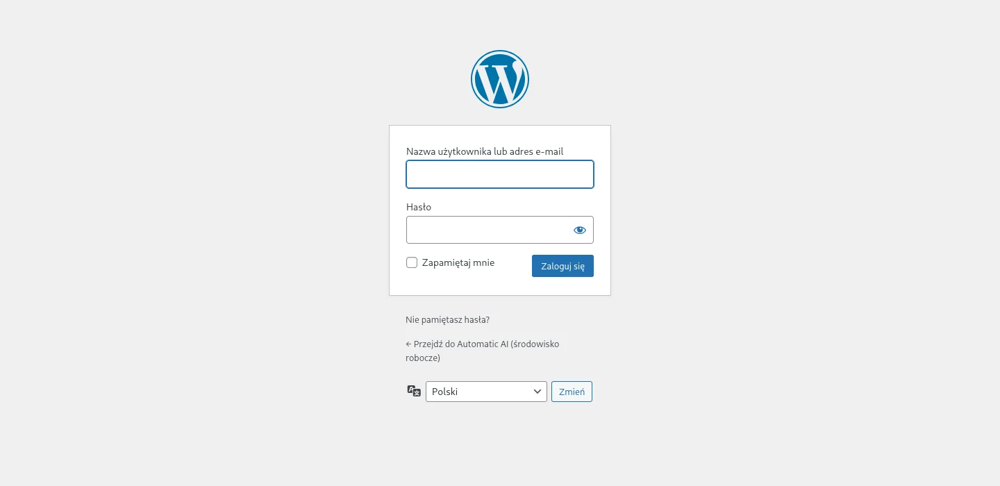
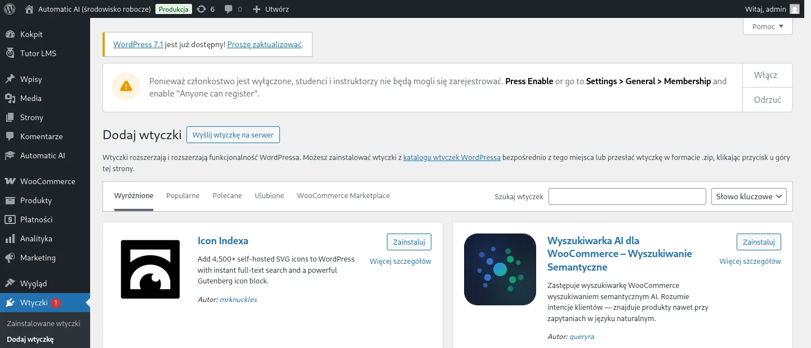
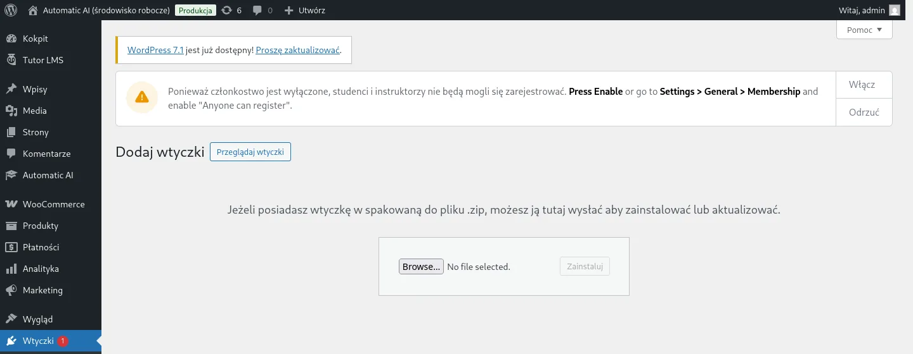
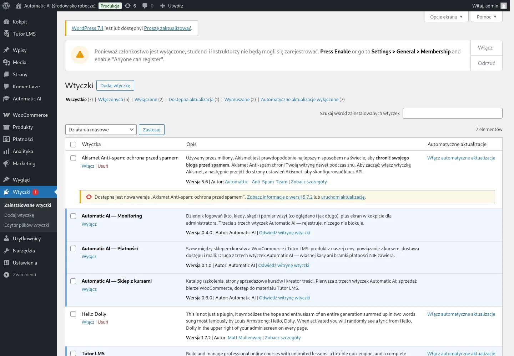
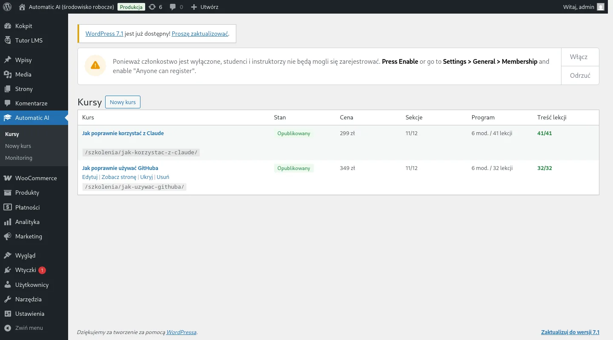
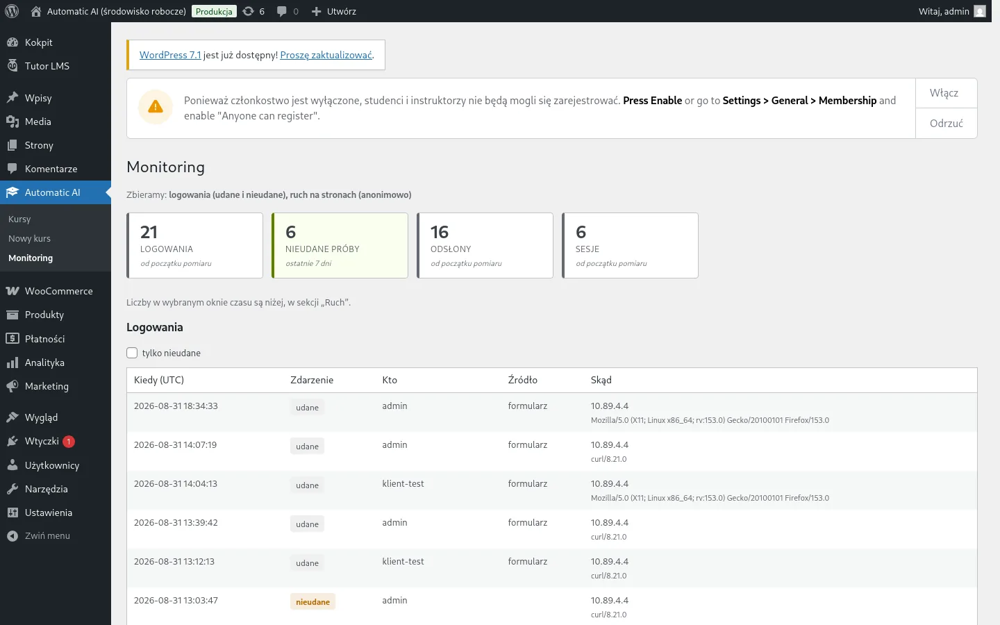

# Instrukcja instalacji — Automatic AI

**Dla kogo:** dla osoby, która nie zna się na programowaniu i nie musi.
Wystarczy, że umie zalogować się na swoją stronę i kliknąć kilka przycisków.

**Ile to zajmie:** około 15 minut.

Instrukcja prowadzi od początku do końca: co dostajesz, gdzie to wgrać,
jak sprawdzić, że działa, i co zrobić, gdy coś pójdzie nie tak.

---

## Spis treści

1. [Co dostajesz od nas](#1-co-dostajesz-od-nas)
2. [Czego potrzebujesz, zanim zaczniesz](#2-czego-potrzebujesz-zanim-zaczniesz)
3. [Jak zalogować się do WordPressa](#3-jak-zalogować-się-do-wordpressa)
4. [Instalacja — trzy wtyczki po kolei](#4-instalacja--trzy-wtyczki-po-kolei)
5. [Co sprawdzić zaraz po instalacji](#5-co-sprawdzić-zaraz-po-instalacji)
6. [Jak sprawdzić, że wszystko naprawdę działa](#6-jak-sprawdzić-że-wszystko-naprawdę-działa)
7. [Co robić, gdy coś nie działa](#7-co-robić-gdy-coś-nie-działa)
8. [Czego lepiej nie zmieniać samemu](#8-czego-lepiej-nie-zmieniać-samemu)
9. [Co przysłać, zgłaszając problem](#9-co-przysłać-zgłaszając-problem)
10. [Rzeczy, które zostają do ustawienia poza wtyczkami](#10-rzeczy-które-zostają-do-ustawienia-poza-wtyczkami)

---

## 1. Co dostajesz od nas

Dostajesz **trzy pliki ZIP** — po jednym na każdą wtyczkę. Nie rozpakowuj ich.
WordPress rozpakuje je sam.

| Plik | Nazwa w WordPressie | Do czego służy |
|---|---|---|
| `aai-sklep-<wersja>.zip` | Automatic AI — Sklep z kursami | katalog kursów, strony sprzedażowe, panel do pisania kursów, czytanie lekcji |
| `aai-platnosci-<wersja>.zip` | Automatic AI — Płatności | spina kursy ze sklepem: przycisk zakupu, konto klienta, maile po zakupie |
| `aai-monitor-<wersja>.zip` | Automatic AI — Monitoring | pokazuje, kto się logował i co ludzie czytają |

Do tego dostajesz plik **`KOLEJNOSC-INSTALACJI.txt`** — to ta sama kolejność,
co w tej instrukcji, na wypadek gdybyś wracał do tego za pół roku.

> **Skąd wziąć te pliki, jeśli ich nie masz.** Powstają jedną komendą z kodu
> źródłowego: `npm run pakuj`. Jeśli nie wiesz, co to znaczy — po prostu
> poproś nas o pliki.

---

## 2. Czego potrzebujesz, zanim zaczniesz

Zanim zaczniesz, sprawdź cztery rzeczy. Jeśli którejś nie masz, **napisz do
nas przed instalacją** — wtyczki bez nich nie zadziałają poprawnie.

- [ ] **Dostęp do panelu WordPressa** — adres, login i hasło administratora.
- [ ] **WordPress w wersji 6.9 lub nowszej** oraz **PHP 8.1 lub nowsze**.
      Gdzie to sprawdzić: *Kokpit → Narzędzia → Stan witryny → Informacje*.
- [ ] **Wtyczka WooCommerce** — włączona. To ona obsługuje koszyk i płatności.
- [ ] **Wtyczka Tutor LMS** — włączona. To ona pilnuje, kto ma dostęp do kursu.
- [ ] **Motyw Automatic AI** — bez niego strona będzie działać, ale będzie
      wyglądać inaczej, niż powinna.

> **Zrób kopię zapasową strony przed instalacją.** Zawsze, przy każdej wtyczce,
> nie tylko naszej. Większość firm hostingowych ma przycisk „kopia zapasowa”
> w swoim panelu. Jeśli nie wiesz, gdzie go szukać — zapytaj swojego hostingu.

---

## 3. Jak zalogować się do WordPressa

1. Wpisz w przeglądarce adres swojej strony i dopisz na końcu `/wp-admin`
   — na przykład `https://twojastrona.pl/wp-admin`.
2. Wpisz login i hasło administratora.
3. Kliknij **Zaloguj się**.

Po zalogowaniu zobaczysz **Kokpit** — panel z menu po lewej stronie.
Wszystko, co robimy dalej, dzieje się w tym menu.

---

## 4. Instalacja — trzy wtyczki po kolei

### Kolejność ma znaczenie

Wgrywaj wtyczki **w tej kolejności i włączaj każdą zaraz po wgraniu**:

> **1.** Sklep z kursami → **2.** Płatności → **3.** Monitoring

**Dlaczego akurat tak:** wtyczka Płatności spina kursy ze sklepem, więc bez
Sklepu nie ma czego sprzedawać. Monitoring działa niezależnie od obu, ale
instalujemy go na końcu, żeby kolejność była zawsze ta sama i łatwa do
zapamiętania.

Jeśli pomylisz kolejność, nic się nie zepsuje — po prostu włącz brakującą
wtyczkę i zapisz dowolny kurs (rozdział 7 mówi, jak to zrobić).

### Krok po kroku — powtórz to trzy razy, po razie na każdy plik

**Krok 1.** W menu po lewej najedź na **Wtyczki** i kliknij **Dodaj wtyczkę**.

**Krok 2.** Na górze strony kliknij przycisk **Wyślij wtyczkę na serwer**.

**Krok 3.** Kliknij **Wybierz plik** i wskaż pierwszy plik ZIP
(`aai-sklep-…zip`). **Nie rozpakowuj go wcześniej** — WordPress oczekuje
właśnie pliku ZIP.

**Krok 4.** Kliknij **Zainstaluj**. Poczekaj kilka sekund.

**Krok 5.** Gdy pojawi się napis „Wtyczka została zainstalowana pomyślnie”,
kliknij **Włącz wtyczkę**.

**Krok 6.** Wróć do punktu 1 i zrób to samo z drugim plikiem, a potem z trzecim.

> **Jeśli WordPress powie, że wtyczka już istnieje** — to znaczy, że wgrywasz
> nowszą wersję czegoś, co już masz. WordPress zapyta, czy zastąpić. Wybierz
> **Zastąp obecną wersję**. Twoje kursy i ustawienia zostaną nietknięte:
> wtyczki nigdy nie kasują danych przy aktualizacji ani przy wyłączeniu.

---

## 5. Co sprawdzić zaraz po instalacji

### Sprawdzenie 1 — czy wszystkie trzy są włączone

Wejdź w **Wtyczki** (menu po lewej). Powinieneś zobaczyć trzy pozycje
zaczynające się od „Automatic AI”, a pod każdą z nich napis **Wyłącz**
(napis „Wyłącz” znaczy, że wtyczka jest **włączona** — WordPress pokazuje
tam czynność, którą możesz wykonać).

### Sprawdzenie 2 — czy pojawiło się nowe menu

W menu po lewej powinna pojawić się pozycja **Automatic AI**, a w niej:

- **Kursy** — lista kursów,
- **Nowy kurs** — dodawanie kursu,
- **Monitoring** — statystyki.

### Sprawdzenie 3 — czy nie ma czerwonych komunikatów

Na górze ekranu nie powinno być czerwonych ani pomarańczowych ramek
z ostrzeżeniem od Automatic AI. Jeśli jest — przeczytaj rozdział 7.

---

## 6. Jak sprawdzić, że wszystko naprawdę działa

Trzy rzeczy do kliknięcia. Zajmą minutę.

**1. Otwórz stronę z kursami.** Wpisz adres swojej strony z dopiskiem
`/szkolenia` — na przykład `https://twojastrona.pl/szkolenia`.

Powinieneś zobaczyć katalog kursów w wyglądzie Automatic AI.

> **Jeśli strona jest pusta, a nie zepsuta** — to normalne na nowej instalacji.
> Znaczy tylko tyle, że nie ma jeszcze żadnego kursu. Dodasz je
> w *Automatic AI → Nowy kurs*.

> **Jeśli widzisz „Nie znaleziono strony” (błąd 404)** — wejdź w
> *Ustawienia → Bezpośrednie odnośniki* i kliknij **Zapisz zmiany**,
> nic nie zmieniając. To odświeża adresy stron w WordPressie i naprawia
> ten konkretny problem.

**2. Otwórz stronę pojedynczego kursu.** Kliknij dowolny kurs w katalogu.
Powinna otworzyć się strona sprzedażowa z ceną i przyciskiem.

**3. Zajrzyj do Monitoringu.** *Automatic AI → Monitoring*. Powinieneś
zobaczyć swoje własne logowanie sprzed chwili.

> **Twoje wizyty na stronie nie będą tam liczone** — administratora celowo
> nie mierzymy. Żeby zobaczyć pomiar ruchu, otwórz stronę w oknie prywatnym
> przeglądarki (Ctrl+Shift+P w Firefoksie, Ctrl+Shift+N w Chrome).

---

## 7. Co robić, gdy coś nie działa

Zacznij zawsze od tej tabeli. W większości przypadków wystarczy jedno
kliknięcie.

| Co widzisz | Co to znaczy | Co zrobić |
|---|---|---|
| Biała, pusta strona po włączeniu wtyczki | Coś przerwało ładowanie strony | Wejdź na `/wp-admin` i wyłącz ostatnio włączoną wtyczkę. Napisz do nas. |
| Komunikat: brakuje WooCommerce albo Tutor LMS | Wtyczka Płatności nie ma z czym się połączyć | Włącz brakującą wtyczkę i odśwież stronę |
| `/szkolenia` pokazuje błąd 404 | WordPress nie odświeżył adresów stron | *Ustawienia → Bezpośrednie odnośniki* → **Zapisz zmiany** |
| Katalog pusty, choć kursy są dodane | Kursy są zapisane jako szkice | *Automatic AI → Kursy* → przy kursie kliknij **Opublikuj** |
| Kurs jest w katalogu, ale nie da się go kupić | Sprzedaż jest domyślnie **zamknięta** | Napisz do nas — to jedno ustawienie, które włączamy my (patrz niżej) |
| Klient kupił i nie dostał maila | Serwer nie wysyła poczty | Napisz do nas i podaj numer zamówienia. Nic nie przepadło — da się wysłać ponownie |
| Strona wygląda „rozsypanie” | Zwykle brak motywu Automatic AI | Sprawdź w *Wygląd → Motywy*, czy jest włączony |

### Dwie rzeczy, które są bezpieczne i prawie zawsze pomagają

1. **Wyłącz i włącz wtyczkę ponownie.** To nie kasuje żadnych danych — ani
   kursów, ani zamówień, ani klientów.
2. **Wejdź w *Ustawienia → Bezpośrednie odnośniki* i kliknij Zapisz zmiany.**
   Nic nie zmieniaj, po prostu zapisz. Naprawia to wszystkie problemy
   z adresami stron.

### Jedna rzecz, której NIE rób sam

**Nie kasuj wtyczki, żeby „zainstalować ją od nowa”.** Wyłączenie jest
bezpieczne i odwracalne. Usunięcie — nie zawsze. Najpierw napisz do nas.

### Sprzedaż jest domyślnie zamknięta i to jest celowe

Po instalacji klienci **nie mogą jeszcze kupować**. Przycisk na stronie kursu
prowadzi do kontaktu, nie do kasy.

Tak ma być: sprzedaż otwiera się dopiero wtedy, gdy podpięta jest prawdziwa
bramka płatności i gdy istnieje regulamin sklepu. **Otwarcie sprzedaży robimy
my** — to jedno ustawienie, którego nie da się zmienić klikaniem w panelu.
Napisz do nas, gdy będziesz gotowy zacząć sprzedawać.

---

## 8. Czego lepiej nie zmieniać samemu

Te rzeczy są ze sobą powiązane i zmiana w jednym miejscu potrafi po cichu
zepsuć drugie. Jeśli którejś potrzebujesz — napisz do nas, zrobimy to razem.

| Nie zmieniaj | Dlaczego |
|---|---|
| **Ceny w WooCommerce** (w *Produkty*) | Cena kursu ustawia się **w kreatorze**, w *Automatic AI → Kursy*. Cena wpisana w WooCommerce zostanie nadpisana przy najbliższym zapisie kursu. **Promocję** możesz ustawić w WooCommerce — tej nie ruszamy. |
| **Kursów w Tutor LMS** (*Tutor LMS → Courses*) | To tylko kopia. Zmiana zniknie przy najbliższym zapisie kursu w naszym kreatorze. Kursy edytuj **wyłącznie** w *Automatic AI*. |
| **Produktów kursów** (*Produkty*) | Powstają same, z kursu. Skasowanie produktu odetnie sprzedaż kursu. |
| **Adresów stron koszyka i kasy** | Wtyczka Płatności zna te adresy. Zmiana zostawi klientów na pustej stronie. |
| **Ustawień Tutor LMS dotyczących płatności** | Są ustawione tak, żeby zakup działał od początku do końca. |
| **Usuwania kursu, który ktoś kupił** | Kupujący **stracą do niego dostęp**, bezpowrotnie. Panel zapyta o to wprost i poprosi o drugie kliknięcie — potraktuj to pytanie poważnie. |

**Co możesz zmieniać bez obaw:** treść kursów, opisy, ceny (w kreatorze),
program, okładki, tytuły, teksty na stronach sprzedażowych, promocje
w WooCommerce.

---

## 9. Co przysłać, zgłaszając problem

Im więcej z tych rzeczy podasz, tym szybciej to naprawimy. Nic z tego nie
wymaga wiedzy technicznej.

1. **Co robiłeś** — dosłownie, krok po kroku („kliknąłem Włącz przy wtyczce
   Płatności”).
2. **Co się stało** — i co miało się stać.
3. **Zrzut ekranu.** Cały ekran, razem z paskiem adresu — to często ten pasek
   mówi najwięcej. (Windows: klawisz `PrtScr` albo `Win+Shift+S`.
   Mac: `Cmd+Shift+4`.)
4. **Adres strony**, na której to widzisz.
5. **Wersje wtyczek.** Wejdź w *Wtyczki* i przepisz numery przy trzech
   pozycjach „Automatic AI”.
6. **Stan witryny.** Wejdź w *Narzędzia → Stan witryny → Informacje*, kliknij
   **Skopiuj informacje o witrynie do schowka** i wklej to w wiadomości.
   To jeden przycisk, a mówi nam o wersji WordPressa, PHP, serwera i o tym,
   jakie inne wtyczki masz włączone.

> **Nie przysyłaj nam hasła do swojej strony.** Nigdy o nie nie poprosimy
> w wiadomości. Jeśli będziemy potrzebowali dostępu, umówimy się na to osobno.

---

## 10. Rzeczy, które zostają do ustawienia poza wtyczkami

Uczciwie: wtyczki to nie wszystko. Te rzeczy są poza nimi i trzeba je
załatwić osobno, zanim ruszy prawdziwa sprzedaż.

| Co | Kto to robi |
|---|---|
| **Bramka płatności** (Przelewy24, Tpay, PayU, BLIK) | Wtyczka do WooCommerce od dostawcy płatności — pomożemy wybrać i podpiąć |
| **Regulamin sklepu** | Ty (najlepiej z prawnikiem) |
| **Polityka prywatności** | Ty — wtyczki podpowiadają gotowy tekst o tym, co zbierają: *Narzędzia → Prywatność* |
| **Adres internetowy i certyfikat HTTPS** | Firma hostingowa |
| **Wysyłanie poczty** (maile po zakupie) | Firma hostingowa albo wtyczka do wysyłki poczty |
| **Widoczność w wyszukiwarce Google** | Sprawdź, czy w *Ustawienia → Czytanie* **nie jest** zaznaczone „Proś wyszukiwarki o nieindeksowanie tej witryny” |
| **Waluta sklepu** | Ty — sprawdź to **przed pierwszą sprzedażą**, patrz ostrzeżenie niżej |

> ### ⚠️ Waluta — sprawdź to, zanim ktokolwiek kupi
>
> WooCommerce po instalacji ustawia walutę na **dolary amerykańskie** i nigdy
> o to nie pyta. Strony kursów pokazują ceny w złotówkach niezależnie od tego
> ustawienia — więc klient zobaczy „299,00 zł" na stronie kursu i **tę samą
> liczbę oznaczoną dolarem w koszyku i w kasie**, czyli dokładnie tam, gdzie
> płaci.
>
> **Jak sprawdzić:** *WooCommerce → Ustawienia → Ogólne → Waluta*.
> Ma być **Złoty polski (zł)**. Jeśli jest co innego — zmień i zapisz.
>
> Wtyczki tego nie ustawią za Ciebie: waluta jest ustawieniem sklepu, a nie
> naszym, i nie mamy prawa zmieniać jej komuś bez pytania. Kontrola
> `wp aai-platnosci sprawdz` powie Ci, gdy waluta rozjeżdża się z cenami.

---

## W skrócie — ściągawka

1. Zrób kopię zapasową strony.
2. Sprawdź: WooCommerce i Tutor LMS są włączone.
3. *Wtyczki → Dodaj wtyczkę → Wyślij wtyczkę na serwer* → wybierz ZIP →
   **Zainstaluj** → **Włącz**.
4. Powtórz dla trzech plików, w kolejności: **Sklep → Płatności → Monitoring**.
5. Sprawdź, czy w menu po lewej jest **Automatic AI**.
6. Otwórz `/szkolenia` na swojej stronie.
7. Coś nie gra? *Ustawienia → Bezpośrednie odnośniki → Zapisz zmiany*.
8. Dalej nie gra? Napisz do nas i dołącz zrzut ekranu oraz „Stan witryny”.

---

*Schematy pokazujące, jak te trzy wtyczki ze sobą współpracują, leżą
w [docs/SCHEMATY.md](SCHEMATY.md) — również w wersji dla osób nietechnicznych.*
