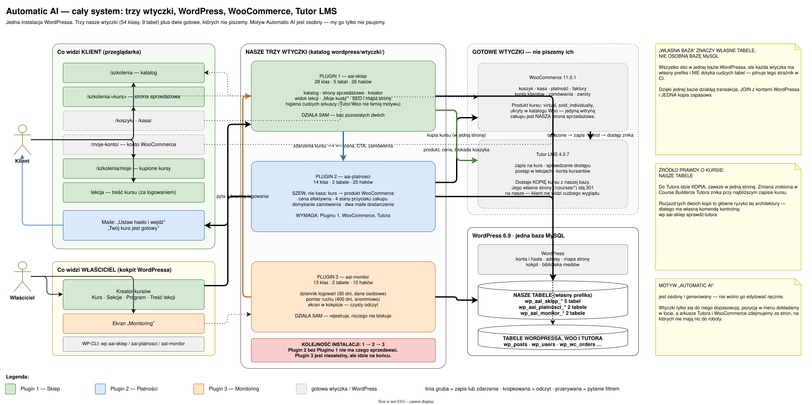
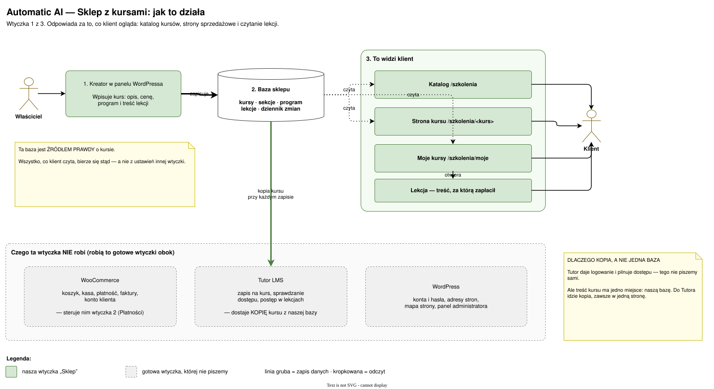
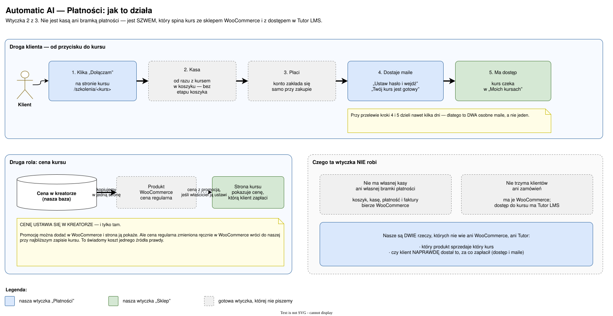
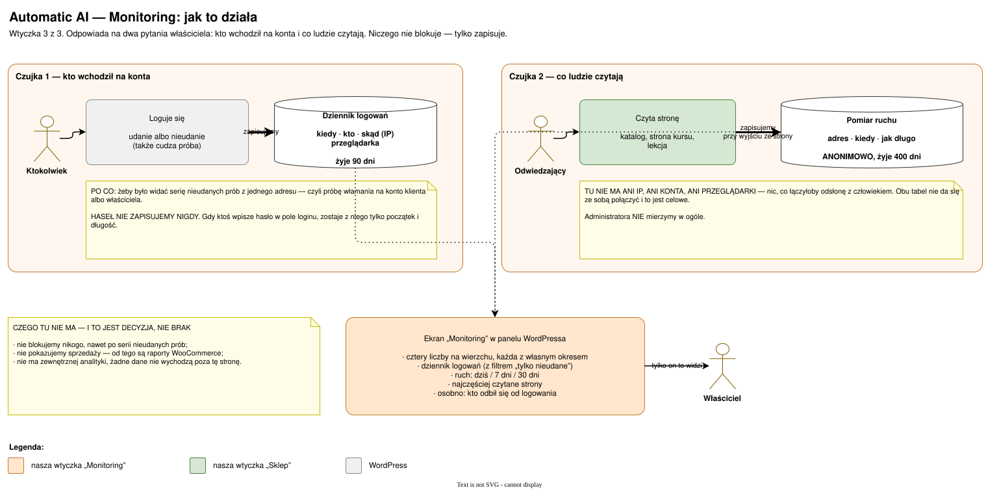

# Schematy — dokumentacja wizualna trzech wtyczek

Siedem diagramów w dwóch wariantach: **prostym** (dla każdego) i
**technicznym** (dla programisty). Do tego jeden diagram całego systemu.

**Źródłem są pliki `.drawio`** — to je się edytuje, w [draw.io](https://app.diagrams.net)
albo w programie desktopowym. Obrazki `.svg` obok są tylko podglądem, bo
GitHub nie renderuje `.drawio`.

---

## Cały system

Jak trzy wtyczki, WordPress, WooCommerce i Tutor LMS współpracują ze sobą
i z jedną bazą danych. **Ten diagram jest jedynym miejscem, które pokazuje
szwy MIĘDZY wtyczkami** — przed nim istniały tylko trzy osobne opisy, każdy
o jednej wtyczce.

[](schematy/system.svg)

Źródło: [`SYSTEM.drawio`](SYSTEM.drawio)

---

## Plugin 1 — `aai-sklep`

Katalog kursów, strony sprzedażowe, kreator, widok lekcji.
**28 klas · 5 tabel · 26 haków.**

| Wariant | Podgląd |
|---|---|
| **Prosty** — jak to działa, bez pojęć technicznych | [otwórz](schematy/plugin-1-prosty.svg) |
| **Techniczny** — klasy, tabele, haki, przepływ danych | [otwórz](schematy/plugin-1-techniczny.svg) |

[](schematy/plugin-1-prosty.svg)

Źródło: [`plugin-1/schematy.drawio`](plugin-1/schematy.drawio) (dwie zakładki)

---

## Plugin 2 — `aai-platnosci`

Szew między kursem a WooCommerce i Tutorem. Nie jest kasą ani bramką płatności.
**14 klas · 2 tabele · 25 haków.**

| Wariant | Podgląd |
|---|---|
| **Prosty** — droga klienta od przycisku do kursu | [otwórz](schematy/plugin-2-prosty.svg) |
| **Techniczny** — produkt, cena, dostarczanie, maile | [otwórz](schematy/plugin-2-techniczny.svg) |

[](schematy/plugin-2-prosty.svg)

Źródło: [`plugin-2/schematy.drawio`](plugin-2/schematy.drawio) (dwie zakładki)

---

## Plugin 3 — `aai-monitor`

Dziennik logowań i pomiar ruchu. Rejestruje, niczego nie blokuje.
**13 klas · 3 tabele · 10 haków.**

| Wariant | Podgląd |
|---|---|
| **Prosty** — dwie czujki i ekran w kokpicie | [otwórz](schematy/plugin-3-prosty.svg) |
| **Techniczny** — beacon, podpis ścieżki, sito wejścia | [otwórz](schematy/plugin-3-techniczny.svg) |

[](schematy/plugin-3-prosty.svg)

Źródło: [`plugin-3/schematy.drawio`](plugin-3/schematy.drawio) (dwie zakładki)

---

## Jak z tym pracować

### Edycja

Otwórz plik `.drawio` w [app.diagrams.net](https://app.diagrams.net) (przez
przeglądarkę, bez instalowania czegokolwiek) albo w draw.io Desktop.
Pliki mają po dwie zakładki — prostą i techniczną.

### Po każdej zmianie

```bash
npm run schematy
```

Ta komenda eksportuje podglądy SVG i zapisuje skróty źródeł w
`schematy/ZRODLA.json`. **Bez niej podgląd w tym pliku pokazuje starą
wersję** — i właśnie dlatego pilnuje tego strażnik.

Komenda potrzebuje draw.io Desktop. Ścieżkę wskazuje zmienna `AAI_DRAWIO`;
bez niej szukamy w `~/.cache/aai-narzedzia` i w `PATH`.
AppImage: <https://github.com/jgraph/drawio-desktop/releases>
(przy braku FUSE rozpakuj: `./drawio.AppImage --appimage-extract`).

### Czego pilnuje `straznik-schematow`

Sześć rzeczy — wszystkie sprawdzalne maszynowo:

1. każdy schemat istnieje i jest poprawnym XML-em,
2. każdy podgląd SVG istnieje,
3. podgląd jest **aktualny** wobec źródła (porównanie sha256, nie dat plików
   — git dat nie przechowuje),
4. każda nazwa klasy użyta na schemacie **istnieje w kodzie**,
5. każda klasa z kodu jest **na którymś schemacie**,
6. żadna etykieta nie niesie pojedynczo uciekłego znacznika — `<kurs>`
   zapisane raz zniknęłoby przy renderze, bo HTML połyka nieznany znacznik.

Reguły 4 i 5 są tu sednem: łapią zmianę nazwy, usunięcie klasy i dołożenie
nowej — czyli trzy sposoby, na jakie ta dokumentacja naprawdę się zestarzeje.

**Czego strażnik NIE umie** — i trzeba to wiedzieć, żeby mu nie ufać ponad
miarę: nie sprawdza, czy strzałka wskazuje właściwą stronę, czy opis w
pudełku mówi prawdę, ani czy układ jest czytelny. Pilnuje **słownika**, nie
sensu. Sens dalej trzeba przeczytać samemu.

---

## Uwagi do formatu (żeby nie tracić na to czasu drugi raz)

Cztery rzeczy zmierzone przy pisaniu tych schematów:

- **Łamanie linii w etykiecie to `&lt;br&gt;`, nie znak nowej linii.**
  Przy `html=1` draw.io traktuje etykietę jak HTML i `\n` jest dla niego
  spacją — każde pudełko wychodzi wtedy ścianą zawijanego tekstu. Surowy
  `<br>` w wartości atrybutu to z kolei niepoprawny XML, więc znacznik musi
  jechać uciekły.
- **Eksport draw.io NIE waliduje pliku.** Zepsuty XML eksportuje się
  z **kodem wyjścia 0** i produkuje obrazek z połową treści. Kod wyjścia nie
  jest tu dowodem na nic — dlatego `tools/schematy.mjs` pyta o powstały plik,
  a strażnik osobno sprawdza sam XML.
- **Nawiasy ostre w etykiecie muszą być uciekłe DWA razy** (`&amp;lt;`).
  Etykieta jest renderowana jako HTML, więc `<kurs>` zapisane pojedynczo
  staje się nieznanym znacznikiem i znika bez śladu — zmierzone:
  „/szkolenia/<kurs>” wychodziło jako „/szkolenia/”. Nic się przy tym nie
  zapala: XML jest poprawny, eksport kończy się kodem 0, a na obrazku po
  prostu brakuje kawałka napisu.
- **Strony numerowane są od 1** (w draw.io od wersji 27.0.2; wcześniej od
  zera). Zła numeracja daje jasny komunikat „Invalid page index”, nie cichy
  eksport złej strony.
