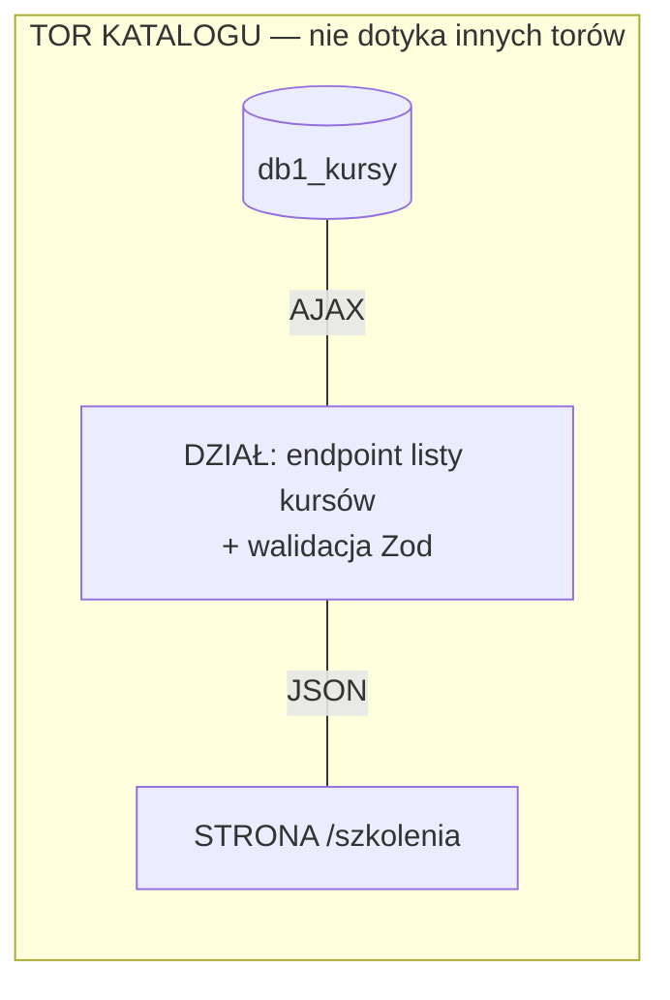
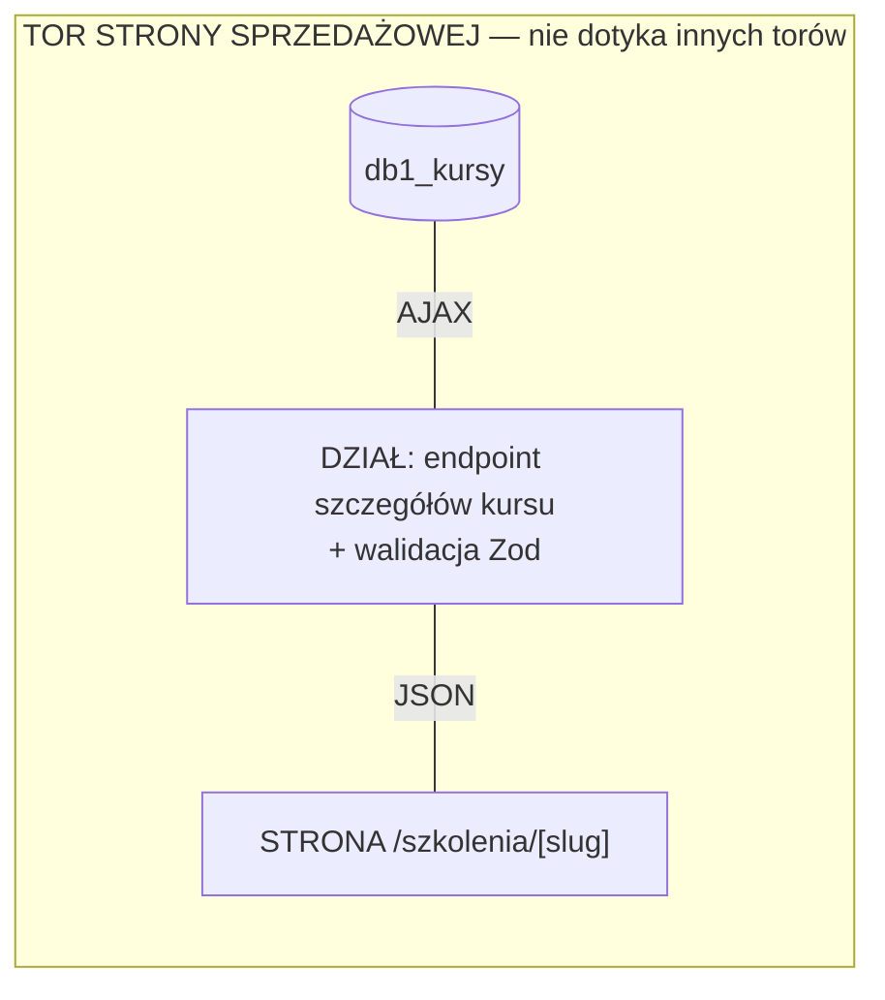
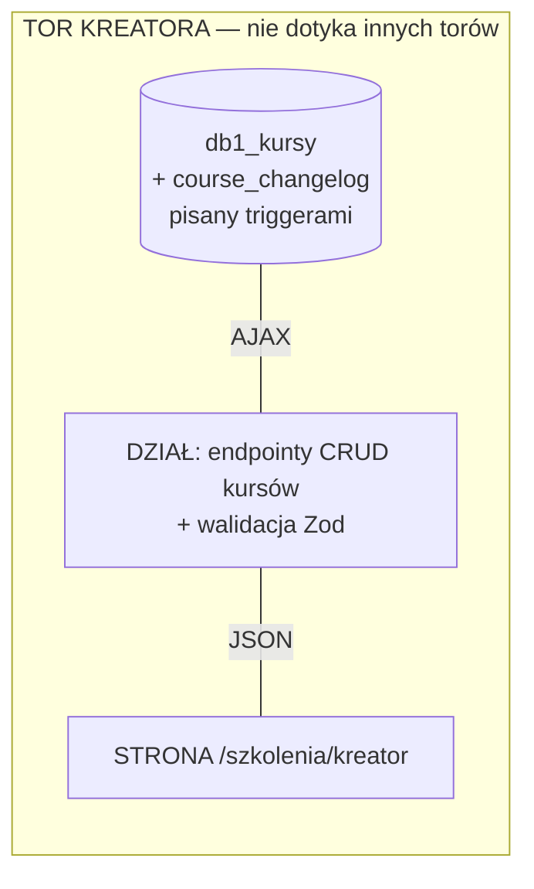
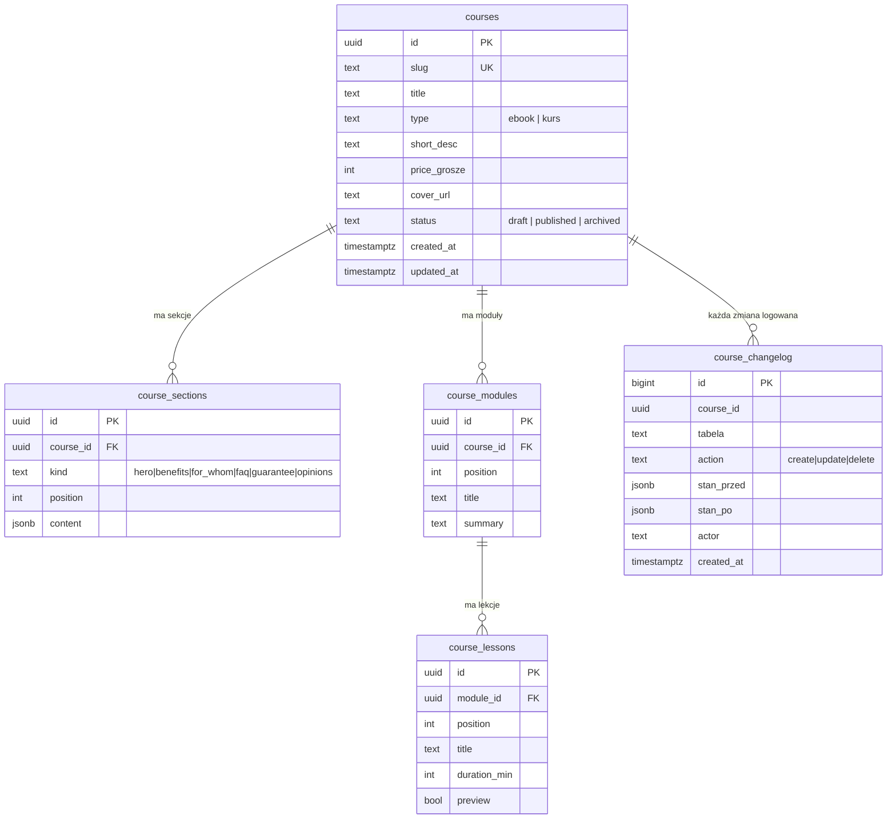

# Plugin 1 — Sklep z kursami: diagram działów, przepływu danych i bramek jakości

Wersja do oceny przez właściciela. Zasady z [WYTYCZNE.md](../WYTYCZNE.md)
obowiązują w całości; konwencja przepływu danych przejęta z projektu
egzaminacyjnego mp-offer-automation-suite: **dane zawsze idą
BAZA → DZIAŁ → STRONA** — strona nigdy nie sięga do bazy bezpośrednio.

---

## 1. Podział na działy i kolejność budowy

Każdy dział kończy się **bramką jakości (B)** — dopóki bramka nie jest
zielona, następny dział nie startuje. Po każdym dziale: PR → CI → merge
(workflow Weryfikacja-PR), po działach oznaczonych 🏷 — tag + release.

```mermaid
flowchart TB
    subgraph D1["DZIAŁ 1 — Fundament aplikacji"]
        d1[Szkielet Next.js 16 + TS + Tailwind 4<br/>design przejęty z matthewplugins.pl<br/>layout podstrony /szkolenia]
    end
    B1{{"B1: build przechodzi, strona startuje na localhost,<br/>wygląd zgodny ze stroną główną — OCENA WŁAŚCICIELA"}}

    subgraph D2["DZIAŁ 2 — Baza db1_kursy"]
        d2[PostgreSQL w Dockerze<br/>migracje SQL: courses, course_sections,<br/>course_modules, course_lessons, course_changelog<br/>TRIGGERY audytu na INSERT/UPDATE/DELETE]
    end
    B2{{"B2: migracje wstają od zera, triggery logują<br/>każdą operację — test dowodzi, goldeny schematu"}}

    subgraph D3["DZIAŁ 3 — API kursów (warstwa DZIAŁ)"]
        d3[endpointy odczytu: lista + szczegóły kursu<br/>endpointy kreatora: CRUD + publikacja<br/>walidacja Zod na każdej granicy]
    end
    B3{{"B3: testy API zielone, goldeny odpowiedzi JSON,<br/>audyt CRUD widoczny w course_changelog"}}

    subgraph D4["DZIAŁ 4 — Katalog /szkolenia"]
        d4[siatka kart kursów<br/>okładka, tytuł, opis, cena, badge typu, CTA]
    end
    B4{{"B4: strona renderuje kursy Z BAZY przez API,<br/>golden HTML, smoke test — OCENA WŁAŚCICIELA na localhost"}}

    subgraph D5["DZIAŁ 5 — Strona sprzedażowa /szkolenia/[slug]"]
        d5[hero → korzyści → program modułów<br/>→ dla kogo → opinie → cena+CTA → gwarancja → FAQ<br/>wzór: claudedlafirm.pl/#poznaj]
    end
    B5{{"B5: pełna strona z bazy, golden HTML,<br/>smoke test — OCENA WŁAŚCICIELA na localhost"}}

    subgraph D6["DZIAŁ 6 — Kreator kursów"]
        d6[lista kursów + formularz tworzenia/edycji<br/>moduły, lekcje, sekcje sprzedażowe, okładka<br/>dostęp tymczasowo tokenem — pełny auth da Plugin 3]
    end
    B6{{"B6: dodanie/edycja/usunięcie/publikacja działa end-to-end,<br/>każda operacja zostawia ślad w changelogu"}}

    subgraph D7["DZIAŁ 7 — Treść i domknięcie"]
        d7[2 kursy właściciela wprowadzone kreatorem<br/>przegląd końcowy: agent-recenzent + KRYTYK]
    end
    B7{{"B7 KOŃCOWA: wszystkie strażnicy + goldeny + testy zielone,<br/>przegląd pary agent+krytyk, AKCEPTACJA WŁAŚCICIELA"}}

    D1 --> B1 --> D2 --> B2 --> D3 --> B3 --> D4 --> B4 --> D5 --> B5 --> D6 --> B6 --> D7 --> B7
    B7 --> R["🏷 release: Plugin 1 gotowy<br/>merge plugin-1-sklep-kursow → main"]
```

🏷 Release'y pośrednie: po B2 (baza działa) i po B5 (sklep widoczny) —
większe kroki wg CONTRIBUTING.

## 2. Przepływ danych — każdy dział ma WŁASNY TOR (poprawka właściciela)

Jak w mp-offer-automation-suite: dane idą **BAZA —AJAX→ DZIAŁ —JSON→
STRONA**, a każdy dział ma swój **osobny tor** i nie dotyka torów innych
działów. Nie ma jednego wspólnego kanału z bazy do wszystkich — baza
rozmawia z KAŻDYM działem osobno, dział oddaje JSON tylko SWOJEJ stronie.

Twarde zasady torów:
- **strona nigdy nie rozmawia z bazą** — zawsze przez swój dział;
- **tor nie przecina toru** — endpoint katalogu nie obsługuje kreatora,
  strona kreatora nie woła endpointu katalogu; awaria/zmiana jednego toru
  nie rusza pozostałych;
- dostęp do SQL ma wyłącznie katalog `modules/m1-sklep/db/`; przypilnuje
  tego **straznik-granic** (powstanie w Dziale 1);
- `course_changelog` piszą triggery PostgreSQL — kod aplikacji nie umie go
  ominąć ani sfałszować;
- przyszłe moduły (2, 3) rozmawiają z modułem 1 przez jego API,
  nigdy przez jego tabele.

## 3. Baza db1_kursy — schemat

Wymaganie właściciela „zapis kursów do bazy nawet przy dodawaniu, usuwaniu
i modyfikowaniu" realizują triggery na WSZYSTKICH czterech tabelach treści —
changelog zapisuje stan przed i po, więc działa też jako kopia do
odtworzenia (współgra z procedurą `.bak` z WYTYCZNE §1).

## 4. Bramki jakości — z czego się składają

Każda bramka B1–B7 to ten sam zestaw, rosnący z projektem:

| Warstwa | Narzędzie | Kiedy |
|---|---|---|
| Strażnicy (`tools/straznicy/`) | auto-wykrywani przez runner | pre-commit + CI, każda bramka |
| Testy działu | `node --test` / testy API | CI, od Działu 2 |
| Goldeny | wzorcowe JSON-y API i HTML stron | CI, od Działu 3; naprawa nie może ich zmienić poza miejscem naprawianym (WYTYCZNE §5) |
| Statusy GitHuba | checks na PR — czerwone = stop | każdy PR (WYTYCZNE §2) |
| Ocena właściciela | localhost — wygląd i działanie | B1, B4, B5, B7 |
| Agent + KRYTYK | przegląd kodu przed zamknięciem pluginu | tylko B7 (zgodnie z ustaleniem: agenci to bramki, nie stała obsada) |

Nowi strażnicy planowani w tym pluginie: `straznik-granic` (strony nie
importują klienta bazy), `straznik-migracji` (migracje numerowane, bez dziur,
niemodyfikowane po fakcie), `straznik-ci` (gdy wejdzie package.json — kroki
lint/tsc/test/build podpięte w CI).

## 5. Dokumentacja techniczna per dział (WYTYCZNE N2)

Przed startem każdego działu pobieramy oryginalną dokumentację do
`docs/dokumentacja-techniczna/<dzial>/` (z plikiem ZRODLA.md: URL, data, wersja):

| Dział | Dokumentacja do pobrania |
|---|---|
| D1 | Next.js App Router (routing, layouts), Tailwind 4 |
| D2 | PostgreSQL: CREATE TRIGGER, plpgsql, JSONB; node-postgres (pg) |
| D3 | Next.js Route Handlers, Zod |
| D4–D5 | Next.js: fetch/cache/rewalidacja danych |
| D6 | Next.js Server Actions / formularze, upload plików |
| D7 | — (przegląd, bez nowej dokumentacji) |

## 6. Localhost do oceny

- **Strona główna matthewplugins.pl** — uruchamiana lokalnie z klonu
  (`npm run dev`, port 3000) jako punkt odniesienia wyglądu. Repo pozostaje
  tylko do odczytu.
- **Plugin 1** — własny serwer dev (port 3001) od Działu 1; po Dziale 4
  każda bramka „ocena właściciela" odbywa się na localhost.
