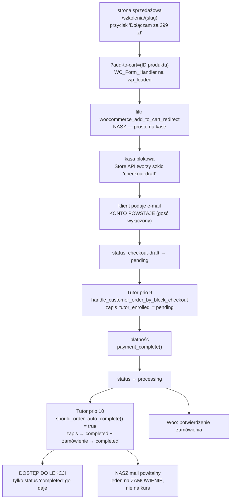
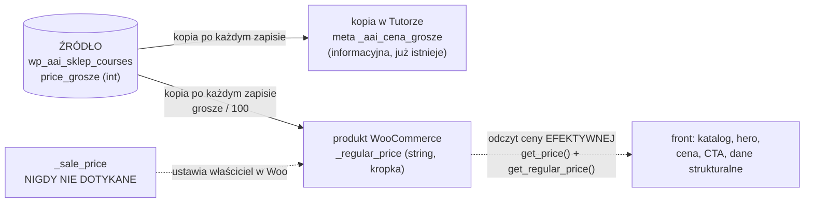
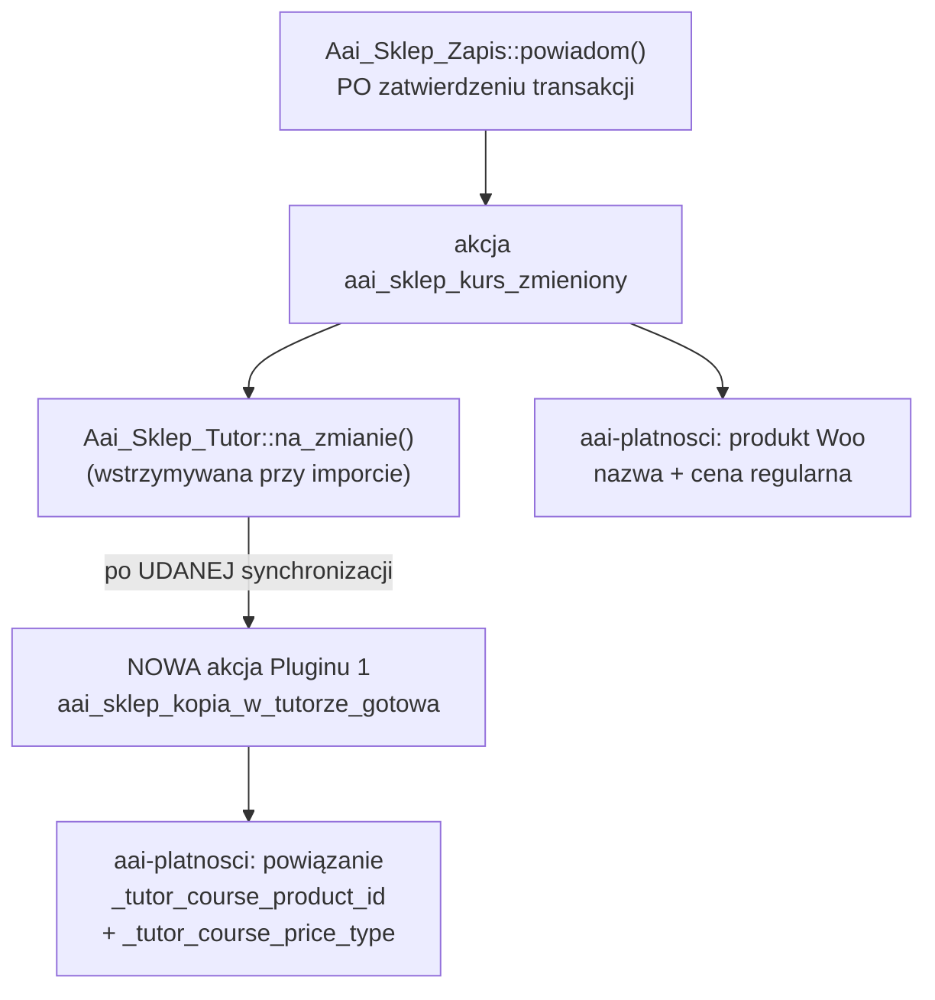

# Plugin 2 — Płatności: diagram szwu, przepływu zakupu i bramek jakości

**Status: SCHEMAT (krok P0). Przed kodem.** Ten dokument powstaje przed
implementacją, zgodnie z Zasadą 0 właściciela (2026-08-26): najpierw schemat,
potem jego krytyka, dopiero po akceptacji kod.

Rodzeństwo tego pliku: [docs/plugin-1/DIAGRAM.md](../plugin-1/DIAGRAM.md)
(działy D1–D7 prototypu) i [docs/ETAP-WP.md](../ETAP-WP.md) (decyzje etapu WP).
Zakres i osiem decyzji właściciela z 2026-08-26 — w ETAP-WP.md, sekcja
„Plugin 2".

## 0. Skąd pochodzą fakty w tym dokumencie

Wszystkie liczby, nazwy haków, kluczy meta i kolejności pochodzą z **czytania
zainstalowanego kodu**, nie z dokumentacji: Tutor LMS **4.0.7**, WooCommerce
**11.0.1**, `tutor()->has_pro === false`, sprawdzone w kontenerze `aai_wp_wordpress`
(instalacja `:8892`). Dokumentacja Tutora rozjeżdża się z kodem w trzech
miejscach i **prawdą jest kod**:

| Dokumentacja mówi | Kod 4.0.7 |
|---|---|
| jest opcja „Generate WooCommerce Order" | **nie istnieje** (zero trafień w całym `tutor/`) |
| „Auto Redirect wymaga włączonego auto-complete" | kod tego nie wymusza, to zależność praktyczna |
| lista silników: Native, WooCommerce, Subscriptions, EDD, PMPro, RCP | w darmowej wersji realnie: `free`, `tutor`, `wc` (i `wc` tylko gdy Woo aktywne) |

**Czego NIE sprawdzono:** ani jedna prawdziwa płatność nie przeszła —
`wp_wc_orders` ma 0 wierszy, żadna bramka nie jest skonfigurowana. Łańcuch
z sekcji 2 jest odtworzony z kodu i **musi zostać potwierdzony przebiegiem**
(bramka kroku P3).

## 1. Granica: co jest nasze, a co cudze

**Plugin 2 nie jest sklepem. Jest szwem.** Własnej kasy, koszyka ani bramki
płatniczej nie piszemy — to decyzja właściciela z 2026-08-25, a jej powodem
jest zarówno dublowanie gotowego kodu, jak i zgodność z przepisami o obsłudze
płatności.

| Obszar | Kto | Dowód, że tamten to umie |
|---|---|---|
| katalog, strony sprzedażowe, kreator, treść lekcji | **`aai-sklep` (Plugin 1)** | zrobione, W1–W6, `v0.45.0` |
| koszyk, kasa, płatności, faktury, waluta, podatki, kupony, promocje | **WooCommerce** | strony blokowe `wp:woocommerce/cart` i `wp:woocommerce/checkout`, HPOS włączone |
| konta, dostęp do materiału za logowaniem, postęp, zapis na kurs po opłacie, odebranie dostępu przy zwrocie | **Tutor LMS** | `classes/WooCommerce.php` — pełny łańcuch od pozycji zamówienia do statusu zapisu |
| **produkt Woo z naszej ceny** | **`aai-platnosci` (Plugin 2)** | — |
| **powiązanie produktu z kopią kursu w Tutorze** | **`aai-platnosci`** | Tutor Pro robi to sam; w darmowym **nie robi tego nikt** |
| **CTA, cena na froncie, `PreOrder → InStock`** | **`aai-platnosci`** (przez filtry Pluginu 1) | — |
| **mail powitalny „Ustaw hasło i wejdź"** | **`aai-platnosci`** | — |
| **kontrola rozjazdu trzech kopii ceny** | **`aai-platnosci`** | — |

Nazwa wtyczki: **`aai-platnosci`**, katalog `wordpress/wtyczki/aai-platnosci/`.

## 2. Przepływ zakupu — od kliknięcia do lekcji

Instalacja ma **kasę blokową**, a to zmienia łańcuch: Store API najpierw robi
zamówienie-szkic `checkout-draft`, więc Tutor zapisuje kursanta nie przy
dodaniu pozycji, tylko przy PIERWSZEJ zmianie statusu (priorytet 9).

**Trzy miejsca, w których ten łańcuch się rwie, gdyby zostawić domyślne
ustawienia:**

1. **Produkt wirtualny, ale nie „do pobrania", NIE domyka zamówienia.**
   `WC_Order::needs_processing()` uznaje pozycję za niewymagającą obsługi
   tylko gdy `is_downloadable() && is_virtual()`. Tutor ustawia wyłącznie
   `_virtual`. Czyli `payment_complete()` daje **`processing`**, a dostęp do
   lekcji daje **wyłącznie `completed`**. **Klient płaci i nie dostaje kursu.**
   Odpowiedź projektu: włączamy `tutor_woocommerce_order_auto_complete`
   i **pilnujemy tego asercją**, bo to jedno ustawienie stoi między zapłatą
   a dostępem.
2. **Konto się nie zakłada.** Przy włączonym zakupie gościa i wyłączonej
   rejestracji w kasie Store API nigdy nie tworzy użytkownika — a bez konta
   nie ma dostępu do materiału. Odpowiedź: **wyłączamy zakup gościa**, przez co
   `is_registration_required()` staje się prawdziwe i konto powstaje zawsze.
3. **Dwa linki do ustawienia hasła zabijają się nawzajem.** Każde nowe
   `get_password_reset_key()` nadpisuje `user_activation_key`, więc poprzedni
   link umiera. Gdyby Woo wysłał swój mail „nowe konto" z linkiem, a my swój,
   jeden z nich byłby martwy. Odpowiedź: **mail `customer_new_account` Woo
   wyłączamy**; jedyny link niesie nasz mail powitalny.

**Ścieżka testowa (krok P3) różni się od produkcyjnej i to jest świadome.**
`should_order_auto_complete()` wyklucza `cod`, `cheque` i `bacs` — czyli
płatności ręczne, przy których pieniędzy jeszcze nie ma. Nasza metoda testowa
to przelew bankowy (`bacs`), więc zamówienie zatrzyma się na `on-hold`,
a przejście na `completed` zrobimy ręcznie albo programowo — i to jest
**dokładnie ta sama zmiana statusu**, którą wywoła prawdziwa bramka. Smoke ma
przejść **obie** ścieżki: `bacs → on-hold → completed` oraz
`processing → auto-complete → completed`.

## 3. Cena: jedno źródło, trzy kopie

Decyzja właściciela z 2026-08-26: źródłem jest `courses.price_grosze` w naszej
tabeli, do Woo jedzie **cena regularna**, jednokierunkowo, **pola ceny
promocyjnej nie dotykamy nigdy**.

Zasady, z których każda staje się niezmiennikiem w sekcji 7:

- kopia jedzie **po każdym udanym zapisie kursu**, nie „przy publikacji" —
  inaczej zostaje okno rozjazdu (ta sama decyzja co przy kopii do Tutora);
- zapis kursu **bez zmian też wysyła kopię**, dzięki czemu ponowne kliknięcie
  „Zapisz kurs" **naprawia** rozjazd zamiast go potwierdzać;
- **cena regularna zmieniona ręcznie w Woo wróci do naszej przy następnym
  zapisie kursu** — świadomy koszt decyzji, do napisania wprost przy polu ceny
  w kreatorze (Plugin 1, krok P3);
- grosze dzielimy **sami**: Woo trzyma cenę jako string z kropką i przy
  `wc_format_decimal($cena)` bez drugiego parametru **nie robi żadnego
  przeliczenia** — `29999` zapisałoby się jako `29999`, nie `299.99`;
- do porównania „czy się rozjechało" używamy `get_regular_price('edit')`,
  bo `'view'` przechodzi przez cudze filtry;
- **podniesienie ceny regularnej powyżej promocyjnej po cichu kasuje promocję**
  (robi to sam data store Woo). To nie jest nasza operacja, ale nasza kopia
  może ją wywołać — kontrola ma o tym mówić, zamiast udawać, że nic nie zaszło.

## 4. Kiedy jedzie kopia — i dlaczego kolejność jest problemem

Warstwa zapisu Pluginu 1 ogłasza `aai_sklep_kurs_zmieniony` **po zatwierdzeniu
transakcji** i **także przy „bez zmian"**. To dobre wejście dla nas — ale jest
pułapka kolejności:

**`Aai_Sklep_Import` wstrzymuje TYLKO kopię do Tutora** (`Aai_Sklep_Tutor::wstrzymaj()`),
a akcja leci do wszystkich pozostałych słuchaczy normalnie. Podczas importu
masowego dostalibyśmy więc sygnał o kursie, **którego kopii w Tutorze jeszcze
nie ma** — a to na jej wpisie siedzi `_tutor_course_product_id`.

**Rozdzielamy dwie rzeczy, bo mają różne warunki:** produkt Woo można zrobić
zawsze (nie zależy od Tutora), a powiązanie wymaga istniejącego wpisu kursu
w Tutorze. Gdy Tutora nie ma albo jego kopia padła, produkt istnieje,
powiązania nie ma, a **kontrola rozjazdu mówi o tym wprost** — zamiast
zostawiać stan, w którym kurs wygląda na sprzedawalny i nie jest.

Wymagana zmiana w Pluginie 1: jedno `do_action` w `Aai_Sklep_Tutor::synchronizuj_kurs()`
po udanym przebiegu. Zgodne z zasadą, którą ta klasa już wyznaje — warstwa
zapisu nie wie, kto na jej zmiany czeka.

## 5. Ustawienia jako KOD, nie jako klikanie

Wszystkie poniższe wartości ustawia i **sprawdza** wtyczka. Powód jest z tego
projektu: środowisko, którego nikt nie umie odtworzyć, jest dowodem
jednorazowym (to samo zdanie stoi w nagłówku `postaw.sh`).

| Ustawienie | Klucz | Wartość docelowa | Dlaczego |
|---|---|---|---|
| silnik sprzedaży Tutora | `tutor_option['monetize_by']` | `wc` | dziś `tutor` — natywna kasa Tutora, której nie używamy |
| automatyczne domykanie zamówień | `tutor_option['tutor_woocommerce_order_auto_complete']` | włączone | **bez tego klient płaci i nie ma dostępu** (sekcja 2, punkt 1) |
| tryb gościa Tutora | `tutor_option['enable_guest_course_cart']` | wyłączone | kurs jest za logowaniem; gość i tak musiałby założyć konto |
| zakup gościa w Woo | `woocommerce_enable_guest_checkout` | `no` | wymusza założenie konta, bez którego nie ma dostępu |
| generowanie hasła | `woocommerce_registration_generate_password` | `yes` (już jest) | klient nie wymyśla hasła — decyzja właściciela |
| mail „nowe konto" Woo | wyłączony | — | jedyny link do hasła ma iść naszym mailem (sekcja 2, punkt 3) |
| przekierowanie po dodaniu do koszyka | filtr, nie opcja | na kasę | „prosto do kasy" — decyzja właściciela |

**Przestawienie silnika na `wc` wyłącza natywną warstwę handlową Tutora**
w całości: `CartController`, `CheckoutController`, `OrderController`,
`CouponController`, `PaymentHandler` i sąsiednie nie są nawet
instancjonowane. Skutek widoczny dla człowieka: **strony koszyka i kasy
Tutora (ID 151 i 152) zostają jako puste strony WP.** Do rozstrzygnięcia
w P3: skasować je czy przekierować. `/dashboard/` **nie** jest tym dotknięte
— i tak przekierowujemy je na `/szkolenia/moje/` od W6.

Dodatkowo: **deaktywacja WooCommerce sama cofa `monetize_by` na `free`**.
Nasza asercja musi to widzieć i mówić o tym, zamiast po cichu przywracać.

## 6. Nasze klucze — kontrakt danych

| Klucz | Siedzi na | Znaczenie |
|---|---|---|
| `_aai_zrodlo_uuid` | produkcie Woo | nasz identyfikator kursu; **dopasowanie po nim, nigdy po slugu ani tytule** (ta sama decyzja co przy kopii do Tutora) |
| `_aai_platnosci_mail_wyslany` | zamówieniu | znacznik idempotencji maila powitalnego |
| `aai_platnosci_blad` | opcja WP | ostatnia nieudana kopia — na ekran kreatora, jak przy Tutorze |

Kluczy Tutora **nie wymyślamy**, tylko ustawiamy jego własne:
`_tutor_course_product_id` i `_tutor_course_price_type = 'paid'` na wpisie
kursu, `_tutor_product = 'yes'` i `_virtual = 'yes'` na produkcie.

**Kurs jest sprzedawalny wtedy i tylko wtedy, gdy prawdziwe są OBIE rzeczy
naraz**: `_tutor_course_price_type === 'paid'` **oraz** niepuste
`_tutor_course_product_id`. Jedno bez drugiego daje kurs, który wygląda na
płatny i nie da się go kupić.

### 6.1. Stany kursu a produkt — i dlaczego produktu nie kasujemy

Usunięcie kursu **nie kasuje produktu** po stronie Tutora ani Woo — produkt
zostaje sierotą w sklepie (sprawdzone: `CourseModel::delete_course_data()` nie
ma ani jednego odwołania do produktu). Reakcja musi więc być nasza.

| Stan kursu u nas | Produkt Woo | Dlaczego tak |
|---|---|---|
| `published`, cena > 0 | `publish`, cena regularna z naszej | jedyny stan, w którym da się kupić |
| `published`, cena = 0 | **brak produktu**, `price_type = free` | nie ma czego sprzedawać; kurs zostaje dostępny |
| `draft` (szkic) | **brak produktu** | szkicu nie sprzedajemy; produkt-szkic zaśmiecałby sklep |
| `archived` | produkt → `draft` | znika ze sklepu, **zostaje w historii zamówień** |
| kurs usunięty | produkt → `draft`, **nigdy skasowany** | skasowanie produktu, który ktoś kupił, psuje historię zamówień, faktury i wpisy zarobkowe; sprzątanie sklepu nie może niszczyć dowodów sprzedaży |

**Produktu nie kasujemy nigdy — nawet gdy nikt go nie kupił.** Rozróżnianie
„kupiony / niekupiony" znaczyłoby, że to samo działanie właściciela ma dwa
różne skutki w zależności od stanu, którego nie widzi na ekranie. Kontrola
rozjazdu raportuje produkty bez kursu jako **osierocone** i to wystarczy.

## 7. Niezmienniki — to, czego pilnują strażniki i smoke'i

Każdy z nich ma być sprawdzalny **skryptem**, nie oceną. To one, a nie agenci,
będą pilnować tego modułu codziennie.

1. Nikt poza `aai-platnosci` nie pisze do produktu WooCommerce powiązanego
   z kursem.
2. Kopia ceny jest **jednokierunkowa**: nigdzie w kodzie nie ma odczytu ceny
   z Woo do naszej tabeli.
3. `_sale_price` nie występuje w kodzie zapisu **w żadnej formie**.
4. Cena jedzie przez dzielenie przez 100 i zapis z kropką — nigdy surowe
   grosze.
5. Dopasowanie produktu do kursu idzie **wyłącznie** po `_aai_zrodlo_uuid`.
6. Po każdym `$product->save()` znacznik `_tutor_product` jest ustawiany
   **ponownie** (patrz sekcja 10, pułapka 2).
7. Mail powitalny wychodzi **najwyżej raz na zamówienie** — chroni go znacznik
   na zamówieniu, a nie założenie, że hak wykona się raz.
8. Mail powitalny **nie zawiera hasła** w żadnej postaci.
9. Kurs opublikowany z ceną większą od zera ma produkt, powiązanie
   i `price_type = paid`; kontrola kończy się **kodem wyjścia 1** przy
   jakimkolwiek rozjeździe.
10. Ustawienia z sekcji 5 mają wartości docelowe; rozjazd = kod wyjścia 1.
11. Żadna nowa podstrona sklepu nie ma własnego `add_rewrite_rule` — wchodzi
    przez `Aai_Sklep_Trasy::PODSTRONY` (BLAD-021).
12. `Aai_Sklep_Widok::adres_zakupu()` nie jest używane do niczego innego niż
    zakup (patrz sekcja 9).
13. W kodzie nie ma **żadnego** kasowania produktu WooCommerce (sekcja 6.1).

## 8. AJAX: jedna operacja, jeden kontrakt

**Na ścieżce klienta Plugin 2 nie wprowadza ani jednego własnego AJAX-a.**
Dodanie do koszyka, kasa i płatność to gotowe kanały WooCommerce; dokładanie
naszego byłoby dublowaniem cudzej odpowiedzialności.

W kokpicie powstaje **jeden** — i tylko jeden:

| | |
|---|---|
| **cel** | naprawa rozjazdu JEDNEGO kursu (produkt + powiązanie + cena) |
| **wejście** | `id` kursu (uuid) + nonce |
| **wyjście** | JSON: co zrobione, co bez zmian, co się nie udało |
| **odpowiedzialność** | wyłącznie synchronizacja jednego kursu — nie zapisuje treści, nie zmienia ustawień, nie dotyka zamówień |
| **walidacja** | uuid musi istnieć w naszych tabelach; nieznany = odmowa, nie „utwórz" |
| **autoryzacja** | `manage_options` + nonce, jak w kreatorze W4 |
| **błędy** | komunikat ogólny na zewnątrz, szczegół do dziennika i opcji błędu |
| **skutki w bazie** | zero zapisów w NASZYCH tabelach; zmiany wyłącznie w `wp_posts`/`wp_postmeta` produktu i kursu Tutora |

Operacji zbiorczej („napraw wszystko") **nie robimy jako AJAX** — od tego jest
komenda WP-CLI, która ma czas i kod wyjścia.

## 9. Zmiany wymagane w Pluginie 1

Trzy, każda minimalna i każda z powodem, którego nie da się obejść w Pluginie 2.

**9.1. Rozdzielenie `adres_zakupu()` i `adres_kontaktu()`.** Dziś jedna metoda
obsługuje dwie różne intencje: przycisk „Dołączam za 299 zł"
(`Aai_Sklep_Widok::cta()`) **oraz** „Napisz do nas" w sekcji FAQ
(`szablony/sekcje/faq.php:36`). Dopóki oba prowadzą na `/kontakt`, nikt tego
nie widzi. W chwili przełączenia na koszyk **„Napisz do nas" zaczęłoby wrzucać
kurs do koszyka** — zero objawów, strona 200, zepsuty sens. To ta sama klasa
co BLAD-021.

**9.2. Filtry zamiast wartości wpisanych na sztywno.** Plugin 1 nie może
zależeć od Pluginu 2, więc to Plugin 1 wystawia punkty zaczepienia, a Plugin 2
je podpina: adres zakupu, **cena wyświetlana** (regularna + efektywna) oraz
dostępność w danych strukturalnych (`PreOrder` → `InStock`). Bez Pluginu 2
wszystko zostaje jak dziś.

Cena jest na froncie w **czterech** miejscach, nie w jednym: karta katalogu,
hero, `czesci/cena.php` i sam przycisk CTA — plus dane strukturalne. Decyzja
o pokazywaniu ceny promocyjnej dotyczy więc **także katalogu**.

**9.3. Akcja po udanej kopii do Tutora** (sekcja 4).

## 10. Pułapki w cudzym kodzie i odpowiedź projektu

| # | Pułapka | Odpowiedź projektu |
|---|---|---|
| 1 | produkt wirtualny nie domyka zamówienia → brak dostępu mimo zapłaty | włączone auto-complete + **asercja** + smoke na obu ścieżkach |
| 2 | **każdy programowy `$product->save()` kasuje `_tutor_product`**, bo `save_post_product` czyta `$_POST` | ustawiamy znacznik **po** zapisie; niezmiennik 6 |
| 3 | **Tutor Pro nadpisałby naszą cenę** (regularną i promocyjną) przy każdym zapisie kursu | jednokierunkowość ceny zależy od braku Pro — **kontrola ma to sprawdzać i mówić**, a nie zakładać |
| 4 | `mark_order_complete()` woła zmianę statusu **wewnątrz** obsługi zmiany statusu → nasz hak wykona się dwa razy (a przy dwóch kursach — cztery) | idempotencja przez znacznik na zamówieniu; niezmiennik 7 |
| 5 | `do_enroll()` nie widzi zapisów `pending`, więc ponowna próba zakupu tworzy **drugi wiersz** zapisu | nie tworzymy zapisów sami; kontrola raportuje duplikaty zamiast je mnożyć |
| 6 | `is_enrolled()` ma pamięć na czas żądania i nikt jej nie unieważnia — w tym samym żądaniu mówi „nie" | dostęp weryfikujemy **osobnym żądaniem** (ta sama pułapka co w W6) |
| 7 | **zwrot CZĘŚCIOWY nie odbiera dostępu** (Tutor nie ma haka refundowego dla ścieżki Woo) | zapisane wprost jako zachowanie, nie usterka; do decyzji właściciela przy prawdziwej bramce |
| 8 | `_tutor_wc_guest_customer_id` jest zapisywane **na poście kursu** pojedynczą wartością — drugi gość nadpisuje pierwszego | tryb gościa wyłączony, więc ta ścieżka jest martwa; asercja tego pilnuje |
| 9 | nowy klucz hasła unieważnia poprzedni link | wyłączony mail „nowe konto" Woo; jedyny link w naszym mailu |
| 10 | `tutor_update_product_url()` zwraca `null` dla produktu spoza Tutora → psuje link w koszyku każdemu innemu produktowi | odnotowane; dziś sklep sprzedaje wyłącznie kursy, ale to **nie jest** nasza gwarancja na zawsze |
| 11 | zero transakcji w całym łańcuchu Tutora; przerwane żądanie zostawia stan pośredni | kontrola rozjazdu jest jedyną odpowiedzią, jaką mamy na cudzy kod — i dlatego ma kod wyjścia 1 |

## 11. Co zostaje otwarte świadomie

| Rzecz | Dlaczego teraz nie | Bramka |
|---|---|---|
| prawdziwa bramka płatności, faktury, VAT | wymaga danych firmy i umowy z operatorem | osobny krok po P6 |
| regulamin + zgoda na natychmiastowe dostarczenie treści cyfrowej | decyzja właściciela 2026-08-26 | **przed pierwszym prawdziwym klientem**, nie po nim |
| zobowiązania handlowe stron sprzedażowych (gwarancja 30 dni, dostęp bez limitu, aktualizacje bez dopłat) | należą do właściciela, nie do kodu | przy uruchomieniu sprzedaży |
| zwrot częściowy nie odbiera dostępu | cudzy kod, brak haka | do decyzji przy bramce |
| przypięcie wersji Tutora | dostęp klienta stoi na cudzym kodzie | propozycja w P1 |

## 12. Kroki i bramki dowodowe

| Krok | Zakres | Dowód, że zrobione |
|---|---|---|
| **P0** | ten schemat | krytyk + akceptacja właściciela |
| **P1** | fundament wtyczki, zależności, strażnik | strażnik + mutacje; wyłączenie Woo/Tutora daje komunikat, nie biały ekran |
| **P2** | produkt z ceny, powiązanie, kontrola rozjazdu | import ×3 → `0/0/N bez zmian`; kontrola z kodem 1 na celowo zepsutej cenie |
| **P3** | ustawienia jako kod, adresy PL, CTA, `InStock`, wygląd koszyka i kasy | smoke frontu + motywu; **przebieg zakupu obiema ścieżkami** |
| **P4** | konto przy zakupie, mail powitalny | mail przechwycony w teście: jeden na zamówienie, link żyje, hasła nie ma |
| **P5** | zwroty i przypadki brzegowe | smoke na każdym przypadku z sekcji 10 |
| **P6** | test ręczny właściciela | scenariusz w repo, konto `klient-test` |

Każdy krok: gałąź → strażnik + smoke + audyt mutacyjny → PR → **merge wyłącznie
za zgodą właściciela**.
