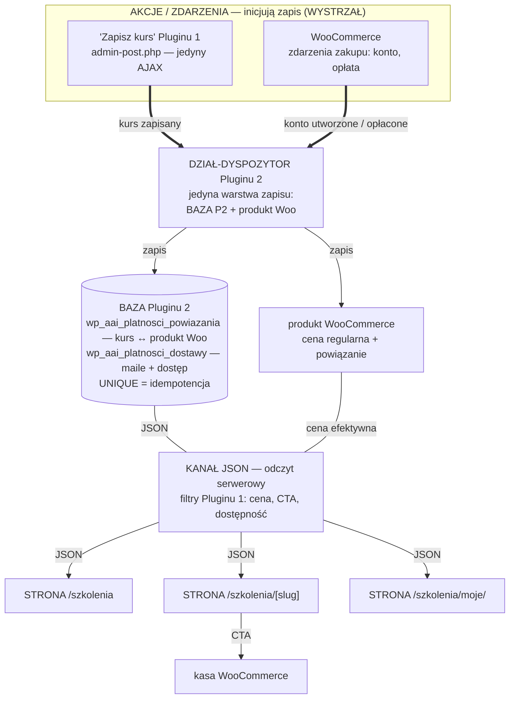
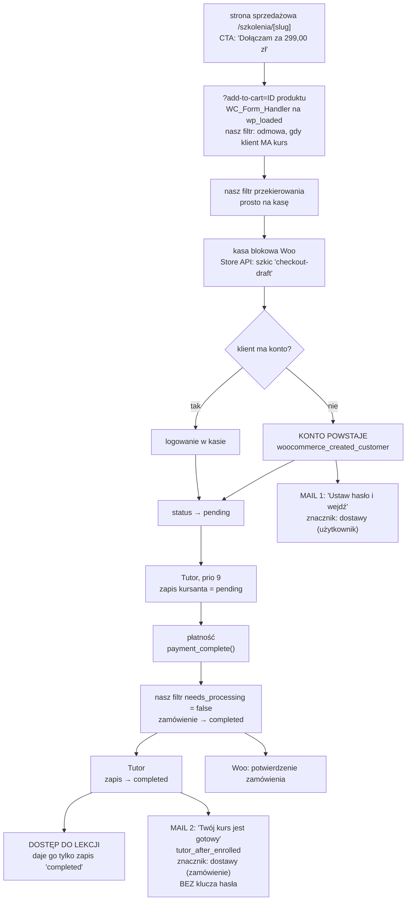
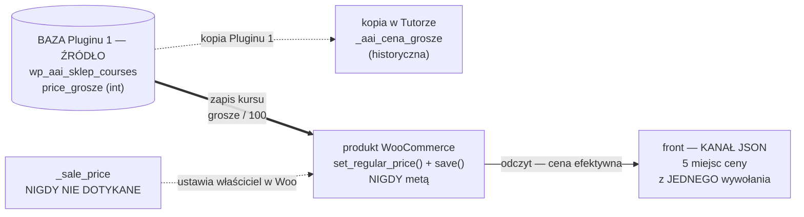
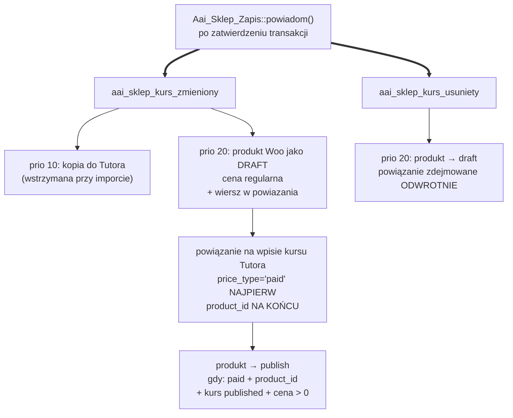

# Plugin 2 — Płatności: diagram szwu, przepływu zakupu i bramek jakości

**Status: SCHEMAT (krok P0), PO JEDNYM PRZEPISANIU wg krytyki. Przed kodem.**
Ten dokument powstał przed implementacją, zgodnie z Zasadą 0 właściciela
(2026-08-26): najpierw schemat, potem jego krytyka, dopiero po akceptacji kod.
Wersja obecna wprowadza **wszystkie 54 znaleziska trzech krytyków**
z [KRYTYKA-P0.md](KRYTYKA-P0.md) (oznaczenia K/U/L/B/P w nawiasach przy
zmienionych miejscach) oraz dwa polecenia właściciela: sekcje 1–2 opisują ten
sam projekt **w języku pluginów tego projektu** i **w języku WordPressa**,
a baza, wystrzał i kanał JSON są w diagramach nazwane wprost.

Rodzeństwo tego pliku: [docs/plugin-1/DIAGRAM.md](../plugin-1/DIAGRAM.md)
(działy D1–D7 prototypu) i [docs/ETAP-WP.md](../ETAP-WP.md) (decyzje etapu WP:
osiem decyzji o zakresie z 2026-08-26, decyzja o cenie, decyzja o tabelach
`powiazania` + `dostawy`).

## 0. Skąd pochodzą fakty w tym dokumencie

Wszystkie liczby, nazwy haków, kluczy meta i kolejności pochodzą z **czytania
zainstalowanego kodu**, nie z dokumentacji: Tutor LMS **4.0.7**, WooCommerce
**11.0.1**, `tutor()->has_pro === false`, sprawdzone w kontenerze
`aai_wp_wordpress` (instalacja `:8892`). Dokumentacja Tutora rozjeżdża się
z kodem w trzech miejscach i **prawdą jest kod**:

| Dokumentacja mówi | Kod 4.0.7 |
|---|---|
| jest opcja „Generate WooCommerce Order" | **nie istnieje** (zero trafień w całym `tutor/`) |
| „Auto Redirect wymaga włączonego auto-complete" | kod tego nie wymusza, to zależność praktyczna |
| lista silników: Native, WooCommerce, Subscriptions, EDD, PMPro, RCP | w darmowej wersji realnie: `free`, `tutor`, `wc` (i `wc` tylko gdy Woo aktywne) |

**Czego NIE sprawdzono:** ani jedna prawdziwa płatność nie przeszła —
`wp_wc_orders` ma 0 wierszy, żadna bramka nie jest skonfigurowana. Łańcuch
z sekcji 4 jest odtworzony z kodu i **musi zostać potwierdzony przebiegiem**
(bramka kroku P3b).

**Ten dokument stoi na internals dwóch cudzych wtyczek** *(L17)*. Odpowiedzią
nie jest samo „przypięcie wersji" (nie wykrywa aktualizacji z kokpitu), tylko
kontrola: `wp aai-platnosci sprawdz` **porównuje wersje Tutora I WooCommerce**
z tymi, na których dowiedziono łańcuch (4.0.7 / 11.0.1), a przy różnicy kończy
się kodem **0 z ostrzeżeniem** (aktualizacja to nie awaria) i wypisuje trzy
fakty do ponownego potwierdzenia:

1. łańcuch domknięcia zamówienia (`needs_processing` → `completed`, sekcja 5);
2. kolejność pary `_tutor_course_price_type` / `_tutor_course_product_id`
   w `do_enroll()` (sekcja 7, B2);
3. para opcji kasy: zakup gościa + rejestracja z kasy (sekcja 8, B1).

## 1. Schemat w języku pluginów tego projektu (WYTYCZNE §8)

Ten sam szkielet co w Pluginie 1: **BAZA → DZIAŁ → strony**, z JEDNYM
wystrzałem (kanał akcji) i kanałem JSON (odczyt serwerowy) obok.

Górna połowa diagramu to **ZAPIS** (akcje → dyspozytor → baza), dolna to
**ODCZYT** (baza → kanał JSON → strony) — te dwie ścieżki się nie mieszają.

Jak to się ma do WYTYCZNE §8, punkt po punkcie:

- **BAZA** Pluginu 2 to **dwie tabele: `powiazania` + `dostawy`** — bez
  klientów, zamówień i płatności, bo te ma WooCommerce (decyzja właściciela
  2026-08-26, uzasadnienie w PLAN.md §3 i ETAP-WP.md). `powiazania` mówi,
  który produkt Woo sprzedaje który kurs; `dostawy` mówi, czy klient
  naprawdę dostał to, za co zapłacił (mail, dostęp) — **jedyna wiedza,
  której nie ma ani Woo, ani Tutor**.
- **DZIAŁ** to warstwa szwu: jedna klasa zapisu (wzorem `Aai_Sklep_Zapis`)
  jako **jedyne** miejsce piszące do BAZY P2 i do produktu Woo.
- **WYSTRZAŁ**: Plugin 2 **nie dodaje własnego kanału akcji** — jego dział
  uruchamiają: (a) ten sam jeden AJAX Pluginu 1 (`admin-post.php`, akcja
  „Zapisz kurs"), (b) gotowe kanały zakupowe WooCommerce (koszyk, kasa,
  płatność). Zasada „jeden AJAX na plugin" jest zachowana w najmocniejszej
  postaci: **zero nowych kanałów** *(U4 — ROZSTRZYGNIĘTE przez właściciela
  2026-08-28, sekcja 11)*.
- **KANAŁ JSON** (odczyt serwerowy): dział czyta bazę przy renderowaniu
  i oddaje stronom gotowe dane — u nas to cena wyświetlana, stan CTA
  i dostępność w danych strukturalnych, podawane Pluginowi 1 filtrami.
  Strona nigdy nie dotyka bazy — tak samo jak w Pluginie 1.

## 2. Ten sam schemat w języku WordPressa

| Pojęcie projektu | W WordPressie konkretnie |
|---|---|
| BAZA Pluginu 2 | dwie tabele przez `dbDelta` przy aktywacji: `wp_aai_platnosci_powiazania` (kolumny: `course_uuid` UNIQUE, `product_id` UNIQUE, `sync_ts`), `wp_aai_platnosci_dostawy` (kolumny: `zdarzenie` + identyfikator z **UNIQUE na parze** — atomowy `INSERT` rozstrzyga wyścig) |
| DZIAŁ-DYSPOZYTOR | klasa zapisu `Aai_Platnosci_Zapis` (jedyny pisarz do obu tabel i do produktu Woo — zawsze `WC_Product::set_*()` + `save()`, nigdy meta ceny) + klasa kontroli (nigdy nie pisze, L11) |
| WYSTRZAŁ (wejścia działu) | haki: `aai_sklep_kurs_zmieniony` **prio 20** (U2 — Tutor kopiuje na 10, my wchodzimy PO nim), `aai_sklep_kurs_usuniety` (L5), `woocommerce_created_customer` (mail 1, B9), `tutor_after_enrolled` (dostęp + mail 2, B7), `save_post_product` prio > 10 (przywraca `_tutor_product`, B13), filtr `woocommerce_order_item_needs_processing` rejestrowany na `plugins_loaded` (B18), filtr `woocommerce_add_to_cart_validation` (B10), filtr `woocommerce_add_to_cart_redirect` (prosto do kasy) |
| KANAŁ JSON (odczyt do stron) | filtry Pluginu 1 z kursem w argumencie (K3): adres zakupu, cena wyświetlana, stan CTA, dostępność JSON-LD; odczyt kursu po uuid: `Aai_Sklep_Odczyt::kurs_po_id()` (L2) |
| kokpit | **żadnej własnej akcji `admin-post.php`** (U4 — decyzja właściciela 2026-08-28); komunikat o rozjeździe przez `admin_notices` na ekranach `aai-sklep*` (L14) + zdanie „kliknij Zapisz kurs, żeby naprawić" |
| CLI | `wp aai-platnosci sync [<slug>]` i `wp aai-platnosci sprawdz` (U3, L17); `sync` podpięty też do **aktywacji wtyczki**, bo na istniejącej instalacji nikt kursów nie zapisuje i bez tego po aktywacji nie powstałby ani jeden produkt |
| meta (nasze) | `_aai_platnosci_kurs_uuid` na produkcie (własny przedrostek — `_aai_zrodlo_uuid` siedzi już na 90 wpisach Tutora, B4/L13); `_aai_platnosci_sync_ts` na produkcie (B15) |
| meta (Tutora — ustawiamy jego własne) | `_tutor_course_price_type`, `_tutor_course_product_id` na wpisie kursu; `_tutor_product`, `_virtual`, `_sold_individually` (B14) na produkcie |

Konsekwencja dla środowiska: odtworzenie od zera wymaga odtąd **czterech**
komend, nie trzech — `npm run wp:import` → `npm run wp:sync` →
`npm run wp:zrzuty` → `wp aai-platnosci sync` *(U3; do dopisania w CLAUDE.md
przy implementacji)*.

## 3. Granica: co jest nasze, a co cudze

**Plugin 2 nie jest sklepem. Jest szwem.** Własnej kasy, koszyka ani bramki
płatniczej nie piszemy — to decyzja właściciela z 2026-08-25, a jej powodem
jest zarówno dublowanie gotowego kodu, jak i zgodność z przepisami o obsłudze
płatności.

Z czterech punktów zakresu z ETAP-WP.md **punkt 2 (zapis na kurs po opłacie
i odebranie dostępu przy zwrocie) okazał się gotowy w darmowym Tutorze** —
zamiast go pisać, **włączamy** go ustawieniem i pilnujemy asercją *(L15)*.

| Obszar | Kto | Dowód, że tamten to umie |
|---|---|---|
| katalog, strony sprzedażowe, kreator, treść lekcji | **`aai-sklep` (Plugin 1)** | zrobione, W1–W6, `v0.45.0` |
| koszyk, kasa, płatności, faktury, waluta, podatki, kupony, promocje | **WooCommerce** | strony blokowe `wp:woocommerce/cart` i `wp:woocommerce/checkout`, HPOS włączone |
| konta, dostęp do materiału za logowaniem, postęp, zapis na kurs po opłacie, odebranie dostępu przy zwrocie | **Tutor LMS** | `classes/WooCommerce.php` — pełny łańcuch od pozycji zamówienia do statusu zapisu |
| **produkt Woo z naszej ceny** | **`aai-platnosci` (Plugin 2)** | — |
| **powiązanie produktu z kopią kursu w Tutorze** | **`aai-platnosci`** | Tutor Pro robi to sam; w darmowym **nie robi tego nikt** |
| **CTA, cena na froncie, `PreOrder → InStock`** | **`aai-platnosci`** (przez filtry Pluginu 1) | — |
| **mail powitalny „Ustaw hasło i wejdź" + mail „Twój kurs jest gotowy"** | **`aai-platnosci`** | — |
| **kontrola rozjazdu naszej tabeli z produktem Woo** *(L16)* | **`aai-platnosci`** | — |

Nazwa wtyczki: **`aai-platnosci`**, katalog `wordpress/wtyczki/aai-platnosci/`.

Kopia ceny w Tutorze (`_aai_cena_grosze`) **nie wchodzi do tej kontroli** —
to dana historyczna, której nikt na froncie nie czyta; pilnuje jej istniejące
`wp aai-sklep sprawdz-tutora` *(L16)*.

## 4. Przepływ zakupu — od kliknięcia do lekcji

Instalacja ma **kasę blokową**, a to zmienia łańcuch: Store API najpierw robi
zamówienie-szkic `checkout-draft`, więc Tutor zapisuje kursanta nie przy
dodaniu pozycji, tylko przy PIERWSZEJ zmianie statusu (priorytet 9,
`handle_customer_order_by_block_checkout`).

Zmiany wobec pierwszej wersji łańcucha, każda z powodem:

- **Gałąź „klient ma już konto"** *(B16)*: przy wymuszonej rejestracji kasa
  woła `wc_create_new_customer()`, a ta przy znanym adresie zwraca
  `WP_Error` — powracający niezalogowany klient dostałby **400 zamiast
  kasy**. Ustawienie z B1 (rejestracja i logowanie w kasie) daje blok
  logowania — jedyne sensowne wyjście. Przypadek „powtórny zakup na ten sam
  adres" wchodzi do bramki P3b.
- **Dwa maile, bo to dwa różne zdarzenia** *(K1)*: konto powstaje przy
  złożeniu zamówienia, a dostęp dopiero po opłacie. Mail z linkiem do hasła
  zawieszony na `completed` zostawiałby każde zamówienie, które tam nie
  doszło (nieudana płatność, porzucona kasa, a przede wszystkim
  `bacs → on-hold` z metody testowej P3), z kontem bez żadnej wiadomości
  i z hasłem, którego nikt nigdy nie pokazał. Szczegóły maili: sekcja 5.
- **Odmowa drugiego zakupu** *(B10)*: drugi zakup ukończonego kursu zabrałby
  pieniądze i zostawił zamówienie, które NIGDY się nie domknie —
  `do_enroll()` wychodzi PRZED zapisem meta na zamówieniu. Filtr
  `woocommerce_add_to_cart_validation` odrzuca kurs, na który klient ma
  zapis `completed`; do tego CTA ma trzeci stan „masz ten kurs" (sekcja 5).
- **Etykieta przycisku** brzmi tak, jak składa ją kod: „Dołączam za
  299,00 zł" z twardymi spacjami (`widok.php:320`, `:128`) — nie „299 zł"
  *(drobiazg C)*.
- **CTA jest zwykłym odnośnikiem GET nie przypadkiem** *(L9)*: Plugin 1
  **zdejmuje wszystkie zasoby Woo** z naszych stron
  (`Aai_Sklep_Zasoby`), więc każda wersja CTA zależna od skryptu Woo
  padłaby bez jednego objawu. Niezmiennik 16.

**Ścieżka testowa (krok P3) różni się od produkcyjnej i to jest świadome.**
Nasza metoda testowa to przelew (`bacs`), a `bacs` jest wykluczony
z auto-domykania — zamówienie stanie na `on-hold`, przejście na `completed`
zrobimy ręcznie. **Ale to NIE sprawdza mechanizmu produkcyjnego** *(B11)*:
zamówienie już `completed` wpada w gałąź, która zwraca `true` bezwarunkowo,
z pominięciem wszystkich warunków. Dlatego bramka P3b ma DWA przebiegi:

1. `bacs → on-hold → completed` ręcznie — ścieżka testowa właściciela;
2. **z WP-CLI** (`is_admin()` fałszywe): metoda płatności spoza
   `cod/cheque/bacs`, `payment_complete()`, asercja, że zamówienie **samo**
   doszło do `completed`; plus test negatywny z wyłączonym mechanizmem
   domykania.

## 5. Dostarczenie: dostęp, dwa maile i tabela `dostawy`

### 5.1. Co domyka zamówienie — dwie dźwignie, wybór POMIAREM

Produkt wirtualny, ale nie „do pobrania", NIE domyka zamówienia:
`WC_Order::needs_processing()` uznaje pozycję za niewymagającą obsługi tylko
gdy `is_downloadable() && is_virtual()`, a Tutor ustawia wyłącznie `_virtual`.
`payment_complete()` daje wtedy **`processing`**, dostęp daje wyłącznie
**`completed`** — czyli **klient płaci i nie dostaje kursu**. Kandydaci na
naprawę, od najmocniejszego:

| Mechanizm | Dlaczego | Status |
|---|---|---|
| **filtr `woocommerce_order_item_needs_processing` → `false`** dla produktu z naszym powiązaniem *(B18)* | rozwiązuje problem u źródła, w Woo, bez zależności od opcji Tutora; **wynik jest cache'owany** (`order-needs-processing-{id}`), więc filtr rejestrujemy na `plugins_loaded`, nigdy warunkowo | **główny mechanizm** |
| auto-complete Tutora (`tutor_woocommerce_order_auto_complete`) | działa, ale warunek ma cztery człony, z których każdy potrafi go wyłączyć bez objawu, a `monetize_by` sam wraca na `free` po deaktywacji Woo *(U1)* | **drugi pas bezpieczeństwa** |
| `_downloadable = 'yes'` bez ani jednego pliku *(U1, propozycja krytyka C)* | też domyka, ale dotyka danych produktu zamiast decyzji o obsłudze | **porównywany w P3b pomiarem** — żadnej z dróg nie przyjmujemy na słowo |

Bramka P3b przechodzi ścieżkę `processing → completed` z **wyłączonym**
auto-complete Tutora — dowód, że główny mechanizm stoi sam.

### 5.2. Dwa maile *(K1, B6, B8, B9)*

| | MAIL 1: „Ustaw hasło i wejdź" | MAIL 2: „Twój kurs jest gotowy" |
|---|---|---|
| zdarzenie | `woocommerce_created_customer` — konto naprawdę powstało | `tutor_after_enrolled` — dostęp naprawdę przyznany *(B7)*; `order_id` z `_tutor_enrolled_by_order_id` |
| niesie | `get_password_reset_key()` + **termin ważności napisany w treści** + widoczny odnośnik do `lost-password` na wypadek wygaśnięcia *(B8)* | link do kursu; **żadnego klucza hasła** — dzięki temu kolizja dwóch kluczy (każdy nowy unieważnia poprzedni) znika sama *(K1)* |
| znacznik idempotencji | wiersz w `dostawy` na **użytkownika** | wiersz w `dostawy` na **zamówienie** — jeden mail na zamówienie, nie na kurs |
| hasła w treści | **nigdy** (niezmiennik 8) | **nigdy** |

Zasady wspólne, każda z powodem w cudzym kodzie:

- **Znacznik jest atomowy przez UNIQUE w tabeli `dostawy`**: `INSERT`
  wygrywa albo przegrywa, przegrany nie wysyła. To ta sama własność, którą
  krytyka proponowała przez `add_option` *(B6)* — u nas mieszka we własnej
  tabeli, bo dokładnie po to ona jest. Powód: `mark_order_complete()` woła
  zmianę statusu **wewnątrz** obsługi zmiany statusu, więc hak wykonuje się
  rekurencyjnie, a `wp_wc_orders_meta` nie ma UNIQUE.
- **Hak nigdy nie czyta stanu z obiektu podanego przez Woo** — w rekurencji
  jest NIEAKTUALNY; zawsze świeży `wc_get_order()` *(B6)*.
- **Adresatem maila 1 jest zawsze `$user->user_email`, nigdy
  `get_billing_email()`** *(B9)* — zamówienie założone w kokpicie na cudze
  `customer_id` z dowolnym adresem rozliczeniowym wysłałoby ważny klucz
  resetu pod ten adres = przejęcie konta. Do tego klucz resetu idzie
  **wyłącznie** dla konta, które powstało w tym samym żądaniu
  (`woocommerce_created_customer` zapisuje znacznik w `dostawy`
  i tylko przy nim mail niesie klucz).
- **Wynik `wp_mail()` zapisujemy** (w `dostawy` i w komunikacie kokpitu) —
  `wp_mail()` zwraca `false` po cichu, a link do hasła nie dociera żadnym
  innym kanałem *(B8)*.

### 5.3. Trzeci stan CTA: „masz ten kurs" *(L6)*

Kupujący nie może dalej widzieć „Dołączam za 299,00 zł". Stany CTA:

| Stan | Skąd wiadomo | CTA |
|---|---|---|
| gość / niekupione | brak zapisu | „Dołączam za …" → kasa |
| kupione | **ZAPIS w Tutorze, nie `dostep`** — `dostep` jest prawdziwy także dla zapowiedzi i admina (ta sama pułapka co w W6) | „Przejdź do kursu" → pierwsza nieodhaczona lekcja |
| Plugin 2 nieaktywny | — | jak dziś: `/kontakt`, `PreOrder` |

## 6. Cena: jedno źródło, dwie kopie pod kontrolą

Decyzja właściciela z 2026-08-26: źródłem jest `courses.price_grosze` w naszej
tabeli, do Woo jedzie **cena regularna**, jednokierunkowo, **pola ceny
promocyjnej nie dotykamy nigdy**.

Zasady, z których każda staje się niezmiennikiem w sekcji 10:

- **zapis ceny WYŁĄCZNIE przez `WC_Product::set_regular_price()` + `save()`**
  *(B5)*: cena, którą Woo naprawdę liczy w koszyku, siedzi w `_price`,
  wyliczanym tylko w `handle_updated_props()` podczas prawdziwego `save()`.
  Zapis samej mety `_regular_price` dałby rozjazd „katalog nowa cena, kasa
  stara" — **niewidzialny dla kontroli porównującej `get_regular_price()`**.
  Dlatego kontrola porównuje **`get_price('edit')` obok
  `get_regular_price('edit')`**;
- kopia jedzie **po każdym udanym zapisie kursu**, nie „przy publikacji" —
  inaczej zostaje okno rozjazdu (ta sama decyzja co przy kopii do Tutora);
- zapis kursu **bez zmian też wysyła kopię**, dzięki czemu ponowne kliknięcie
  „Zapisz kurs" **naprawia** rozjazd zamiast go potwierdzać;
- **cena regularna zmieniona ręcznie w Woo wróci do naszej przy następnym
  zapisie kursu** — świadomy koszt decyzji, do napisania wprost przy polu
  ceny w kreatorze (Plugin 1);
- grosze dzielimy **sami**: Woo trzyma cenę jako string z kropką i przy
  `wc_format_decimal($cena)` bez drugiego parametru **nie robi żadnego
  przeliczenia** — `29999` zapisałoby się jako `29999`, nie `299.99`;
- **cena na stronie i cena w danych strukturalnych pochodzą z tego samego
  wywołania** *(K2)*: filtr ceny obejmuje **także `Offer.price`
  i `priceValidUntil`** w JSON-LD. Trzeciej możliwości nie ma — albo obie
  z Woo, albo obie nasze; jedna promocja w Woo przy starym JSON-LD to
  rozjazd, za który wyszukiwarka karze (ostrzega o tym komentarz w naszym
  własnym `class-aai-sklep-seo.php:256-260`);
- cena jest na froncie w **PIĘCIU miejscach** (CTA renderuje się dwa razy:
  `hero.php`, `final-cta.php`; do tego karta katalogu, `czesci/cena.php`,
  etykieta w `widok.php:320` — plus `seo.php:281`), więc zamiast pilnować
  liczby: **żaden szablon nie formatuje ceny sam** *(drobne B)*;
- do porównania „czy się rozjechało" używamy `get_regular_price('edit')`,
  bo `'view'` przechodzi przez cudze filtry;
- **podniesienie ceny regularnej powyżej promocyjnej po cichu kasuje
  promocję** (robi to sam data store Woo). To nie jest nasza operacja, ale
  nasza kopia może ją wywołać — kontrola ma o tym mówić, zamiast udawać, że
  nic nie zaszło.

## 7. Kiedy jedzie kopia — zdarzenia, kolejność, stany produktu

Warstwa zapisu Pluginu 1 ogłasza `aai_sklep_kurs_zmieniony` **po zatwierdzeniu
transakcji** i **także przy „bez zmian"**, a przy usunięciu kursu —
`aai_sklep_kurs_usuniety` *(L5)*. Kopia Pluginu 1 do Tutora
(`Aai_Sklep_Tutor::na_zmianie()`) wisi na priorytecie **10**.

**Nowa akcja w Pluginie 1 jest niepotrzebna** *(U2)*: nasz słuchacz na
priorytecie **20** zastaje kopię w Tutorze już zrobioną. Jedyny wyjątek to
import masowy (kopia do Tutora wstrzymana) — a tam i tak trzeba odpalić
komendę `sync`.

Trzy reguły, każda z dowodem w cudzym kodzie:

- **Kolejność pary powiązania jest sprawą bezpieczeństwa, nie stylu** *(B2)*:
  jeśli `_tutor_course_product_id` trafi na wpis kursu **przed**
  `_tutor_course_price_type = 'paid'`, to `product_belongs_with_course()`
  już znajduje kurs, a `is_course_purchasable()` jeszcze zwraca `false` —
  i `do_enroll()` tworzy zapis od razu **`completed`** na zamówieniu
  `pending`. **Klient dostaje pełny dostęp bez zapłaty**, a po fatalu okno
  zostaje na stałe. Stan pośredni przy naszej kolejności znaczy „jeszcze
  niesprzedawalny", nigdy „darmowy". Przy kasowaniu — odwrotnie.
- **Produkt rodzi się jako `draft` i przechodzi na `publish` dopiero
  w kroku powiązania** *(B3)*: udokumentowana procedura `import` → `sync`
  zostawiałaby inaczej **opublikowany, kupowalny produkt bez powiązania** —
  czyli stan „klient płaci i nie dostaje nic" (bez powiązania nie ma
  zapisu, `is_tutor_order()` jest fałszywe i zamówienie nigdy nie dojdzie
  do `completed`). Do tego `aai-platnosci` **wstrzymuje własną kopię na
  czas importu**, tak jak Tutorową.
- **Każdy nasz słuchacz `aai_sklep_*` łapie `Throwable`** *(L1)*:
  niezłapany wyjątek wyleciałby przez `zapisz_kurs()` i właściciel zamiast
  „Kurs zapisany" zobaczyłby błąd krytyczny, a przy imporcie przerwałby
  cały przebieg. Awaria kopii NIE cofa zapisu (ta sama zasada co przy
  kopii do Tutora); błąd jedzie do opcji i na ekran kokpitu.

**Odporność na cudzą zmianę priorytetu** *(U2)*: gdyby ktoś przestawił
priorytet Tutora na ≥ 20, nasze powiązanie wskazywałoby wpis, którego jeszcze
nie ma. Dlatego krok powiązania **sam sprawdza istnienie wpisu kursu
w Tutorze** — gdy go nie ma, kończy się jak przy wyłączonym Tutorze: produkt
zostaje `draft`, kontrola mówi o tym wprost.

## 8. Ustawienia jako KOD, nie jako klikanie

Trzy role są **rozdzielone** *(L11)*: **ustawianie** dzieje się przy
aktywacji i na `wp aai-platnosci sync --napraw`; **kontrola**
(`wp aai-platnosci sprawdz`) **nigdy nie pisze** — inaczej mierzyłaby skutek
własnego działania i nigdy nie byłaby czerwona; **stan „Woo wyłączone"**
kończy kontrolę kodem **0 z komunikatem** (1 rezerwujemy dla działającego Woo
z innym ustawieniem — inaczej bramka P1 „wyłączenie Woo daje komunikat"
przeczyłaby samej sobie).

| Ustawienie | Klucz | Stan dziś | Wartość docelowa | Dlaczego | Co przy deaktywacji *(L3)* |
|---|---|---|---|---|---|
| silnik sprzedaży Tutora | `tutor_option['monetize_by']` | `tutor` | `wc` | natywnej kasy Tutora nie używamy | **zostaje** — kupieni klienci mają zachować dostęp |
| automatyczne domykanie zamówień Tutora | `tutor_option['tutor_woocommerce_order_auto_complete']` | wyłączone | włączone | drugi pas za filtrem `needs_processing` (sekcja 5.1) | zostaje |
| tryb gościa Tutora | `tutor_option['enable_guest_course_cart']` | **już `false`** *(drobiazg C)* | wyłączone | **„dla porządku, nic nie chroni"** *(B12)*: ta opcja NIE zamyka gościnnej gałęzi zapisu Tutora — tamta pyta wyłącznie o brak `customer_id` i sesję; realną asercją są DANE: **żaden wpis kursu nie ma `_tutor_wc_guest_customer_id`** (kod 1, jeśli ma) | zostaje |
| zakup gościa w Woo | `woocommerce_enable_guest_checkout` | `yes` | `no` | wymusza konto, bez którego nie ma dostępu | zostaje (sklep bez Pluginu 2 i tak nie sprzedaje) |
| **rejestracja i logowanie w kasie** *(B1)* | `woocommerce_enable_signup_and_login_from_checkout` | **`no`** | **`yes`** | **bez tego kasa oddaje 403** `woocommerce_rest_guest_checkout_disabled` każdemu niezalogowanemu — przy wyłączonym gościu i wyłączonej rejestracji z kasy **nikt nie kupi niczego**; do tego daje blok logowania powracającym klientom *(B16)* | zostaje |
| generowanie hasła | `woocommerce_registration_generate_password` | **już `yes`** | `yes` | klient nie wymyśla hasła — decyzja właściciela | zostaje |
| mail „nowe konto" Woo | `customer_new_account` → wyłączony | włączony | wyłączony | jedyny link do hasła ma iść naszym mailem (sekcja 5.2) | **WŁĄCZYĆ z powrotem** — bez Pluginu 2 nie ma naszego maila, a konto bez żadnego linku do hasła to klasa K1 |
| przekierowanie po dodaniu do koszyka | filtr, nie opcja | — | na kasę | „prosto do kasy" — decyzja właściciela | znika z kodem wtyczki |

**Ustawienie w bazie to za mało** *(B17)*: `Utils::update_option()` Tutora to
czytaj-modyfikuj-zapisz bez blokady, ekran ustawień cofa wartość jednym
kliknięciem, a **deaktywacja WooCommerce sama cofa `monetize_by` na `free`**.
Dlatego krytyczne klucze mają **wartość w bazie ORAZ filtr na kluczu**
(`Utils::get_option()` robi `apply_filters( $key, $value )`): baza po to, żeby
ekran Tutora pokazywał prawdę; filtr po to, żeby cudza zmiana nie odcięła
klientom dostępu. Uwaga techniczna: przełączniki Tutora zapisują się jako
`'on'`/`'off'`, a filtr działa tylko dla kluczy obecnych w tablicy opcji.
Kontrola **mówi** o rozjeździe bazy z filtrem, zamiast po cichu przywracać.

Przestawienie silnika na `wc` wyłącza kontrolery natywnej kasy Tutora
(`CartController`, `CheckoutController`, `OrderController`,
`CouponController`, `PaymentHandler` nie są instancjonowane) — ale **nie
„warstwę handlową w całości"**: `Ecommerce::__construct()` tworzy `Settings`
i `Tax` przed sprawdzeniem silnika, więc ekrany ustawień handlowych zostają
*(drobne B)*. Skutek widoczny dla człowieka: **strony koszyka i kasy Tutora
(ID 151 i 152) zostają jako puste strony WP** — co z nimi, rozstrzyga
bramka P3a. `/dashboard/` nie jest tym dotknięte — od W6 przekierowujemy je
na `/szkolenia/moje/`.

## 9. Kontrakt danych: dwie tabele i klucze

### 9.1. BAZA Pluginu 2

| Tabela | Trzyma | UNIQUE (idempotencja) |
|---|---|---|
| `wp_aai_platnosci_powiazania` | kurs (uuid) ↔ produkt Woo (ID) + `sync_ts` ostatniej udanej kopii *(B15)* | `course_uuid`; `product_id` |
| `wp_aai_platnosci_dostawy` | zdarzenia dostarczenia: mail 1 (na użytkownika), mail 2 i dostęp (na zamówienie) + wynik `wp_mail()` | para (`zdarzenie`, identyfikator) — atomowy `INSERT` rozstrzyga wyścig *(B6)* |

**Dopasowanie produktu do kursu idzie WYŁĄCZNIE przez tabelę `powiazania`**
— nigdy po slugu, tytule ani skanie postmeta. Powód zmierzony *(B4)*:
`_aai_zrodlo_uuid` **nie jest wolny** — siedzi już na 90 wpisach Tutora
(kursy, moduły, lekcje) z tymi samymi wartościami, więc zapytanie bez
`post_type` rozstrzyga losowo. Na produkcie zapisujemy **własny klucz
`_aai_platnosci_kurs_uuid`** (dane Pluginu 2 pod własnym przedrostkiem,
*L13*) — pomocniczo, do wglądu od strony Woo; a gdyby jakiekolwiek zapytanie
po nim znalazło **więcej niż jeden** produkt, to jest **błąd, nie „weź
pierwszy"**.

### 9.2. Meta — nasze i Tutora

| Klucz | Siedzi na | Znaczenie |
|---|---|---|
| `_aai_platnosci_kurs_uuid` | produkcie Woo | pomocnicza kopia uuid (źródłem jest tabela `powiazania`) |
| `_aai_platnosci_sync_ts` | produkcie Woo | znacznik czasu ostatniej kopii — po nim kontrola odróżnia „w trakcie" od „zepsute" *(B15)* |

Kluczy Tutora **nie wymyślamy**, tylko ustawiamy jego własne:
`_tutor_course_product_id` i `_tutor_course_price_type = 'paid'` na wpisie
kursu (kolejność: sekcja 7); na produkcie `_tutor_product = 'yes'`,
`_virtual = 'yes'` oraz **`_sold_individually = 'yes'`** *(B14)* — bez tego
`?add-to-cart=ID&quantity=3` bierze trzy sztuki: **klient płaci N razy,
a zapisuje się raz**.

**Kurs jest sprzedawalny wtedy i tylko wtedy, gdy prawdziwe są OBIE rzeczy
naraz**: `_tutor_course_price_type === 'paid'` **oraz** niepuste
`_tutor_course_product_id`. Jedno bez drugiego daje kurs, który wygląda na
płatny i nie da się go kupić.

**Znacznik `_tutor_product` kasuje KAŻDY zapis produktu** — masowa edycja,
REST, `wc_scheduled_sales`, cudza wtyczka — bo `save_post_product` Tutora
czyta `$_POST` *(B13)*. Ustawianie go „po naszym zapisie" nie wystarczy:
nasz hak na `save_post_product` z priorytetem **> 10** przywraca
`_tutor_product` i `_virtual` każdemu produktowi obecnemu w `powiazania`.
Niezmiennik jest o zachowaniu, nie o kodzie: **produkt kursu ZAWSZE ma
`_tutor_product`**.

### 9.3. Stany kursu a produkt — i dlaczego produktu nie kasujemy

Usunięcie kursu **nie kasuje produktu** po stronie Tutora ani Woo — produkt
zostaje sierotą w sklepie (sprawdzone: `CourseModel::delete_course_data()`
nie ma ani jednego odwołania do produktu). Reakcja musi więc być nasza.
Tabela rozbita na dwie kolumny *(L12)*, bo „brak produktu" znaczyło dwie
różne rzeczy i w jednej z nich łamało zakaz kasowania:

| Stan kursu u nas | Gdy produktu JESZCZE NIE MA | Gdy produkt JUŻ ISTNIEJE | `_tutor_course_price_type` |
|---|---|---|---|
| `published`, cena > 0 | powstaje `draft` → powiązanie → `publish` (sekcja 7) | `publish`, cena regularna z naszej | `paid` |
| `published`, cena = 0 | nie powstaje | **→ `draft`** (nie kasujemy) | `free` — kurs zostaje dostępny |
| `draft` (szkic) | nie powstaje | **→ `draft`** | bez zmian — szkicu nie sprzedajemy |
| `archived` | nie powstaje | **→ `draft`** — znika ze sklepu, **zostaje w historii zamówień** | `free` |
| kurs usunięty *(L5)* | — | **→ `draft`, nigdy skasowany**; powiązanie zdejmowane odwrotną kolejnością (sekcja 7) | `free` |

**Produktu nie kasujemy nigdy — nawet gdy nikt go nie kupił.** Rozróżnianie
„kupiony / niekupiony" znaczyłoby, że to samo działanie właściciela ma dwa
różne skutki w zależności od stanu, którego nie widzi na ekranie. Skasowanie
produktu, który ktoś kupił, psuje historię zamówień, faktury i wpisy
zarobkowe. Kontrola raportuje produkty bez kursu jako **osierocone** i to
wystarczy.

## 10. Niezmienniki — każdy z przepisem na sprawdzenie

Formuła „sprawdzalny skryptem" jest tu potraktowana dosłownie *(K4)*: każdy
wiersz mówi, JAK skrypt go sprawdza i KTO go pilnuje. Wzorce celują
w **zachowanie**, nie w nazwę metody — pułapka nazwy zzieleniała w tym repo
już dwa razy (0.29.0, 0.44.0).

| # | Niezmiennik | Jak sprawdzany | Kto pilnuje |
|---|---|---|---|
| 1 | nikt poza `aai-platnosci` nie pisze do produktu Woo powiązanego z kursem | **pomiar stanu**: `sha256` wiersza produktu razem z meta **przed i po** operacji, która produktu dotyczyć nie ma (`wp aai-sklep sync`, `import`, zapis lekcji) — równość wymagana (chwyt ze `smoke-wp-tutor`) | smoke P2 |
| 2 | jednokierunkowość: żadnego odczytu ceny z Woo do naszej tabeli, żadnego zapisu do danych Pluginu 1 | grep: w `aai-platnosci` **zero** `$wpdb->insert\|update\|delete\|replace` i `INSERT INTO\|UPDATE \|DELETE FROM` na tabelach `aai_sklep_*` oraz **zero** wywołań `Aai_Sklep_Zapis::`; zapisy do WŁASNYCH tabel wyłącznie przez klasę zapisu | strażnik P1 |
| 3 | `_sale_price` nie występuje w kodzie zapisu w żadnej formie; **zero `update_post_meta` na `_regular_price`/`_price`/`_sale_price`** — cena tylko przez `set_regular_price()` + `save()` *(B5)* | grep po całej wtyczce | strażnik P1 |
| 4 | grosze → string z kropką | **smoke, nie grep**: zapis `29999` → `get_regular_price('edit') === '299.99'` | smoke P2 |
| 5 | dopasowanie kurs ↔ produkt wyłącznie przez tabelę `powiazania`; każde pomocnicze zapytanie postmeta podaje `post_type`, a > 1 wynik = błąd | grep na zapytania postmeta bez `post_type` + test „dwa produkty z tym samym uuid → kod 1" | strażnik + smoke P2 |
| 6 | produkt kursu ZAWSZE ma `_tutor_product` (zachowanie, nie nazwa) | (a) zapis produktu pada w **dokładnie jednym** miejscu wtyczki — mutacja „dodaj drugie miejsce" czerwona; (b) smoke po KAŻDEJ ścieżce zapisu czyta `_tutor_product` z bazy i wymaga `yes`; (c) cudzy zapis symulowany `wp post update` → znacznik wraca (hak B13) | strażnik + smoke P2 |
| 7 | mail wychodzi najwyżej raz (1 na użytkownika / 2 na zamówienie) | znacznik = `INSERT` z UNIQUE w `dostawy`; smoke woła obsługę dwa razy → jeden mail; hak czyta stan ze świeżego `wc_get_order()`, nie z argumentu | smoke P4 |
| 8 | mail bez hasła; klucz resetu tylko dla konta założonego przez to zamówienie; adresat = `$user->user_email` *(B9)* | smoke P4 przechwytuje mail: brak hasła, brak klucza dla cudzego konta | smoke P4 |
| 9 | kurs `published` + cena > 0 ⇒ produkt `publish` + powiązanie + `price_type = paid` | `wp aai-platnosci sprawdz`, **kod 1** przy rozjeździe | kontrola |
| 10 | ustawienia z sekcji 8 mają wartości docelowe | kontrola czyta i porównuje; **nigdy nie pisze**; Woo wyłączone → kod 0 + komunikat *(L11)* | kontrola |
| 11 | Plugin 2 **nie dodaje żadnej trasy** *(L10)* | grep: zero `add_rewrite_rule` w `aai-platnosci` (koszyk i kasa to strony WP, nie reguły przepisywania — BLAD-021 tej ścieżki nie dotyczy; gdyby kiedyś trasa była potrzebna, wymaga otwarcia `Aai_Sklep_Trasy::PODSTRONY` filtrem) | strażnik P1 |
| 12 | `adres_zakupu()` pada wyłącznie na liście dozwolonych miejsc (plik + funkcja): `hero.php`, `czesci/cena.php`, `czesci/final-cta.php`, `czesci/karta.php` | lista w strażniku + **kontrprzykład w audycie mutacyjnym**: wstawienie `adres_zakupu()` do `faq.php` zapala strażnika | `straznik-frontu-wp` |
| 13 | zero kasowania produktu Woo | grep: żadnego `wp_delete_post` / `->delete(` na produkcie w `aai-platnosci` | strażnik P1 |
| 14 | kolejność powiązania: `price_type` przed `product_id`, kasowanie odwrotnie *(B2)* | smoke P5: ręcznie `product_id` bez `price_type` → zakup → zapis ma `pending`, nie `completed` | smoke P5 |
| 15 | żaden szablon nie formatuje ceny sam | grep po `szablony/` na formatowanie kwot | strażnik P1 |
| 16 | żadna nasza strona nie zależy od skryptu Woo *(L9)* | smoke frontu: CTA działa jako czysty odnośnik GET przy zdjętych zasobach Woo | smoke P3b |
| 17 | każdy słuchacz `aai_sklep_*` łapie `Throwable` *(L1)* | grep: każda metoda podpięta pod `aai_sklep_*` ma `catch ( Throwable` | strażnik P1 |
| 18 | filtr `needs_processing` zarejestrowany na `plugins_loaded`, bezwarunkowo *(B18 — wynik cache'owany)* | grep + smoke P3b z wyłączonym auto-complete Tutora | strażnik + smoke |
| 19 | cena strony = cena JSON-LD (jedno wywołanie) *(K2)* | smoke SEO porównuje `Offer.price` z ceną wyrenderowaną na stronie | smoke P3b |

## 11. Wystrzał i AJAX — ROZSTRZYGNIĘTE (właściciel, 2026-08-28)

Pierwsza wersja schematu przewidywała jeden własny AJAX w kokpicie („naprawa
rozjazdu jednego kursu"). **Obaj krytycy (A i C) niezależnie go wykreślili**
*(U4)*, z dowodami:

- w całej wtyczce `aai-sklep` **nie ma ani jednego `wp_ajax_*`** — wszystkie
  akcje kokpitu idą przez `admin-post.php` z `check_admin_referer`
  + `current_user_can`, i tego pilnuje strażnik; formuła „autoryzacja jak
  w kreatorze W4" była nieścisła, bo W4 nie ma AJAX-a;
- naprawę jednego kursu **już dziś robi** przycisk „Zapisz kurs" (zapis bez
  zmian też wysyła kopię — sekcja 6) oraz komenda `sync <slug>`;
- **w języku WordPressa wystrzałem JEST `admin-post.php`** — jeden kanał
  platformy z nazwanymi akcjami, każda z własnym kontraktem. Plugin 1 tak
  właśnie działa. Szkielet z WYTYCZNE §8 zostaje w całości — zmienia się
  tylko nazwa kanału.

**DECYZJA WŁAŚCICIELA (2026-08-28): AJAX odpada.** Obowiązuje jedno zdanie —
**„Plugin 2 nie wprowadza żadnego własnego AJAX-a"** — mocniejszy niezmiennik
i tańszy w pilnowaniu niż kontrakt jednej operacji. Wystrzałem Pluginu 2 są:
kanał `admin-post.php` Pluginu 1 (akcja „Zapisz kurs") oraz kanały zakupowe
WooCommerce. W kokpicie zostaje komunikat o rozjeździe (`admin_notices` na
ekranach `aai-sklep*`, *L14*) plus zdanie „kliknij Zapisz kurs, żeby
naprawić"; naprawa zbiorcza jedzie komendą `wp aai-platnosci sync`.

*Wariant odrzucony przy tej decyzji:* własna akcja `admin-post.php` „napraw
rozjazd jednego kursu" — drugi kanał do pilnowania, robiący to samo, co
istniejący przycisk.

Na ścieżce klienta w OBU wariantach: **zero naszych kanałów** — dodanie do
koszyka, kasa i płatność to gotowe kanały WooCommerce.

## 12. Zmiany wymagane w Pluginie 1 — policzone uczciwie

Formuła „trzy zmiany, każda minimalna" była nieprawdą *(K3)* — filtry ceny
nie miały JAK poznać kursu: `adres_zakupu()` bez argumentów, `cta()` z samą
ceną, a `Aai_Sklep_Trasy::kurs()` zwraca `null` w katalogu, gdzie karty
renderują się w pętli. Realna lista:

| # | Zmiana | Pliki |
|---|---|---|
| 1 | rozdzielenie `adres_zakupu()` / `adres_kontaktu()` — dziś jedna metoda obsługuje przycisk zakupu ORAZ „Napisz do nas" w FAQ; po przełączeniu na kasę „Napisz do nas" wrzucałoby kurs do koszyka (zero objawów, strona 200, zepsuty sens) | `class-aai-sklep-widok.php`, `szablony/sekcje/faq.php:36` |
| 2 | **zmiana sygnatur**: `adres_zakupu( array $kurs )`, `cta( array $kurs )`, nowa `cena_wyswietlana( array $kurs )`; filtry dostają kurs drugim argumentem (wszystkie miejsca wywołania MAJĄ tablicę kursu) | `class-aai-sklep-widok.php` + **cztery szablony**: `hero.php:53,57`, `czesci/cena.php:22,83`, `czesci/final-cta.php:26`, `czesci/karta.php:52` + etykieta `widok.php:320` |
| 3 | filtr dostępności i ceny w danych strukturalnych: `PreOrder → InStock` ORAZ `Offer.price` + `priceValidUntil` z tego samego wywołania co strona *(K2)* | `class-aai-sklep-seo.php:281-283` |
| 4 | publiczny odczyt kursu po uuid: `Aai_Sklep_Odczyt::kurs_po_id( string $uuid )` — akcja niesie sam uuid, a `szczegoly_kursu()` bierze slug, `dane_kursu()` jest prywatna, `Odczyt_Panelu` to warstwa panelu *(L2)* | `class-aai-sklep-odczyt.php` |
| 5 | dwa twarde sprawdzenia smoke'a frontu (`/kontakt`, `PreOrder`) stają się **warunkowe wobec aktywności `aai-platnosci`** — inaczej po P3 smoke Pluginu 1 pada bez Pluginu 2; smoke przechodzi w OBU konfiguracjach *(L7)* | `smoke-wp-front.mjs:194-195`, `:213-214` |

**Czego w Pluginie 1 NIE zmieniamy** (a pierwsza wersja planowała):
nowej akcji `aai_sklep_kopia_w_tutorze_gotowa` — niepotrzebna, priorytet 20
załatwia kolejność *(U2)*; haka `aai_platnosci_blad` „na ekran kreatora" —
takiego haka nie ma *(L14)*, komunikat idzie przez `admin_notices`
z Pluginu 2.

**Wygląd koszyka i kasy NIE jest zmianą Pluginu 2** *(L8)*: strony Woo
stylizuje dziś `aai-sklep/assets/woo-motyw.css` + `Aai_Sklep_Styl_Woo`,
i tam (w Pluginie 1) jedzie ewentualne rozszerzenie — dwa arkusze dwóch
wtyczek na tym samym cudzym markupie to klasa błędu z 0.40.0. Gdyby jednak
coś musiało być w Pluginie 2 — pyta `Aai_Sklep_Zasoby::strona_woo()`
i nie ma własnego warunku.

## 13. Pułapki w cudzym kodzie i odpowiedź projektu

Czwarta kolumna „dowód" *(P5)*: `smoke` = mierzony test z testem negatywnym,
`kontrola` = `wp aai-platnosci sprawdz`, `otwarte` = świadomie bez dowodu
(sekcja 15).

| # | Pułapka | Odpowiedź projektu | Dowód |
|---|---|---|---|
| 1 | produkt wirtualny nie domyka zamówienia → brak dostępu mimo zapłaty | filtr `needs_processing` + auto-complete jako drugi pas (sekcja 5.1) | smoke P3b |
| 2 | **każdy zapis produktu kasuje `_tutor_product`** (`save_post_product` czyta `$_POST`) — masowa edycja, REST, `wc_scheduled_sales` też *(B13)* | nasz hak prio > 10 przywraca znacznik; niezmiennik 6 o zachowaniu | smoke P2 |
| 3 | **Tutor Pro nadpisałby naszą cenę** przy każdym zapisie kursu | jednokierunkowość zależy od braku Pro — kontrola sprawdza `has_pro` i mówi | kontrola |
| 4 | `mark_order_complete()` woła zmianę statusu **wewnątrz** obsługi zmiany statusu → hak ×2 (przy dwóch kursach ×4); obiekt zamówienia w rekurencji NIEAKTUALNY *(B6)* | znacznik UNIQUE w `dostawy`; świeży `wc_get_order()` w haku | smoke P4 |
| 5 | `do_enroll()` nie widzi zapisów `pending` → ponowna próba tworzy drugi wiersz | nie tworzymy zapisów sami; kontrola raportuje duplikaty | kontrola |
| 6 | `is_enrolled()` ma pamięć na czas żądania — w tym samym żądaniu mówi „nie" | dostęp weryfikowany osobnym żądaniem (pułapka z W6) | smoke P3b |
| 7 | **zwrot CZĘŚCIOWY nie odbiera dostępu** (brak haka refundowego dla ścieżki Woo) | zachowanie, nie usterka; decyzja właściciela przy prawdziwej bramce | otwarte |
| 8 | drugi zakup ukończonego kursu = pieniądze wzięte, zamówienie nigdy niedomknięte *(B10)* | filtr `add_to_cart_validation` + trzeci stan CTA; kontrola: zamówienia `processing` starsze niż X h bez `_is_tutor_order_for_course` | smoke P5 + kontrola |
| 9 | nowy klucz hasła unieważnia poprzedni link; **link żyje 24 h**, `wp_mail()` pada po cichu *(B8)* | jeden klucz w jednym mailu; termin w treści + odnośnik `lost-password`; wynik `wp_mail()` zapisany | smoke P4 (w tym „link po 25 h") |
| 10 | mail na adres z zamówienia = przejęcie konta *(B9)* | adresat `$user->user_email`; klucz tylko dla konta z tego żądania | smoke P4 |
| 11 | `tutor_update_product_url()` zwraca `null` dla produktu spoza Tutora → psuje link w koszyku innym produktom | odnotowane; dziś sklep sprzedaje wyłącznie kursy — to nie jest gwarancja na zawsze | otwarte |
| 12 | zero transakcji w łańcuchu Tutora; przerwane żądanie zostawia stan pośredni | kontrola z kodem 1 — jedyna odpowiedź na cudzy kod; **dwa progi** *(B15)*: „rozjazd" (kod 1) vs „w trakcie" (kod 0 + komunikat), rozstrzygane po `sync_ts` | kontrola |
| 13 | `_tutor_wc_guest_customer_id` na poście kursu, pojedynczą wartością — drugi gość nadpisuje pierwszego *(B12)* | gościnna gałąź NIE jest zamykana opcją (pyta o `customer_id` i sesję) — asercja na DANYCH: żaden wpis kursu nie ma tego klucza | kontrola (kod 1) |
| 14 | `is_tutor_order()` **wywala fatal** na nieistniejącym zamówieniu (`wc_get_order()` → `false`, kod robi `->get_meta()`) *(drobne B)* | nasza kontrola i CLI nigdy nie wołają jej bez wcześniejszego `wc_get_order()` | strażnik P1 (grep) |
| 15 | gałąź „już `completed`" w auto-complete zwraca `true` bezwarunkowo — ręczny test `bacs` nie sprawdza mechanizmu *(B11)* | bramka P3b: drugi przebieg z WP-CLI i prawdziwym `payment_complete()` (sekcja 4) | smoke P3b |

## 14. Deaktywacja i odinstalowanie *(L3, L4)*

Zdanie z pierwszej wersji („bez Pluginu 2 wszystko zostaje jak dziś") było
nieprawdziwe — dotyczyło tylko frontu. Naprawdę:

- **deaktywacja**: produkty kursów → **`draft`** (nie kasujemy — niezmiennik
  13; bez tego zostają `publish` i dalej kupowalne przez `?add-to-cart`,
  choć szew już nie działa); mail Woo „nowe konto" → **włączony
  z powrotem**; filtry znikają same (to kod); ustawienia z kolumny
  „zostaje" — zostają, bo kupieni klienci mają zachować dostęp. Front
  Pluginu 1 wraca do stanu dzisiejszego: `/kontakt`, `PreOrder`;
- **`uninstall.php`**: wzorem `aai-sklep` — **domyślnie nie rusza niczego**
  i mówi wprost, co zostawia: obie tabele, produkty, powiązania na wpisach
  Tutora, konta klientów, zamówienia;
- bramka P1: „po deaktywacji żaden produkt kursu nie jest kupowalny".

## 15. Co zostaje otwarte świadomie

| Rzecz | Dlaczego teraz nie | Bramka |
|---|---|---|
| prawdziwa bramka płatności, faktury, VAT | wymaga danych firmy i umowy z operatorem | osobny krok po P6 |
| regulamin + zgoda na natychmiastowe dostarczenie treści cyfrowej | decyzja właściciela 2026-08-26 | **przed pierwszym prawdziwym klientem**, nie po nim |
| zobowiązania handlowe stron sprzedażowych (gwarancja 30 dni, dostęp bez limitu, aktualizacje bez dopłat) | należą do właściciela, nie do kodu | przy uruchomieniu sprzedaży |
| zwrot częściowy nie odbiera dostępu | cudzy kod, brak haka | do decyzji przy bramce |
| aktualizacje Tutora/Woo unieważniają dowody | internals cudzych wtyczek | kontrola wersji w `sprawdz` + trzy fakty do potwierdzenia (sekcja 0) |
| los pustych stron koszyka/kasy Tutora (ID 151, 152) | skasować czy przekierować — do obejrzenia na żywym froncie | P3a |

## 16. Kroki i bramki dowodowe

| Krok | Zakres | Dowód, że zrobione |
|---|---|---|
| **P0** | ten schemat | krytyka wprowadzona (ten dokument) + **akceptacja właściciela** |
| **P1** | fundament wtyczki: tabele dbDelta, klasa zapisu, strażnik, `uninstall.php` | strażnik + mutacje; wyłączenie Woo/Tutora daje komunikat, nie biały ekran; **po deaktywacji żaden produkt kursu nie jest kupowalny** *(L4)* |
| **P2** | produkt z ceny (draft → publish), powiązanie we właściwej kolejności, kontrola rozjazdu, `sync` na aktywacji | import ×3 → **liczba produktów identyczna po 1., 2. i 3. przebiegu; zero `INSERT`-ów typu `product` w 2. i 3.; `sha256` wiersza produktu + meta niezmieniony między 2. a 3.** *(P2 — liczniki Pluginu 1 nie wystarczą: przeszłyby także przy produktach tworzonych od nowa)*; kontrola z kodem 1 na celowo zepsutej cenie |
| **P3a** | ustawienia jako kod (z filtrami B17), **adresy PL** = polskie sluggi stron Woo (koszyk `/koszyk/`, kasa `/kasa/` — do potwierdzenia z właścicielem przy oglądaniu) + los stron Tutora 151/152, wygląd koszyka i kasy (rozszerzenie w Pluginie 1, *L8*) | `smoke-wp-motyw` na koszyku i kasie z asercją **„zakres trafił w ≥ 1 element"** (lekcja W5) |
| **P3b** | CTA (trzy stany), cena z Woo na froncie i w JSON-LD, `InStock`, mechanizm domykania | **przebieg zakupu obiema ścieżkami** (sekcja 4: `bacs` ręcznie ORAZ WP-CLI z `payment_complete()`); porównanie `needs_processing` vs `_downloadable` POMIAREM; powtórny zakup na ten sam adres *(B16)*; smoke SEO: cena strony = cena JSON-LD |
| **P4** | konto przy zakupie, dwa maile, tabela `dostawy` | mail przechwycony w teście: **1 na użytkownika + 1 na zamówienie**, link żyje, hasła nie ma, klucz tylko dla własnego konta; trzy przypadki brzegowe: **zamówienie `bacs`, które nigdy nie doszło do `completed` — klient MA link do hasła** *(K1)*; **link otwarty po 25 h** *(B8)*; wyścig dwóch haków → jeden mail |
| **P5** | zwroty i przypadki brzegowe | **każdy wiersz sekcji 13 ma niepustą kolumnę „dowód", a każdy wiersz `smoke` ma test negatywny** *(P5)* |
| **P6** | test ręczny właściciela | scenariusz w repo, konto `klient-test` (istnieje z W6) |

Każdy krok: gałąź → strażnik + smoke + audyt mutacyjny → PR → **merge wyłącznie
za zgodą właściciela**.
