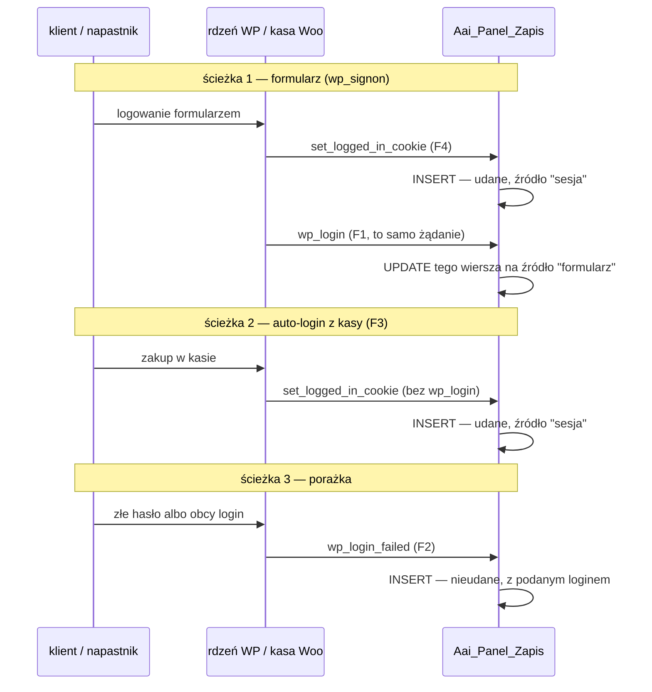
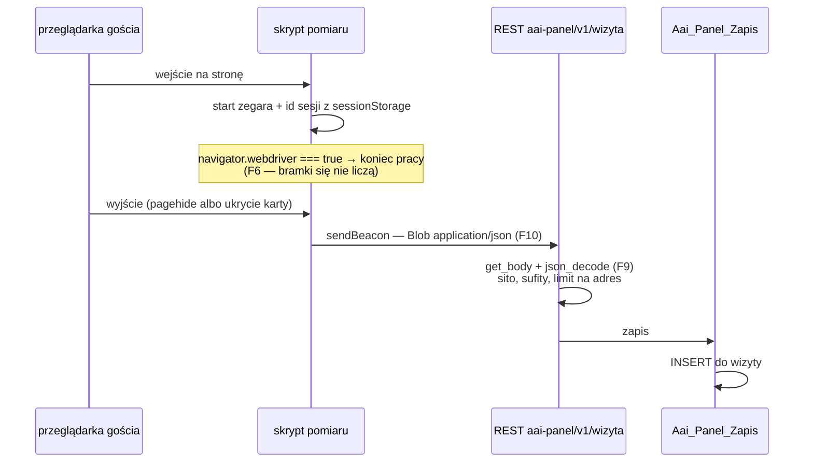

# Plugin 3 — Panel i monitoring: diagram, tabele i bramki jakości

Trzecia i ostatnia wtyczka projektu: **`aai-panel`**. Dwie rzeczy, których
nie ma ani WordPress, ani WooCommerce, ani Tutor: **dziennik logowań**
(kto, kiedy, skąd) i **pomiar wizyt** (którą stronę oglądano i jak długo),
plus **ekran w kokpicie** (tylko admin), który to pokazuje.

Proces wg ZASADY 0 (właściciel, 2026-08-26): najpierw ten schemat, potem
jego krytyka, kod dopiero po akceptacji. Wzorem stylu jest
[diagram Pluginu 1](../plugin-1/DIAGRAM.md), wzorem struktury —
[diagram Pluginu 2](../plugin-2/DIAGRAM.md).

**Ten dokument jest PO krytyce T0** (trzej recenzenci, 30 znalezisk).
Werdykty i dowody: [KRYTYKA-T0.md](KRYTYKA-T0.md).

## 0. Decyzje właściciela, fakty i co zmieniła krytyka

**Decyzje właściciela (2026-08-30), wiążące dla całego modułu:**

| # | Pytanie | Decyzja |
|---|---|---|
| D1 | Gdzie mieszka panel | **Kokpit WP** (menu Automatic AI), jak kreator z W4 — nie trasa na froncie. Zero zmian w `Aai_Sklep_Trasy::PODSTRONY`, zero nowych publicznych adresów HTML |
| D2 | IP w dzienniku logowań | **Pełny adres + kasowanie po 90 dniach** (skrócony/hashowany jest bezużyteczny przy próbie włamania); wzmianka w polityce prywatności |
| D3 | Czyje wizyty liczymy | **Wszyscy oprócz zalogowanych adminów**; sesja anonimowa, bez IP w tabeli i bez łączenia z kontem |
| D4 | Zakres ekranu | **Tylko nasze dwie rzeczy** — logowania i ruch. Sprzedaż/zamówienia mają raporty w Woo; druga kopia liczb wymagałaby kontroli rozjazdu (ta sama korekta co 2026-08-26 w PLAN.md §3) |

**KOREKTA do PLAN.md §4** (ta sama klasa co korekta 2026-08-26 o klientach):
plan mówił o `admin_users`, własnym logowaniu i „haśle hashowanym argon2".
**Własnego logowania NIE piszemy** — konta, role, sesje i hasła ma WordPress;
druga kopia haseł to druga powierzchnia ataku i drugi zbiór danych osobowych
do skasowania przy żądaniu RODO. Panel stoi na `manage_options`, jak kreator.
Z pierwotnej listy tabel zostają **`logowania`** (dawne `admin_login_log`,
rozszerzone na wszystkie konta) i **`wizyty`** (dawne `page_visits`);
`admin_users` odpada.

**Werdykt dla KAŻDEJ pozycji §4** — żeby nic nie zostało przemilczane
zamiast świadomie odrzucone:

| Pozycja PLAN.md §4 | Werdykt |
|---|---|
| `/szkolenia/admin`, logowanie, sesje, hasło argon2 | **ODRZUCONE** — ma WordPress; panel idzie do kokpitu (D1) |
| `admin_users` | **ODRZUCONE** — `wp_users` + role |
| widok „sprzedaż/zamówienia" | **ODRZUCONE** (D4) — raporty ma WooCommerce |
| widok „kursy i ich statusy" | **JUŻ ZROBIONE** w W4: lista kreatora, `admin.php?page=aai-sklep` |
| widok „ruch na podstronie" | **ZOSTAJE** → tabela `wizyty` |
| widok „logi" | **ZOSTAJE** → tabela `logowania` |
| `admin_login_log` | **ZOSTAJE**, rozszerzone na wszystkie konta |
| `page_visits` | **ZOSTAJE** jako `wizyty` |
| baza `db3_monitoring` | **ZASTĄPIONE** — własne tabele z prefiksem w bazie WP (decyzja 2026-08-25) |
| `POST /api/szkolenia/track` + `sendBeacon` | **ZASTĄPIONE** trasą REST `aai-panel/v1/wizyta` (sekcja 5) |

**Trzy obietnice w REPO stają się przez tę korektę nieprawdą i T1 je prostuje**
(inaczej kod i dokumentacja Pluginu 1 obiecują coś, czego Plugin 3 nie zrobi):
`class-aai-sklep-panel.php:51` („Własną rolę redaktora kursów dołoży Plugin 3,
razem z kontami klientów"), `docs/plugin-1/KREATOR.md:29` („Pełne logowanie…
da Plugin 3"), `docs/plugin-1/DIAGRAM.md:44` („pełny auth da Plugin 3").
Osobno: `docs/plugin-1/KROK-2-ZABEZPIECZENIA.md:47` parkuje w Pluginie 3
pozycję **brute force** — konta i sesje przejmują WP i Woo, ale ochrona przed
łamaniem hasła zostaje **bez właściciela**, dopóki nie zapadnie decyzja
z sekcji 11. To trzeba w tamtej checkliście napisać wprost.

Sekcja w PLAN.md dostanie blok „KOREKTA" w kroku **T1**, jak §3.

### Fakty zmierzone w cudzym kodzie

Instalacja pomiarowa: **WordPress 6.9.4**, WooCommerce 11.0.1, Tutor 4.0.7.
Każdy fakt z plikiem i linią — internale zależą od wersji (L17 z krytyki P2),
więc `wp aai-panel sprawdz` wypisuje wersje, na których dowiedziono haki.

| # | Fakt | Dowód |
|---|---|---|
| F1 | `wp_login` odpala się w `wp_signon()` z `($user->user_login, $user)` — **PO** ustawieniu ciastka | `wp-includes/user.php:115` (ciastko) → `:138` (hak) |
| F2 | `wp_login_failed` odpala się w `wp_authenticate()` z `($username, $error)` — łapie formularz **i XML-RPC** (`class-wp-xmlrpc-server.php:301` woła `wp_authenticate`) | `wp-includes/pluggable.php:727` |
| F3 | **Auto-login z kasy NIE odpala `wp_login`** — `wc_set_customer_auth_cookie()` woła `wp_set_current_user()` + `wp_set_auth_cookie()` wprost | `woocommerce/includes/wc-user-functions.php:312–320` |
| F4 | `set_logged_in_cookie` odpala się przy KAŻDYM powstaniu sesji, z `$user_id`; pada **przed** filtrem `send_auth_cookies`, więc i wtedy, gdy ciastko fizycznie nie idzie do klienta | `wp-includes/pluggable.php:1167` |
| F5 | `wp_logout` niesie `$user_id` — świadomie poza zakresem (dziennik LOGOWAŃ) | `wp-includes/pluggable.php:755` |
| F6 | Rig bramek zdradza się `navigator.webdriver === true`; `sendBeacon` i `sessionStorage` w nim działają | zmierzone na żywym rigu 2026-08-30 |
| F7 | Nikt na instalacji nie rejestruje logowań ani nie mierzy wizyt | skan wtyczek + `SHOW TABLES` |
| F8 | `Aai_Sklep_Trasy::PODSTRONY` to `private const` Pluginu 1 — front wymagałby zmiany w cudzym module; dzięki D1 **nie dotykamy** | `class-aai-sklep-trasy.php:81` |
| **F9** | **`sendBeacon(url, string)` idzie jako `text/plain`, a REST WP wtedy CIAŁA NIE PARSUJE**: `get_param()` = `NULL`, `json_params` = 0, `body_params` = 0 — choć `get_body()` niesie pełny ładunek. Ten sam ładunek z `application/json` parsuje się normalnie | zmierzone na `WP_REST_Request`; `class-wp-rest-request.php:685` (`parse_json_params` wychodzi przy innym typie) |
| **F10** | **`sendBeacon` z `Blob({type:'application/json'})` zachowuje ten typ i jest przyjmowany przez przeglądarkę** — obejście F9 po stronie klienta jest wykonalne | zmierzone w rigu: `sendBeacon` → `true`, `blob.type` → `application/json` |
| **F11** | **Wyjątek z handlera `set_logged_in_cookie` WYCHODZI z `wc_set_customer_auth_cookie()`** — w żądaniu kasy oznacza HTTP 500 i przerwany zakup | zmierzone: handler rzucający `RuntimeException` → wyjątek wyleciał z funkcji Woo |
| **F12** | **Nieudane logowanie hasłem aplikacji REST nie odpala `wp_login_failed`** — `determine_current_user` → `wp_validate_application_password` woła `wp_authenticate_application_password()` bezpośrednio, z pominięciem `wp_authenticate()` | `default-filters.php:509`, `user.php:536` |
| **F13** | **Brak zewnętrznego object cache** (`wp_using_ext_object_cache()` → fałsz) — transient siedzi w `wp_options`, czyli licznik czytaj-modyfikuj-zapisz **bez atomowego `INCR`** | zmierzone |
| **F14** | **`REMOTE_ADDR` w środowisku warsztatu to stała brama podmana** — wszystkie trzy realne zakupy właściciela zapisały `10.89.4.4` | `wp_wc_orders.ip_address` dla zamówień 1625 / 2010 / 2590 |
| **F15** | Emiterów `set_logged_in_cookie` bez `wp_login` jest więcej: rejestracja Tutora (dziś uśpiona — natywne logowanie wyłączone, ale włączy się cicho) | `tutor/classes/Student.php:156`, `Instructor.php:189` |
| **F16** | **Nadpisanie `navigator.webdriver` preloadem DZIAŁA** w Firefoksie przez BiDi (`false` po `evaluateOnNewDocument`), tak samo wstrzyknięcie flagi testowej | zmierzone w rigu 2026-08-30 — to rozstrzyga dowodliwość T3 |

### Co zmieniła krytyka T0

Trzydzieści znalezisk, wszystkie potwierdzone niezależnie
([KRYTYKA-T0.md](KRYTYKA-T0.md)). Najważniejsze zmiany w tym dokumencie:

1. **Timer wizyt był NIE DO UDOWODNIENIA i nie działałby** — F9 (beacon
   nieparsowany) plus skrypt wyłączający się w rigu plus „204 na wszystko"
   dawały razem awarię **bezobjawową**. Rozstrzygnięte: klient wysyła Blob
   `application/json` (F10), endpoint **dodatkowo** czyta `get_body()`,
   a smoke dowodzi pełnej ścieżki nadpisując `navigator.webdriver` (F16).
2. **Teza „nie ma ścieżki, na której zepsuje sklep" była FAŁSZYWA** (F11) —
   `try/catch ( Throwable )` w każdym handlerze staje się niezmiennikiem.
3. **Obietnica o hasłach aplikacji była nieprawdą** (F12) — proza zawężona.
4. **Sprzeczność przycinanie kontra odrzut** (sekcja 5 vs bramka) —
   rozstrzygnięta na przycinanie.
5. **Niezmiennik „tylko warstwa zapisu" był ślepy i zdublowany** — pilnuje
   go już `straznik-wtyczki-wp` (reguła zapisu, iteracja po wszystkich
   wtyczkach); mój wzorzec szukałby nazw tabel, których sekcja 7 zabrania
   używać poza jednym miejscem.
6. **Dziennik logowań byłby zaśmiecany przez własne bramki** — 8 smoke'ów
   loguje się do instalacji, a „licznik porażek z 7 dni" jest jedyną
   funkcją alarmową ekranu.
7. **Ekranu nie budował ŻADEN krok** — T2 i T3 dokładały do niego sekcje,
   a `Aai_Panel_Odczyt` (cały kanał JSON) nie padał w tabeli kroków ani raz.
8. **Kontrola miała robić żądanie HTTP do siebie** — niewykonalne z kontenera
   WP-CLI (zmierzone: cURL error 7), więc wywracałaby `postaw.sh` na alarmie
   o rzeczy, która działa.
9. **Kolumna `wejscie` nie miała producenta** — wystrzał jej nie przysyła,
   a `now()` przy odbiorze beaconu to moment WYJŚCIA; najdłuższe wizyty
   trafiałyby do złej doby.
10. **Strefa czasowa przemilczana** — w warsztacie `gmt_offset = 0`, więc
    błąd byłby niewidoczny do produkcji.
11. **Korekta do PLAN.md §4 była niekompletna** — teraz ma werdykt dla
    KAŻDEJ pozycji, a T1 prostuje trzy obietnice o Pluginie 3, które przez
    nią stają się w repo nieprawdą.

## 1. Schemat w języku pluginów tego projektu (WYTYCZNE §8)

Ten sam szkielet co w Pluginach 1 i 2: **BAZA → DZIAŁ → strony**, z JEDNYM
wystrzałem i kanałem JSON (odczyt serwerowy) obok. Górna połowa to
**ZAPIS**, dolna **ODCZYT** — nie mieszają się.

Jak to się ma do WYTYCZNE §8, punkt po punkcie:

- **BAZA**: dwie tabele z własnym prefiksem w bazie WP (decyzja 2026-08-25
  o „własnej BD"). `logowania` — jedyna wiedza „kto i skąd wchodził na
  konto"; `wizyty` — jedyna wiedza „co oglądano i jak długo" (F7).
- **DZIAŁ**: jedna klasa zapisu (`Aai_Panel_Zapis`) jako **jedyne** miejsce
  piszące do obu tabel — wzorem `Aai_Sklep_Zapis` i `Aai_Platnosci_Zapis`.
  Retencja mieszka w dziale, nie w cronie: WP-Cron na mało odwiedzanej
  stronie potrafi nie wstać całymi dniami.
- **WYSTRZAŁ — jedyny AJAX Pluginu 3**: endpoint REST przyjmujący beacon
  wizyty. To jest dokładnie przypadek z §8: informacja **spoza systemu**
  (przeglądarka odwiedzającego), która musi dojechać do działu przez sieć.
  Innego AJAX-a nie ma: ekran kokpitu jest czystym odczytem, a zdarzenia
  logowania przychodzą HAKAMI serwera — tak jak zdarzenia zakupowe Woo
  w Pluginie 2, które też nie liczyły się jako AJAX.
- **KANAŁ JSON** (odczyt serwerowy): klasa odczytu składa agregaty przy
  renderowaniu ekranu. Strona nigdy nie dotyka bazy.

## 2. Ten sam schemat w języku WordPressa

| Pojęcie projektu | W WordPressie konkretnie |
|---|---|
| BAZA Pluginu 3 | dwie tabele przez `dbDelta` przy aktywacji (wzorem `Aai_Platnosci_Tabele`: opcja wersji schematu, `tabela()`, `wszystkie()`): `wp_aai_panel_logowania`, `wp_aai_panel_wizyty` — kontrakt w sekcji 7 |
| DZIAŁ-DYSPOZYTOR | `Aai_Panel_Zapis` w `includes/class-aai-panel-zapis.php` — jedyny pisarz (nazwa pliku **musi** trzymać tę konwencję: po niej rozpoznaje warstwę zapisu istniejący `straznik-wtyczki-wp`); wartości przez `$wpdb->prepare()`/`insert()`; retencja przy zapisie |
| WYSTRZAŁ (jedyny AJAX) | trasa REST `aai-panel/v1/wizyta` (POST, `permission_callback` przepuszczający — beacon gościa nie ma jak nieść nonce'a, sekcja 5), rejestrowana na `rest_api_init`. **Ciało czytane przez `get_body()` + `json_decode()`, NIE przez `get_param()`** (F9) |
| zdarzenia logowania (haki) | `set_logged_in_cookie` (powstała sesja — łapie TAKŻE auto-login z kasy, F3/F4), `wp_login` (doprecyzowanie źródła na „formularz", F1), `wp_login_failed` (porażka, F2). **Każdy handler owinięty `try { } catch ( Throwable )`** (F11) |
| KANAŁ JSON (odczyt) | `Aai_Panel_Odczyt` — zapytania agregujące, nigdy nie pisze |
| kokpit | `Aai_Panel_Ekran`: podstrona menu **Automatic AI**, a gdy sklep nieaktywny — własna pozycja top-level; `manage_options`; **czysty odczyt — zero `admin-post.php`, zero `wp_ajax_*`, zero `method="post"`**. Rejestracja na `admin_menu` z **priorytetem 20**: wtyczki ładują się alfabetycznie, więc `aai-panel` biegnie przed `aai-sklep` i przy domyślnym priorytecie nasza pozycja wchodzi do podmenu PRZED pozycjami Pluginu 1 (zmierzone: kolejność `aai-sklep, aai-sklep-kurs, aai-panel, aai-sklep`; z priorytetem 20 nasza ląduje na końcu). Obecność rodzica sprawdzamy przez `isset( $GLOBALS['admin_page_hooks']['aai-sklep'] )` — pytanie o ISTNIENIE MENU, nie o nazwę klasy |
| skrypt pomiaru | `assets/pomiar.js` podpinany na `wp_enqueue_scripts` **tylko gdy oglądający nie ma `manage_options`** (D3); wysyła **Blob typu `application/json`** (F10) na `pagehide`/`visibilitychange` |
| CLI | `wp aai-panel sprawdz` — kod 1, gdy: brak tabel, haki niezarejestrowane, retencja zawiodła (sekcja 4), **ostatni zapis zgłosił błąd**. Trasa sprawdzana **obecnością w `rest_get_server()->get_routes()`, NIGDY żądaniem HTTP**: kontener WP-CLI jest osobny i `home_url()` jest z niego nieosiągalny (zmierzone: cURL error 7), więc kontrola po HTTP byłaby czerwona ZAWSZE i wywracała `postaw.sh`. Wypisuje wersje i ostrzega przy prywatnym `REMOTE_ADDR` (F14) |
| kanał błędów | opcja + `admin_notices` na naszym ekranie, wzorem `Aai_Platnosci_Komunikaty`. Bez niego uszkodzona tabela daje **pustą listę logowań**, którą właściciel przeczyta jako brak prób — fałszywy negatyw na jedynym ekranie, który ma ostrzegać |
| zależności | `Aai_Panel_Zaleznosci` ze stałymi `WP_DOWIEDZIONE` / `WOO_DOWIEDZIONE` (wzorem P2, L17): F3 oraz F1/F4 to wnętrzności cudzego kodu — aktualizacja Woo przełączająca kasę na `wp_signon()` zamieniłaby N3 w cichy podwójny wpis. Różnica wersji = kod 0 + ostrzeżenie z listą faktów do potwierdzenia |
| prefiks assetów i klas CSS | **`aai-monitor-`**. `aai-panel` jest już zajęty w Pluginie 1 (`szablony/katalog.php`, `assets/lekcja.css`, `assets/panel.css`), a krótsze `aai-mon-` myliłoby wyszukiwanie z istniejącą klasą `aai-mono` (czcionka; `szablony/czesci/program.php` i inne). Zmierzone: `aai-monitor` ma dziś **zero** trafień w repo |
| meta / opcje | tylko opcja wersji schematu; **żadnych meta na cudzych wpisach** |

## 3. Granica: co jest nasze, a co cudze

| Obszar | Czyj | Skąd ta granica |
|---|---|---|
| Konta, role, hasła, sesje | **WordPress** | korekta do PLAN.md §4: drugiej kopii haseł nie będzie |
| Zdarzenia logowania | WordPress **emituje**, my **rejestrujemy** | haki F1/F2/F4; nie podmieniamy żadnej funkcji pluggable (lekcja z P6: ciszę rdzenia o hasłach osiągnięto zdjęciem callbacku, nie podmianą) |
| Raporty sprzedaży, klienci, zamówienia | **WooCommerce** | D4 |
| Postęp w kursie | **Tutor** | rozstrzygnięte przy W6 |
| Dziennik logowań, pomiar wizyt, ekran | **Plugin 3** | F7 |
| Wygląd ekranu | **natywny kokpit z akcentem volt** | ta sama decyzja co przy W4 — tego ekranu klient nie widzi |

Plugin 3 nie pisze do żadnej cudzej tabeli i nie zmienia żadnego cudzego
zachowania — wyłącznie nasłuchuje i zapisuje u siebie.

**ALE nasłuch NIE jest darmowy i to trzeba powiedzieć wprost** (F11): nasze
handlery biegną **wewnątrz cudzych żądań**, w tym wewnątrz kasy. Wyjątek
albo błąd bazy w handlerze `set_logged_in_cookie` przerwałby zakup z HTTP
500 — zmierzone. Dlatego `try/catch ( Throwable )` jest tu **wymaganiem
bezpieczeństwa sklepu**, nie higieną kodu (N4), a błąd jedzie do opcji
i na ekran, nie do odpowiedzi klienta. To ta sama lekcja co w Pluginie 2:
„awaria kopii nie cofa zapisu".

## 4. Dziennik logowań — zdarzenia, źródło, retencja

- **Dlaczego dwa haki na sukces.** Sam `wp_login` przegapiłby auto-login
  z kasy (F3) — czyli ścieżkę każdego nowego klienta. Sam
  `set_logged_in_cookie` nie odróżnia formularza od kasy. Więc:
  `set_logged_in_cookie` **tworzy** wiersz (źródło `sesja`), a `wp_login`,
  który w żądaniu formularzowym biegnie chwilę później (F1),
  **doprecyzowuje** źródło na `formularz`. Identyfikator świeżego wiersza
  żyje w polu statycznym klasy przez czas jednego żądania.
- **`wp_login` bez wcześniejszego wiersza tworzy NOWY** (źródło
  `formularz`), zamiast robić UPDATE w próżnię. Dziś każdy znany emiter
  `wp_login` woła wcześniej `wp_set_auth_cookie`, ale to jest założenie
  o cudzym kodzie — cudza wtyczka logująca programowo nie ma przepaść
  z dziennika bez śladu.
- **Źródło `sesja` znaczy: każda sesja spoza formularza** — kasa (F3),
  odnowienie ciastka po zmianie własnego hasła (F4), rejestracja Tutora
  (F15, dziś uśpiona), przyszłe kanały.
- **Porażki**: podany login (przycięty), IP, agent, czas. `wp_login_failed`
  łapie formularz i XML-RPC (F2).
- **Czego dziennik NIE obiecuje** — zapisane wprost, żeby nie kłamał:
  - **nieudane logowanie hasłem aplikacji REST NIE jest rejestrowane**
    (F12) — brute-force po REST jest dla dziennika niewidzialny. Gdyby
    hasła aplikacji weszły do użycia, dochodzi hak
    `application_password_failed_authentication`;
  - udane uwierzytelnienia bez sesji ciastkowej nie tworzą wiersza „udane"
    — tam sesja nie powstaje;
  - wylogowania są poza zakresem (F5).
- **Retencja (D2) i jej uczciwa granica.** Przy każdym `INSERT` do
  `logowania` dział kasuje wiersze starsze niż **90 dni**. Ale mechanizm
  jest z definicji **leniwy**: gdy przez 90 dni nie ma ani jednego zdarzenia
  logowania, stare wiersze czekają na następny zapis. Dlatego:
  - **drugi wyzwalacz**: retencja biegnie także przy renderowaniu ekranu
    panelu (raz dziennie, strażą transientu) — bez WP-Cron;
  - **polityka prywatności mówi prawdę o mechanizmie**: „do 90 dni od
    ostatniej aktywności", nie „twarde 90 dni";
  - **kontrola nie może mierzyć wyłącznie skutku własnego zapisu**
    (lekcja B15 z P2): `sprawdz` daje kod 1, gdy istnieje wiersz starszy
    niż `MAX(czas) − 90 dni − margines`, czyli gdy retencja **miała okazję
    i jej nie wykorzystała**. Porównanie do zegara dawałoby fałszywą
    czerwień na cichej instalacji i psuło `postaw.sh`.

## 5. Timer wizyt — skrypt, wystrzał, anonimowość

- **Kontrakt wystrzału ma dwie połowy i obie są konieczne** (F9): klient
  wysyła **Blob typu `application/json`**, a endpoint i tak czyta
  `get_body()` + `json_decode()` **niezależnie od Content-Type**. Sam Blob
  nie wystarczy (starsze przeglądarki, przyszła zmiana skryptu), samo
  `get_body()` nie wystarczy (traci walidację typu). Endpoint oparty na
  `get_param()` zapisywałby **zero wierszy z prawdziwej przeglądarki**,
  a smoke curlem z `application/json` przechodziłby — awaria bezobjawowa.
- **Co zapisujemy**: ścieżka, moment wejścia, czas na stronie, anonimowy
  identyfikator sesji. **Nie zapisujemy: IP, loginu, user-agenta, niczego
  łączącego z kontem** (D3). Identyfikator sesji: **32 znaki hex** z
  `sessionStorage` (per karta) — format ustalony tu, bo sito go egzekwuje;
  `crypto.randomUUID()` daje 36 znaków z myślnikami i **odrzuciłby własne
  beacony**.
- **Kogo nie liczymy** (D3): zalogowanych z `manage_options` (skrypt nie
  jest im w ogóle podawany); automatów (skrypt kończy pracę przy
  `navigator.webdriver === true`, F6 — bez zmian w istniejących
  smoke'ach); narzędzi bez JS (nie wykonują skryptu); znanych botów po
  nagłówku UA na endpoincie.
- **Dlaczego REST, a nie `admin-post.php`**: beacon idzie od gościa,
  a `sendBeacon` nie niesie nagłówków — nonce'a nie ma jak sprawdzić
  (nonce gościa jest wspólny dla wszystkich niezalogowanych, więc niczego
  by nie dowodził).
- **Sito na wejściu** (endpoint jest publiczny, więc każdy bajt wejścia
  jest wrogi — lekcja z PR 3 kroku 2 prototypu):

  | co | reguła | dlaczego taka |
  |---|---|---|
  | ścieżka | zaczyna się od `/`, przycięta do 191 znaków, **musi trafiać w realną trasę** (nasze widoki albo `url_to_postid()`) | bez tego „top 10 stron" da się dowolnie zatruć ścieżkami nieistniejących stron |
  | pochodzenie | nagłówek `Origin`/`Referer` zgodny z `home_url()` | beacon cross-origin (`text/plain` nie wywołuje preflightu) pozwalałby obcej witrynie zawyżać nasz ruch. **Nagłówek jest do podrobienia poza przeglądarką** — to tama na przypadek, nie na napastnika |
  | id sesji | dokładnie 32 znaki hex | musi być spójny z tym, co generuje skrypt |
  | czas | **PRZYCINANY** do sufitu 4 h, nie odrzucany | czas ponad sufit to zwykle uśpiona karta, nie atak; odrzut wyrzucałby prawdziwe wizyty |
  | ciało | sufit długości = 4× realny beacon *(liczba do zmierzenia przy T3: ścieżka 191 + ms + 32 hex ≈ 300 B)* | smoke musi znać próg, żeby wysłać ciało o bajt za duże |
  | limit na adres | licznik w transiencie kluczowany **skrótem** IP (sól + hash), TTL 60 s, sufit *(do kalibracji)* | IP nie trafia do żadnej tabeli — żyje ulotnie w kluczu |

- **Limiter jest MIĘKKI i to jest świadome** (F13): bez zewnętrznego object
  cache transient siedzi w `wp_options` i działa przez czytaj-modyfikuj-
  zapisz, bez atomowego `INCR` — pod zalewem inkrementy się gubią, a okno
  TTL jest stałe, nie przesuwne, więc na granicy okien przepuszcza do
  podwójnego limitu. **Chroni przed przypadkiem, nie przed napastnikiem.**
  Twardą tamą jest tania treść wiersza (bez danych osobowych) i retencja.
  Gdyby zalew stał się realny, licznik przenosi się do TABELI z atomowym
  `INSERT … ON DUPLICATE KEY UPDATE` — **z jednym** kluczem unikalnym
  w wierszu (pułapka B4 z 0.46.0: `ON DUPLICATE` reaguje na konflikt
  KAŻDEGO klucza unikalnego).
- **Odrzuty odpowiadają 204 tak samo jak przyjęcia** — beacon nie ma
  czytelnika, a różnicowanie odpowiedzi dawałoby napastnikowi sondę.
  Ceną jest brak objawu przy rozjeździe klient–serwer; **dlatego** bramka
  T3 musi dowodzić pełnej ścieżki (sekcja 12), a nie samego endpointu.
- **Retencja wizyt**: wiersze starsze niż **400 dni** kasowane przy
  zapisie — nie RODO, tylko higiena rozmiaru. Okno przekracza największe
  okno ekranu (30 dni), więc jest tu **na poczet zapowiedzianego
  porównania rok-do-roku** (sekcja 11); gdyby ten ekran nie powstał,
  okno schodzi do ~120 dni.

## 6. Ekran panelu (kokpit, czysty odczyt)

Jedna podstrona menu **Automatic AI** (obok kreatora), `manage_options`,
dwie sekcje:

1. **Logowania**: ostatnie wpisy — **kiedy, kto (konto z `user_id`, przy
   porażce podany login), źródło (formularz / sesja), IP, agent skrócony**,
   z podziałem udane/nieudane i licznikiem porażek z ostatnich 7 dni.
   Filtr: wszystkie / tylko nieudane. Kolumna „źródło" jest tu dlatego,
   że dla niej istnieje cała maszyneria dwóch haków: wpis „sesja" bez
   formularza to sesja z kasy.
2. **Ruch**: dziś / 7 dni / 30 dni — odsłony, sesje, łączny i średni czas;
   top 10 ścieżek z odsłonami i średnim czasem.

Ekran **niczego nie zapisuje** — zero formularzy `method="post"`, zero
akcji, zero nonce'ów. Paginacja i filtry przez parametry GET (formularz
`method="get"` jest dozwolony — niezmiennik celuje w zapis, nie w znacznik).

Gdy `aai-sklep` nieaktywny: własna pozycja top-level.

## 7. Kontrakt danych: dwie tabele

**`wp_aai_panel_logowania`** — dane osobowe, okno 90 dni (D2):

| kolumna | typ | czytelnik |
|---|---|---|
| `id` | `bigint unsigned AI` | klucz |
| `czas` | `datetime` (UTC) | ekran (sortowanie, licznik 7 dni) + retencja; **indeks** |
| *(strefa)* | — | obie kolumny trzymamy w UTC, ale okna liczymy od `current_datetime()` przeliczonego na UTC, a wyświetlamy przez `wp_date()`. W warsztacie `gmt_offset = 0`, więc błąd strefy jest tu NIEWIDOCZNY — wyszedłby dopiero na produkcji (Europe/Warsaw: doba zaczynałaby się o 02:00, a godziny logowań byłyby o dwie za małe) |
| `zdarzenie` | `varchar(16)` | ekran: podział udane/nieudane, filtr |
| `zrodlo` | `varchar(16)` | ekran: kolumna „źródło" (`formularz` / `sesja`; puste przy porażce) |
| `user_id` | `bigint unsigned NULL` | ekran: kolumna „kto" przy sukcesie — jedyny pewny identyfikator konta (login bywa zmieniany, a przy porażce jest śmieciem) |
| `login` | `varchar(60)` | ekran: kolumna „kto" przy porażce. Szerokość = `wp_users.user_login` |
| `ip` | `varchar(45)` | ekran: kolumna „skąd"; 45 = maksymalna długość IPv6 |
| `agent` | `varchar(191)` | ekran: kolumna „skąd" (skrócony); 191 = limit indeksu utf8mb4 |

**`wp_aai_panel_wizyty`** — anonimowe, okno 400 dni:

| kolumna | typ | czytelnik |
|---|---|---|
| `id` | `bigint unsigned AI` | klucz |
| `sesja` | `char(32)` | ekran: `COUNT(DISTINCT sesja)` w oknie czasu |
| `sciezka` | `varchar(191)` | ekran: top 10 stron |
| `wejscie` | `datetime` (UTC) | ekran: okna dziś/7/30 + retencja. **Liczone przez SERWER**: `wejscie = now() − trwanie_ms` — beacon przychodzi przy WYJŚCIU, więc samo `now()` byłoby momentem wyjścia i wizyta zaczęta o 23:50 lądowałaby w następnej dobie. Klientowi nie ufamy w żadnym znaczniku czasu |
| `trwanie_ms` | `int unsigned` | ekran: czas łączny i średni; sufit 4 h narzucony w dziale |

Zasady wspólne (wzorem P1/P2): `dbDelta` + opcja wersji schematu; nazwy
tabel z jednego miejsca; wartości wyłącznie przez `prepare()`/`insert()`;
żadnych kolumn bez czytelnika.

**Indeksy ustala `EXPLAIN` przy T3, nie deklaracja tutaj.** Retencji
wystarcza indeks po kolumnie czasu; dla ekranu ruchu wzorzec zapytań to
zakres po `wejscie` z grupowaniem po `sciezka`, więc indeks `(sciezka,
wejscie)` obsługiwałby zakres na drugiej kolumnie — do zmierzenia, czy
lepszy nie jest `(wejscie, sciezka, trwanie_ms)`.

## 8. Niezmienniki — każdy z przepisem na sprawdzenie

Wzorce celują w ZACHOWANIE, nie w nazwę (osiem nawrotów tej pułapki
w projekcie). Zapis „tylko przez warstwę zapisu" **nie ma tu własnego
niezmiennika** — pilnuje go istniejący `straznik-wtyczki-wp` (iteruje po
wszystkich katalogach `wordpress/wtyczki/`, wymaga
`includes/class-<wtyczka>-zapis.php`); dublowanie dałoby regułę słabszą
od istniejącej.

| # | Niezmiennik | Kto pilnuje i jak |
|---|---|---|
| N1 | Ekran kokpitu jest czystym odczytem: zero `admin_post_*`, zero `wp_ajax_*`, zero `method="post"` w szablonach | strażnik (skan zachowania, nie napisu); mutacja: dopisanie akcji zapisu zapala |
| N2 | Logowanie formularzem → **dokładnie jeden** wiersz `udane` ze źródłem `formularz` | smoke; test negatywny: zdjęcie callbacku `wp_login` z `$wp_filter` po nazwie klasy (wzorzec z P5) zostawia `sesja` i smoke czerwienieje |
| N3 | Auto-login z kasy JEST w dzienniku jako `udane`/`sesja` (F3) | smoke: zakup → wiersz; test negatywny: zdjęcie haka `set_logged_in_cookie` gasi wiersz |
| N4 | **Każdy handler haka rdzenia/Woo owinięty `try/catch ( Throwable )` — wyjątek nigdy nie wychodzi** (F11) | strażnik: każda metoda podpięta pod te haki zawiera `catch ( Throwable`; mutacja „zdejmij catch" czerwona. Smoke: handler zmuszony do błędu → kasa dalej kończy 200, błąd w opcji |
| N5 | Porażka logowania JEST w dzienniku z IP i loginem, **nigdy z hasłem** | smoke + **udokumentowany test negatywny**: chwilowa mutacja działu dopisująca `$_POST['pwd']` czerwieni bramkę (bez tego asercja przechodzi zawsze — hak nie niesie hasła) |
| N6 | Retencja: nie istnieje wiersz starszy niż `MAX(czas) − okno − margines` (obie tabele) | smoke: podłożony stary wiersz → INSERT działu → wiersza nie ma; `wp aai-panel sprawdz` kod 1 wg warunku z sekcji 4 (nie względem zegara) |
| N7 | W `wizyty` nie ma danych osobowych | strażnik: kontrakt tabeli; smoke z **testem negatywnym** (mutacja dopisująca kolumnę IP czerwieni) |
| N8 | Admin nie jest liczony: strona oddana kontu z `manage_options` nie zawiera znacznika skryptu pomiaru | smoke: porównanie HTML admina i gościa (asercja celuje w znacznik `<script src>`, nie w napis — lekcja 0.44.0) |
| N9 | **Pełna ścieżka beaconu działa**: prawdziwy `pomiar.js` + prawdziwy `pagehide` → wiersz w tabeli | smoke w rigu z nadpisanym `navigator.webdriver` (F16) |
| N10 | Automaty nie są liczone: ten sam przebieg **bez** nadpisania → wiersza NIE MA | druga połowa tego samego smoke'a; para N9+N10 dowodzi obu stron |
| N11 | Sito odrzuca: zły format sesji, ścieżka spoza realnych tras, obce `Origin`, za duże ciało — **a czas ponad sufit PRZYCINA** (wiersz istnieje z sufitem) | smoke; **każdy zły beacon jest poprawny poza jednym polem**, a blok otwiera i zamyka **beacon kontrolny**, który MUSI utworzyć wiersz (bez tego „bez zmian" przechodzi także na martwym endpoincie — BLAD-022) |
| N12 | Limit na adres działa, a pełne IP nie osiada w bazie | smoke: nadmiar odrzucony; skan `wp_options` **wzorcem IP** (regex), nie konkretnym adresem |
| N13 | **Bramki nie zaśmiecają dziennika**: smoke sprząta wyłącznie własne wiersze (po loginie testowym i oknie przebiegu, nigdy `TRUNCATE`), a istniejące smoke'i logujące się mają rachunek sumienia liczby wierszy | rachunek sumienia wzorem 0.54.0 (PR #93); bez tego „licznik porażek z 7 dni" pokazuje serie wyprodukowane przez własne testy |
| N14 | Plugin 3 nie pisze do cudzych tabel i nie podmienia funkcji pluggable | strażnik: skończona lista funkcji pluggable + `$wpdb`-zapisy poza własnymi tabelami |
| N15 | **Awaria zapisu jest GŁOŚNA**: uszkodzona tabela → `sprawdz` kod 1 i komunikat na ekranie, nie pusta lista | smoke: przemianowanie tabeli pod wtyczką → logowanie → `sprawdz` kod 1 i komunikat obecny (bez tego pusty ekran znaczy „nikt nie próbował") |
| N16 | Deaktywacja = koniec rejestrowania; odinstalowanie NIE kasuje danych bez jawnej zgody | smoke **w `try/finally` z powrotną aktywacją** i asercją końcową „wtyczka aktywna" — inaczej padnięcie zostawia `:8892` z wyłączonym monitoringiem (lekcja 0.53.0) |

## 9. Pułapki w cudzym kodzie i odpowiedź projektu

| # | Pułapka | Odpowiedź |
|---|---|---|
| P1 | **Auto-login z kasy omija `wp_login`** (F3) | dwa haki + doprecyzowanie źródła; N3 |
| P2 | **Nasz handler biegnie wewnątrz kasy** — wyjątek = HTTP 500 i przerwany zakup (F11) | `try/catch ( Throwable )` jako wymaganie bezpieczeństwa sklepu; N4 |
| P3 | **`sendBeacon` idzie jako `text/plain`, REST nie parsuje ciała** (F9) | Blob `application/json` + `get_body()` po stronie serwera; N9 |
| P4 | **Hasła aplikacji REST omijają `wp_login_failed`** (F12) | obietnica zawężona w prozie; hak `application_password_failed_authentication`, gdy wejdą do użycia |
| P5 | **Transient nie jest atomowy** (F13) | limiter nazwany „miękkim"; droga wyjścia przez tabelę z jednym kluczem unikalnym |
| P6 | **`REMOTE_ADDR` w warsztacie to brama kontenera** (F14) | jedna funkcja `ip()` (bez czytania `x-forwarded-for` — nagłówek do podrobienia); smoke asertuje „kolumna niepusta i równa temu, co widzi PHP", **nie** „to prawdziwy klient"; `sprawdz` ostrzega przy adresie prywatnym; pozycja wdrożeniowa „ustal, co u hostingu jest realnym IP" |
| P7 | **WP-Cron na cichej stronie nie wstaje** | retencja przy zapisie + drugi wyzwalacz przy renderze ekranu; N6 mierzy skutek |
| P8 | **Boty wykonujące JS** zawyżałyby ruch | `navigator.webdriver` + filtr UA; N10 |
| P9 | **Smoke'i piszą do wspólnych zasobów** (lekcja 0.54.0) | automaty wycięte u źródła (F6) + higiena dziennika; N13 |
| P10 | **Emiterów sesji przybywa cicho** (F15: rejestracja Tutora) | źródło `sesja` zdefiniowane jako „każda sesja spoza formularza", nie jako zamknięta lista |
| P11 | **Kontener WP-CLI nie dosięga własnego HTTP** (cURL error 7) — kontrola po żądaniu byłaby czerwona zawsze i wywracała `postaw.sh` | `sprawdz` pyta rejestr tras, nie sieć; żywotność HTTP mierzy smoke z hosta |
| P12 | **Wtyczki ładują się alfabetycznie**, więc `aai-panel` rejestruje menu przed Pluginem 1 | priorytet 20 na `admin_menu` + pytanie o `admin_page_hooks`; bramka T1 sprawdza kotwicę pozycji nadrzędnej |
| P13 | **Pusty ekran nie odróżnia ciszy od awarii** — beacon z założenia milczy (204), a haki nie mają komu nic zwrócić | kanał błędów wzorem `Aai_Platnosci_Komunikaty`; `sprawdz` go czyta; ekran przy zerze wpisów mówi, czy ostatni zapis się udał |

## 10. Deaktywacja i odinstalowanie

- **Deaktywacja**: haki znikają razem z wtyczką — rejestrowanie ustaje.
  Żadnych stanów do przestawiania (nie ma odpowiednika „produkty na draft").
- **Odinstalowanie**: `uninstall.php` wzorem P1/P2 — domyślnie **nie kasuje**
  tabel (dziennik logowań to materiał dowodowy po incydencie). Kasowanie
  tylko po jawnej zgodzie (stała w pliku).

## 11. Co zostaje otwarte świadomie

| Co | Dlaczego nie teraz |
|---|---|
| Wpis o dzienniku w polityce prywatności | treść przy T2, ze sformułowaniem „do 90 dni od ostatniej aktywności" (sekcja 4) |
| Ocena prawna `sessionStorage` (ePrivacy) | identyfikator anonimowy, per karta, bez profilowania; pozycja „przed pierwszym klientem" i tak wymaga prawnika |
| Realne IP zza proxy (P6) | zależy od hostingu, którego jeszcze nie ma; jedna funkcja = jedna przyszła zmiana |
| Porównania rok-do-roku na ekranie | uzasadnia okno 400 dni; ozdoba po teście właściciela |
| Powiadomienia o serii nieudanych logowań | to funkcja BEZPIECZEŃSTWA, nie monitoringu; osobna decyzja, gdy dziennik pokaże, że problem istnieje |
| Twarda tama na zalew beaconów (tabela zamiast transientu) | dopóki zalew jest hipotezą, miękki limiter wystarcza — pod warunkiem, że jest tak nazwany |

## 12. Kroki i bramki dowodowe

Reguła właściciela (2026-08-28): przed KAŻDYM krokiem plan przebiegu
+ pytania i zgoda, dopiero potem kod.

| Krok | Zakres | Bramka dowodowa |
|---|---|---|
| **T1 — fundament i EKRAN** | katalog `wordpress/wtyczki/aai-panel/` (wzorem W1/P1): plik główny, `Aai_Panel_Tabele` (dbDelta, 2 tabele), `Aai_Panel_Zapis` w `class-aai-panel-zapis.php`, `Aai_Panel_Zaleznosci`, kanał błędów, `uninstall.php`. **Do tego ekran, którego wcześniejsza wersja tego planu nie budowała w żadnym kroku**: `Aai_Panel_Ekran` + rejestracja menu (priorytet 20) + `Aai_Panel_Odczyt` z jednym agregatem + własny `assets/panel.css` (arkusz kreatora tu nie wejdzie — `Aai_Sklep_Panel::zasoby()` wychodzi na uchwytach spoza `aai-sklep`). **Integracja środowiska to PIĘĆ czynności, nie „montaż"**: mount w usłudze `wordpress` ORAZ w `cli` (bez drugiego `wp aai-panel sprawdz` nie istnieje), gałąź „plik istnieje" w `postaw.sh`, asercja martwego bind mountu (inode), aktywacja, punkt kontrolny w sekcji WERYFIKACJA. Plus wpis `smoke:wp-monitoring` w `package.json` — bez niego bramki nikt nie uruchomi. Plus blok KOREKTA w PLAN.md §4 i sprostowanie trzech obietnic o Pluginie 3 w repo (sekcja 0). **Kolejny strażnik `straznik-monitoringu-wp`** (nazwa spójna ze smoke'iem) + mutacje | strażnicy zieloni, audyt bez martwych, `postaw.sh` kod 0, `sprawdz` kod 0, ekran otwiera się pod `manage_options` i **kotwica pozycji „Automatic AI" dalej celuje w `page=aai-sklep`**. Uwaga: nowy mount wymaga `podman-compose down && ./postaw.sh` (bind mount trzyma inode). Wchodzi po zmergowaniu napraw po P6 (PR #93, 0.54.0) |
| **T2 — dziennik logowań** | trzy haki z `try/catch`, dedup źródła, retencja 90 dni + drugi wyzwalacz, sekcja „Logowania" ekranu, wpis do polityki prywatności | **`smoke-wp-monitoring`**: N2, N3, N4, N5, N6, N13; test ręczny logowania z kasy na `:8892` |
| **T3 — timer wizyt** | `assets/pomiar.js` (Blob `application/json`, id 32 hex, webdriver-kill), trasa REST czytająca `get_body()`, sito z walidacją ścieżki i `Origin`, miękki limiter, retencja 400 dni, sekcja „Ruch" ekranu | smoke: **N9 i N10 jako para** (przebieg z nadpisanym `navigator.webdriver` → wiersz JEST; bez nadpisania → wiersza NIE MA), N7, N8, N11, N12; `EXPLAIN` na trzech zapytaniach ekranu przed ustaleniem indeksów; **pomiar realnego rozmiaru beaconu** przed ustaleniem sufitu ciała |
| **T4 — test ręczny właściciela** | scenariusz wzorem [TEST-RECZNY-P6.md](../plugin-2/TEST-RECZNY-P6.md): logowanie swoje i klienta, zła próba, przegląd ekranu, wizyty z drugiej przeglądarki | zaliczenie właściciela = **Plugin 3 skończony**; potem test całości trzech wtyczek (decyzja 2026-08-25) |

Wersjonowanie: T1 = kolejne `0.X.0` po zmergowaniu PR #93 (0.54.0).

**Liczby do skalibrowania przy T3** (dziś założenia, nie pomiary — reguła
„liczby tylko z pomiaru"): sufit ciała żądania, sufit beaconów na minutę,
margines retencji w `sprawdz`, sufit czasu 4 h. Każda dostaje wartość
z pomiaru albo jawną etykietę „kalibracja po pierwszym tygodniu danych".
