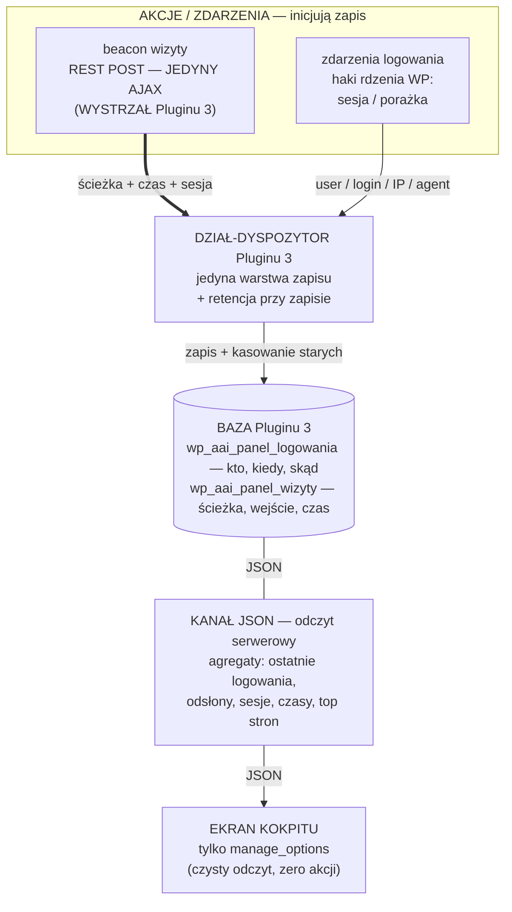
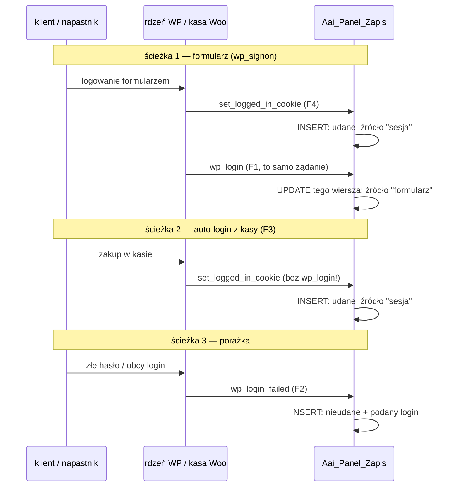
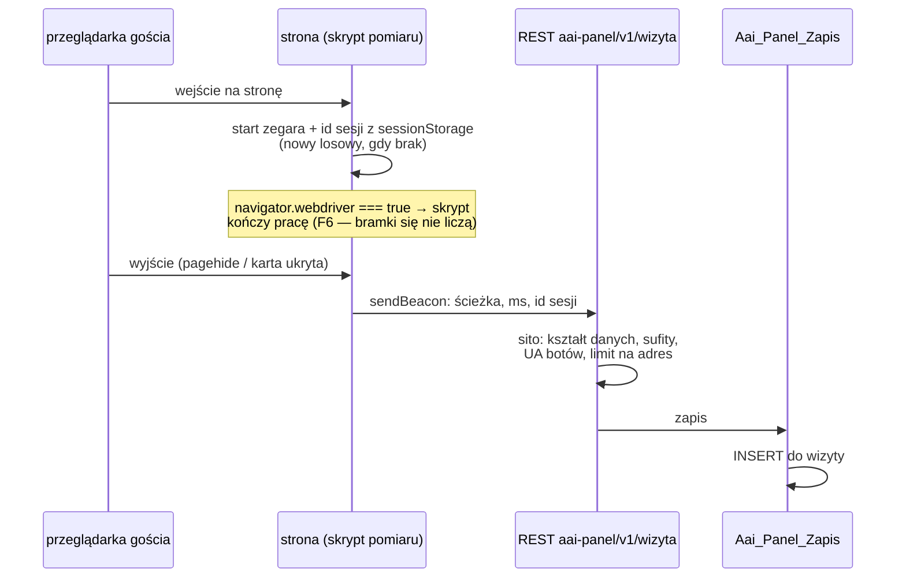

# Plugin 3 — Panel i monitoring: diagram, tabele i bramki jakości

Trzecia i ostatnia wtyczka projektu: **`aai-panel`**. Dwie rzeczy, których
nie ma ani WordPress, ani WooCommerce, ani Tutor: **dziennik logowań**
(kto, kiedy, skąd) i **pomiar wizyt** (którą stronę oglądano i jak długo),
plus **ekran w kokpicie** (tylko admin), który to pokazuje.

Proces wg ZASADY 0 (właściciel, 2026-08-26): najpierw ten schemat, potem
jego krytyka, kod dopiero po akceptacji. Wzorem stylu jest
[diagram Pluginu 1](../plugin-1/DIAGRAM.md), wzorem struktury —
[diagram Pluginu 2](../plugin-2/DIAGRAM.md).

## 0. Decyzje właściciela i skąd pochodzą fakty

**Decyzje właściciela (2026-08-30), wiążące dla całego modułu:**

| # | Pytanie | Decyzja |
|---|---|---|
| D1 | Gdzie mieszka panel | **Kokpit WP** (menu Automatic AI), jak kreator z W4 — nie trasa na froncie. Zero zmian w `Aai_Sklep_Trasy::PODSTRONY`, zero nowych publicznych adresów HTML |
| D2 | IP w dzienniku logowań | **Pełny adres + automatyczne kasowanie po 90 dniach** (skrócony/hashowany jest bezużyteczny przy próbie włamania); wzmianka w polityce prywatności |
| D3 | Czyje wizyty liczymy | **Wszyscy oprócz zalogowanych adminów**; sesja anonimowa, bez IP w tabeli i bez łączenia z kontem |
| D4 | Zakres ekranu | **Tylko nasze dwie rzeczy** — logowania i ruch. Sprzedaż/zamówienia mają raporty w Woo; druga kopia liczb wymagałaby kontroli rozjazdu (ta sama korekta co 2026-08-26 w PLAN.md §3) |

**KOREKTA do PLAN.md §4** (ta sama klasa co korekta 2026-08-26 o klientach):
plan mówił o `admin_users`, własnym logowaniu i „haśle hashowanym argon2".
**Własnego logowania NIE piszemy** — konta, role, sesje i hasła ma WordPress;
druga kopia haseł to druga powierzchnia ataku i drugi zbiór danych osobowych
do skasowania przy żądaniu RODO. Panel stoi na `manage_options`, jak kreator.
Z pierwotnej listy tabel zostają **`logowania`** (dawne `admin_login_log`,
rozszerzone na wszystkie konta — patrz N3) i **`wizyty`** (dawne
`page_visits`); `admin_users` odpada. Sekcja w PLAN.md dostanie blok
„KOREKTA" przy implementacji, jak §3.

**Fakty zmierzone w cudzym kodzie tej instalacji** (WP 7.0.1, Woo 11.0.1,
Tutor 4.0.7) — każdy z plikiem i linią, żeby dało się je zweryfikować:

| # | Fakt | Dowód |
|---|---|---|
| F1 | `wp_login` odpala się w `wp_signon()` z `($user->user_login, $user)` — **PO** ustawieniu ciastka | `wp-includes/user.php:138` |
| F2 | `wp_login_failed` odpala się w `wp_authenticate()` z `($username, $error)` — łapie formularz, XML-RPC i każdy kanał przechodzący przez `wp_authenticate()` | `wp-includes/pluggable.php:727` |
| F3 | **Auto-login z kasy NIE odpala `wp_login`** — `wc_set_customer_auth_cookie()` woła `wp_set_current_user()` + `wp_set_auth_cookie()` wprost, z pominięciem `wp_signon()` | `woocommerce/includes/wc-user-functions.php:312–320` |
| F4 | `set_logged_in_cookie` odpala się przy KAŻDYM powstaniu sesji (formularz, kasa, odnowienie po zmianie własnego hasła), z `$user_id` w argumentach | `wp-includes/pluggable.php:1167` |
| F5 | `wp_logout` istnieje i niesie `$user_id` — świadomie poza zakresem (D: dziennik LOGOWAŃ) | `wp-includes/pluggable.php:755` |
| F6 | Rig bramek zdradza się standardowym `navigator.webdriver === true`; `sendBeacon` i `sessionStorage` działają w nim poprawnie | zmierzone na żywym rigu (puppeteer-core + Firefox, webDriverBiDi) 2026-08-30 |
| F7 | Nikt na instalacji nie rejestruje logowań (jedyne trafienia `wp_login_failed` to nieaktywne SSO Jetpacka w vendor Woo) ani nie mierzy wizyt (`wp_wc_order_stats` to analityka zamówień) | skan wtyczek + `SHOW TABLES` 2026-08-30 |
| F8 | `Aai_Sklep_Trasy::PODSTRONY` jest `private const` Pluginu 1 — front pod `/szkolenia/...` wymagałby zmiany w cudzym module | `class-aai-sklep-trasy.php:81`; dzięki D1 NIE dotykamy |

## 1. Schemat w języku pluginów tego projektu (WYTYCZNE §8)

Ten sam szkielet co w Pluginach 1 i 2: **BAZA → DZIAŁ → strony**, z JEDNYM
wystrzałem i kanałem JSON (odczyt serwerowy) obok. Górna połowa to
**ZAPIS**, dolna **ODCZYT** — nie mieszają się.

Jak to się ma do WYTYCZNE §8, punkt po punkcie:

- **BAZA**: dwie tabele z własnym prefiksem w bazie WP (decyzja 2026-08-25
  o „własnej BD"). `logowania` — jedyna wiedza „kto i skąd wchodził na
  konto"; `wizyty` — jedyna wiedza „co oglądano i jak długo". Nikt inny
  tego nie ma (F7).
- **DZIAŁ**: jedna klasa zapisu (`Aai_Panel_Zapis`) jako **jedyne** miejsce
  piszące do obu tabel — wzorem `Aai_Sklep_Zapis` i `Aai_Platnosci_Zapis`.
  Retencja (D2) mieszka w dziale, nie w cronie: każdy zapis do `logowania`
  kasuje wiersze starsze niż okno. Deterministycznie, bez zależności od
  WP-Cron, który na mało odwiedzanej stronie potrafi nie wstać całymi dniami.
- **WYSTRZAŁ — jedyny AJAX Pluginu 3**: endpoint REST przyjmujący beacon
  wizyty. To jest dokładnie przypadek z §8: informacja **spoza systemu**
  (przeglądarka odwiedzającego), która musi dojechać do działu przez sieć.
  Innego AJAX-a nie ma i nie będzie: ekran kokpitu jest czystym odczytem
  (zero akcji `admin-post.php`), a zdarzenia logowania przychodzą HAKAMI
  serwera — tak jak zdarzenia zakupowe Woo w Pluginie 2, które też nie
  liczyły się jako AJAX.
- **KANAŁ JSON** (odczyt serwerowy): klasa odczytu składa agregaty przy
  renderowaniu ekranu. Strona nigdy nie dotyka bazy.

## 2. Ten sam schemat w języku WordPressa

| Pojęcie projektu | W WordPressie konkretnie |
|---|---|
| BAZA Pluginu 3 | dwie tabele przez `dbDelta` przy aktywacji (wzorem `Aai_Platnosci_Tabele`: opcja wersji schematu, `tabela()`, `wszystkie()`): `wp_aai_panel_logowania`, `wp_aai_panel_wizyty` — kontrakt w sekcji 7 |
| DZIAŁ-DYSPOZYTOR | `Aai_Panel_Zapis` — jedyny pisarz do obu tabel; wartości zawsze przez `$wpdb->prepare()`/`insert()`; retencja przy zapisie |
| WYSTRZAŁ (jedyny AJAX) | trasa REST `aai-panel/v1/wizyta` (POST, `permission_callback` przepuszczający — beacon gościa nie ma jak nieść nonce'a, sekcja 5), zarejestrowana na `rest_api_init` |
| zdarzenia logowania (haki) | `set_logged_in_cookie` (powstała sesja — łapie TAKŻE auto-login z kasy, F3/F4), `wp_login` (doprecyzowanie źródła na „formularz", F1), `wp_login_failed` (porażka, F2) |
| KANAŁ JSON (odczyt) | `Aai_Panel_Odczyt` — zapytania agregujące (`COUNT`, `SUM`, `GROUP BY sciezka`), nigdy nie pisze |
| kokpit | `Aai_Panel_Ekran`: podstrona menu **Automatic AI** (rodzic z `aai-sklep`), a gdy sklep nieaktywny — własna pozycja top-level; `manage_options`; **czysty odczyt — zero formularzy, zero nonce'ów zapisu, zero `admin-post.php`** |
| skrypt pomiaru | `assets/pomiar.js` podpinany na `wp_enqueue_scripts` **tylko gdy oglądający nie ma `manage_options`** (D3); wysyła beacon na `pagehide`/`visibilitychange` |
| CLI | `wp aai-panel sprawdz` — kod 1, gdy: brak tabel, haki niezarejestrowane, retencja nie działa (najstarszy wiersz `logowania` starszy niż okno + margines), endpoint nie odpowiada |
| meta / opcje | tylko opcja wersji schematu (`aai_panel_wersja_schematu`); ŻADNYCH meta na cudzych wpisach — Plugin 3 niczego w cudzych danych nie zmienia |

## 3. Granica: co jest nasze, a co cudze

| Obszar | Czyj | Skąd ta granica |
|---|---|---|
| Konta, role, hasła, sesje | **WordPress** | korekta do PLAN.md §4 (sekcja 0): drugiej kopii haseł nie będzie |
| Zdarzenia logowania | WordPress **emituje**, my **rejestrujemy** | haki F1/F2/F4; nie podmieniamy żadnej funkcji pluggable (lekcja z P6: cisza rdzenia o hasłach została osiągnięta zdjęciem callbacku, nie podmianą) |
| Raporty sprzedaży, klienci, zamówienia | **WooCommerce** | D4; panel ich nie dubluje |
| Postęp w kursie | **Tutor** | już rozstrzygnięte przy W6 („postępu NIE liczymy sami") |
| Dziennik logowań, pomiar wizyt, ekran monitoringu | **Plugin 3** | F7 — nikt inny tego nie robi |
| Wygląd ekranu | **natywny kokpit z akcentem volt** | ta sama decyzja co przy W4 (wariant „premium jak /szkolenia" odrzucony — tego ekranu klient nie widzi) |

Plugin 3 **nie pisze do żadnej cudzej tabeli i nie zmienia żadnego cudzego
zachowania** — wyłącznie nasłuchuje i zapisuje u siebie. To najprostszy
z trzech modułów: nie ma ani jednej ścieżki, na której mógłby zepsuć
sklep, płatności albo materiał kursu.

## 4. Dziennik logowań — zdarzenia, rozróżnienie źródła, retencja

**Trzy zdarzenia, dwa haki źródłowe + jeden doprecyzowujący:**

- **Dlaczego dwa haki na sukces.** Sam `wp_login` przegapiłby auto-login
  z kasy (F3) — czyli dokładnie tę ścieżkę, którą wchodzi każdy nowy klient
  (kasa loguje na 14 dni, pomiar z P6). Sam `set_logged_in_cookie` nie umie
  odróżnić formularza od kasy. Więc: `set_logged_in_cookie` **tworzy** wiersz
  (źródło `sesja`), a `wp_login` — który w żądaniu formularzowym biegnie
  chwilę PÓŹNIEJ (F1) — **doprecyzowuje** źródło na `formularz`. Wiersz
  z „sesja", którego nic nie doprecyzowało, to sesja spoza formularza:
  kasa albo odnowienie ciastka po zmianie własnego hasła (F4).
  Identyfikator świeżego wiersza żyje w polu statycznym klasy przez czas
  jednego żądania — bez opcji, bez transientów.
- **Porażki z pełnym kontekstem**: podany login (przycięty — sekcja 7),
  IP, agent, czas. `wp_login_failed` łapie też XML-RPC i inne kanały
  przechodzące przez `wp_authenticate()` (F2) — więc dziennik odpowiada
  na pytanie „czy ktoś obcy próbował", nie tylko „czy ktoś użył formularza".
- **Czego dziennik NIE obiecuje** (zapisane wprost, żeby nie kłamał):
  udane uwierzytelnienia BEZ sesji ciastkowej (XML-RPC, przyszłe hasła
  aplikacji REST) nie tworzą wiersza „udane" — tam nie powstaje sesja.
  Porażki z tych kanałów SĄ rejestrowane (F2). Wylogowania poza zakresem (F5).
- **Retencja (D2)**: przy każdym `INSERT` do `logowania` dział kasuje
  wiersze starsze niż **90 dni** (indeks po kolumnie czasu; jedna tania
  `DELETE`). Zero crona — patrz sekcja 1. Wpis o dzienniku (co, po co,
  90 dni) dochodzi do polityki prywatności przy T2.

## 5. Timer wizyt — skrypt, wystrzał, anonimowość

- **Co zapisujemy**: ścieżka, moment wejścia, czas na stronie, anonimowy
  identyfikator sesji. **Czego NIE zapisujemy: IP, loginu, user-agenta,
  niczego łączącego z kontem** (D3). Dzięki temu wiersz wizyty nie jest
  daną osobową i nie wchodzi w okno retencji RODO; identyfikator sesji
  żyje w `sessionStorage` (per karta, znika z jej zamknięciem), nie
  w ciastku.
- **Kogo nie liczymy** (D3 + higiena bramek):
  1. zalogowanych z `manage_options` — skrypt pomiaru w ogóle nie jest
     im podawany (`wp_enqueue_scripts` z warunkiem);
  2. automatów: skrypt kończy pracę przy `navigator.webdriver === true`
     (F6 — nasz rig i standardowe automaty; **zero zmian w smoke'ach**),
     a endpoint odrzuca znane boty po nagłówku UA (boty wykonujące JS,
     np. renderer Google'a);
  3. narzędzi bez JS (curl, gitleaks, skanery) — nie wykonują skryptu,
     więc nigdy nie wysyłają beaconu.
- **Dlaczego REST, a nie `admin-post.php`**: beacon idzie od **gościa**
  i `sendBeacon` nie umie nieść nagłówków, więc nonce'a i tak nie ma jak
  sprawdzić (nonce gościa jest wspólny dla wszystkich niezalogowanych —
  niczego by nie dowodził). REST daje czysty POST z JSON-em i kodem
  odpowiedzi bez renderowania HTML. Zalogowany klient wysyłający beacon
  bez nonce'a jest dla REST anonimem — i dobrze, bo wizyt z kontem i tak
  nie łączymy.
- **Sito na wejściu** (endpoint jest publiczny, więc każdy bajt wejścia
  jest wrogi — lekcja z PR 3 kroku 2 prototypu): ścieżka musi zaczynać się
  od `/` i przechodzić przycięcie do 191 znaków; czas przycinany do sufitu
  (4 h); id sesji musi mieć dokładny format (32 znaki hex); ciało z sufitem
  długości; **limit na adres**: licznik w transiencie kluczowany SKRÓTEM
  IP (sol + hash), TTL 60 s, sufit ~30 beaconów/min — IP nie trafia do
  żadnej tabeli, żyje ulotnie w kluczu limitera. Odrzuty odpowiadają 204
  tak samo jak przyjęcia — beacon nie ma czytelnika, a różnicowanie
  odpowiedzi dawałoby napastnikowi sondę.
- **Retencja wizyt**: wiersze starsze niż **400 dni** kasowane przy zapisie
  (rok + margines na porównania rok-do-roku). Nie RODO — czysta higiena
  rozmiaru tabeli; liczba do zbicia w krytyce.

## 6. Ekran panelu (kokpit, czysty odczyt)

Jedna podstrona menu **Automatic AI** (obok kreatora), `manage_options`,
dwie sekcje:

1. **Logowania**: ostatnie wpisy (kto, kiedy, skąd — IP, agent skrócony),
   z podziałem udane/nieudane i licznikiem porażek z ostatnich 7 dni
   (nagła seria = ktoś próbuje). Filtr: wszystkie / tylko nieudane.
2. **Ruch**: dziś / 7 dni / 30 dni — odsłony, sesje, łączny i średni czas;
   top 10 ścieżek z odsłonami i średnim czasem.

Ekran **niczego nie zapisuje** — zero formularzy, zero akcji, zero
nonce'ów. Najmniejsza możliwa powierzchnia: jedyne, co można na nim
zrobić, to patrzeć. Paginacja i filtry przez parametry GET.

Gdy `aai-sklep` nieaktywny: własna pozycja top-level (ten sam warunek,
którym Plugin 2 rozwiązywał zależności — sprawdzenie przy rejestracji,
nie fatal).

## 7. Kontrakt danych: dwie tabele

**`wp_aai_panel_logowania`** — dane osobowe, okno 90 dni (D2):

| kolumna | typ | po co |
|---|---|---|
| `id` | `bigint unsigned AI` | klucz |
| `czas` | `datetime` (UTC) | kiedy; **indeks** (retencja + sortowanie ekranu) |
| `zdarzenie` | `varchar(16)` | `udane` / `nieudane` |
| `zrodlo` | `varchar(16)` | `formularz` / `sesja` (kasa, odnowienie) / `''` przy porażce |
| `user_id` | `bigint unsigned NULL` | konto przy sukcesie; `NULL` przy porażce |
| `login` | `varchar(60)` | podany login (przy porażce bywa obcy — przycięty, nigdy hasło) |
| `ip` | `varchar(45)` | pełne IP (D2); 45 = maks. IPv6 |
| `agent` | `varchar(191)` | user-agent, przycięty |

**`wp_aai_panel_wizyty`** — anonimowe, okno 400 dni:

| kolumna | typ | po co |
|---|---|---|
| `id` | `bigint unsigned AI` | klucz |
| `sesja` | `char(32)` | anonimowy id z sessionStorage (hex); **indeks** (liczenie sesji) |
| `sciezka` | `varchar(191)` | co oglądano; **indeks z `wejscie`** (top stron w oknie czasu) |
| `wejscie` | `datetime` (UTC) | kiedy; **indeks** (okna dziś/7/30) |
| `trwanie_ms` | `int unsigned` | ile; sufit 4 h narzucony w dziale |

Zasady wspólne (wzorem P1/P2): `dbDelta` + opcja wersji schematu; nazwy
tabel z jednego miejsca (`Aai_Panel_Tabele::tabela()`); wartości wyłącznie
przez `prepare()`/`insert()`; **żadnych kolumn „na zapas"** — każda kolumna
ma czytelnika na ekranie albo w retencji.

## 8. Niezmienniki — każdy z przepisem na sprawdzenie

Wzorce mają celować w ZACHOWANIE, nie w nazwę (siedem nawrotów tej pułapki
w projekcie).

| # | Niezmiennik | Kto pilnuje i jak |
|---|---|---|
| N1 | Do tabel Pluginu 3 pisze wyłącznie `Aai_Panel_Zapis` | strażnik: skan wtyczki na `insert/update/delete/query` z nazwami naszych tabel poza klasą zapisu |
| N2 | Ekran kokpitu jest czystym odczytem — zero `admin-post`, zero `wp_ajax_*`, zero formularzy zapisu | strażnik: skan wtyczki; mutacja: dopisanie akcji zapisu musi zapalić |
| N3 | Auto-login z kasy JEST w dzienniku (F3) | smoke: zakup → wiersz `udane/sesja` bez `wp_login`; test negatywny: zdjęcie haka `set_logged_in_cookie` gasi wiersz |
| N4 | Porażka logowania JEST w dzienniku z IP i loginem, ale NIGDY z hasłem | smoke: zła próba → wiersz `nieudane`; asercja: żaden wiersz nie zawiera podanego hasła |
| N5 | Retencja działa i jest mierzona: po zapisie nie istnieje wiersz `logowania` starszy niż 90 dni | smoke: podłożenie starego wiersza wprost do tabeli → dowolny INSERT działu → wiersza nie ma; `wp aai-panel sprawdz` kod 1, gdy najstarszy wiersz przekracza okno + margines |
| N6 | W `wizyty` nie ma danych osobowych: żadnej kolumny IP/loginu/agenta i żaden zapis działu ich tam nie wkłada | strażnik: kontrakt tabeli; smoke: beacon → wiersz bez śladu IP nadawcy |
| N7 | Admin nie jest liczony: strona oddana kontu z `manage_options` nie zawiera skryptu pomiaru | smoke: porównanie HTML admina i gościa |
| N8 | Automaty nie są liczone: skrypt kończy pracę przy `navigator.webdriver === true` | smoke w rigu (F6): odsłona strony w automacie nie tworzy wiersza — czyli WŁASNY przebieg smoke'a jest dowodem; rachunek sumienia liczby wizyt w bramkach przeglądarkowych (higiena z 0.54.0) |
| N9 | Endpoint wisi na sicie: zły format sesji / ścieżka spoza wzorca / czas ponad sufit / za duże ciało → odrzut bez zapisu | smoke: seria złych beaconów → liczba wierszy bez zmian |
| N10 | Limit na adres działa, a IP nie osiada: po przekroczeniu limitu beacony nie tworzą wierszy, a w bazie (opcje + transienty + nasze tabele) nie ma pełnego IP nadawcy beaconu | smoke: >30 beaconów/min → nadmiar odrzucony; skan `wp_options` na surowe IP |
| N11 | Plugin 3 nie pisze do żadnej cudzej tabeli i nie podmienia funkcji pluggable | strażnik: skan wtyczki (wzorem reguły jednokierunkowości P2) |
| N12 | Deaktywacja = koniec rejestrowania, zero skutków ubocznych; odinstalowanie NIE kasuje danych bez jawnej zgody | smoke: po deaktywacji logowanie nie tworzy wiersza; `uninstall.php` wzorem P1/P2 |

## 9. Pułapki w cudzym kodzie i odpowiedź projektu

| # | Pułapka | Odpowiedź |
|---|---|---|
| P1 | **Auto-login z kasy omija `wp_login`** (F3) — dziennik oparty na samym `wp_login` kłamałby o każdym nowym kliencie | dwa haki + doprecyzowanie źródła (sekcja 4); N3 |
| P2 | **`x-forwarded-for` jest do podrobienia** (zapisane już przy limiterze prototypu) — a za proxy hostingu `REMOTE_ADDR` bywa adresem proxy | jedna funkcja IP w dziale: `REMOTE_ADDR`, bez czytania nagłówków; przy wdrożeniu na hosting z proxy ŚWIADOMA zmiana w jednym miejscu (wpis w MIGRACJA/wdrożeniowej liście, nie cicha „inteligencja") |
| P3 | **`wp_login_failed` niesie surowy login napastnika** — może być dowolnym śmieciem (długość, znaki sterujące) | przycięcie + oczyszczenie przed zapisem; N4 |
| P4 | **WP-Cron na mało odwiedzanej stronie nie wstaje** — retencja na cronie mogłaby nie biec tygodniami | retencja przy zapisie (sekcje 1, 4); N5 mierzy skutek, nie mechanizm |
| P5 | **`sendBeacon` nie niesie nagłówków ani nie czeka na odpowiedź** — nonce niemożliwy, odpowiedź nieczytelna | endpoint publiczny z sitem i limitem (sekcja 5); jednolite 204; N9/N10 |
| P6 | **Boty wykonujące JS** (renderer wyszukiwarek) zawyżałyby ruch | `navigator.webdriver` w skrypcie + filtr UA na endpoincie; N8 |
| P7 | **Smoke'i przeglądarkowe piszą do wspólnych zasobów** — lekcja 0.54.0: bramka zostawiająca ślady każe następnym mierzyć śmieci | automaty wycięte u źródła (F6); rachunek sumienia wizyt w bramkach; N8 |

## 10. Deaktywacja i odinstalowanie

- **Deaktywacja**: haki znikają razem z wtyczką — rejestrowanie po prostu
  ustaje. Żadnych stanów do przestawiania (nie ma odpowiednika „produkty
  na draft" z P2).
- **Odinstalowanie**: `uninstall.php` wzorem P1/P2 — domyślnie NIE kasuje
  tabel (dziennik logowań to także materiał dowodowy po incydencie;
  skasowanie go razem z wtyczką byłoby niespodzianką). Kasowanie tylko
  po jawnej zgodzie (stała w pliku, jak w P1).

## 11. Co zostaje otwarte świadomie

| Co | Dlaczego nie teraz |
|---|---|
| Wpis o dzienniku logowań w polityce prywatności (D2) | treść przy T2, razem z realnym oknem retencji; polityka jest podpięta w kasie od N6/P4 |
| Ocena prawna `sessionStorage` (ePrivacy) | identyfikator anonimowy, per karta, bez profilowania — ryzyko minimalne, ale pozycja „przed pierwszym klientem" (regulamin + zgody) i tak wymaga przeglądu prawnika; tam dopisujemy pytanie |
| Mapowanie IP zza proxy (P2) | zależy od docelowego hostingu, którego jeszcze nie ma; jedna funkcja = jedna przyszła zmiana |
| Wykresy/eksporty w panelu | D4: najpierw dwie rzeczy, których nie ma nikt; ozdoby po B-teście właściciela |
| Powiadomienia o serii nieudanych logowań (mail/limit prób) | to funkcja BEZPIECZEŃSTWA (jak limiter prototypu), nie monitoringu; osobna decyzja właściciela, jeśli dziennik pokaże, że problem istnieje |

## 12. Kroki i bramki dowodowe

Reguła właściciela (2026-08-28) obowiązuje: przed KAŻDYM krokiem plan
przebiegu + pytania i zgoda, dopiero potem kod.

| Krok | Zakres | Bramka dowodowa |
|---|---|---|
| **T1 — fundament** | katalog `wordpress/wtyczki/aai-panel/` (wzorem W1/P1): plik główny, `Aai_Panel_Tabele` (dbDelta, 2 tabele), `Aai_Panel_Zapis`, `uninstall.php`, montaż w compose + `postaw.sh`, `wp aai-panel sprawdz` (wersja minimalna), **37. strażnik `straznik-panelu-wp`** + mutacje w audycie | strażnicy zieloni, audyt bez martwych, `postaw.sh` kod 0, tabele istnieją, `sprawdz` kod 0 |
| **T2 — dziennik logowań** | haki F1/F2/F4 + dedup źródła, retencja 90 dni, sekcja „Logowania" ekranu, wpis do polityki prywatności | **`smoke-wp-monitoring`** (nazwa NIE `smoke-wp-panel` — ta jest zajęta przez kreator): N3, N4, N5; test ręczny logowania z kasy na `:8892` |
| **T3 — timer wizyt** | `assets/pomiar.js`, trasa REST z sitem i limitem, retencja 400 dni, sekcja „Ruch" ekranu | smoke: N6–N10 (beacon z riga = dowód N8); rachunek sumienia wizyt w bramkach przeglądarkowych |
| **T4 — test ręczny właściciela** | scenariusz wzorem [TEST-RECZNY-P6.md](../plugin-2/TEST-RECZNY-P6.md): logowanie swoje i klienta, zła próba, przegląd ekranu, wizyty z telefonu/drugiej przeglądarki | zaliczenie właściciela = **Plugin 3 skończony**; potem test całości trzech wtyczek (decyzja 2026-08-25) |

Wersjonowanie: T1 = 0.55.0, dalsze kroki kolejne `0.X.0` (wzorem P1→P6).
